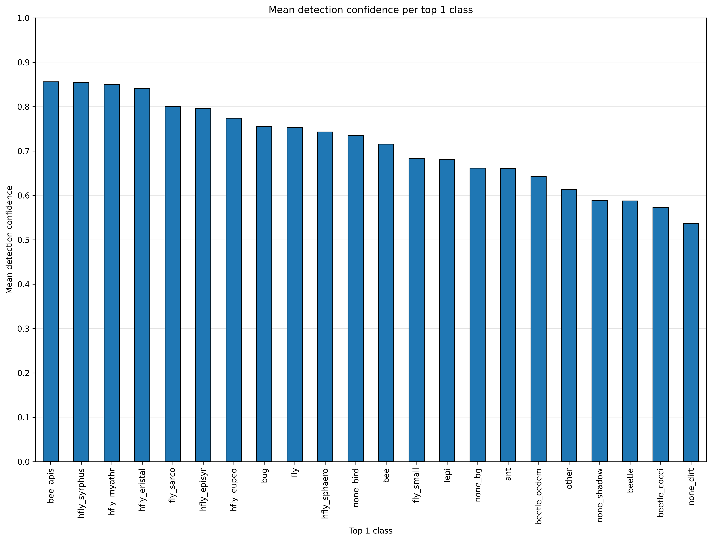
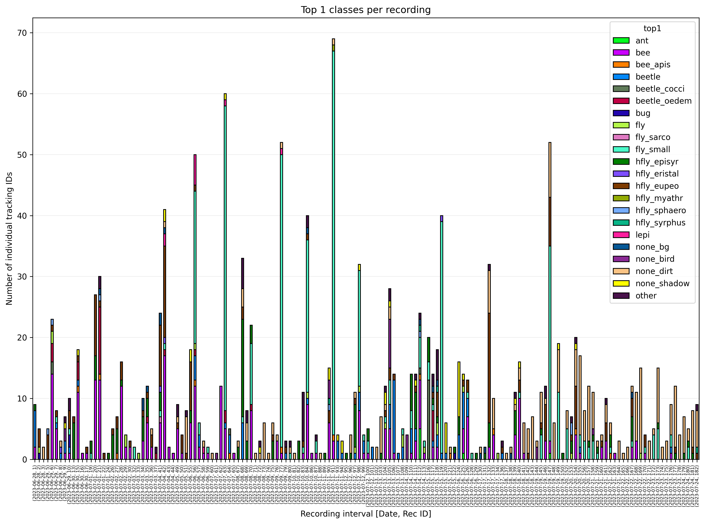
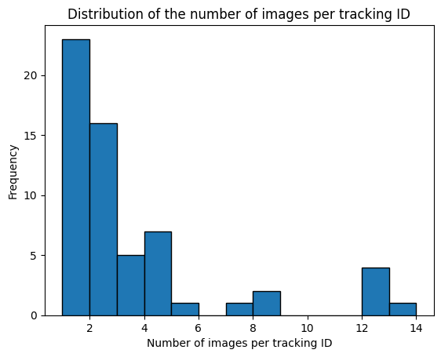
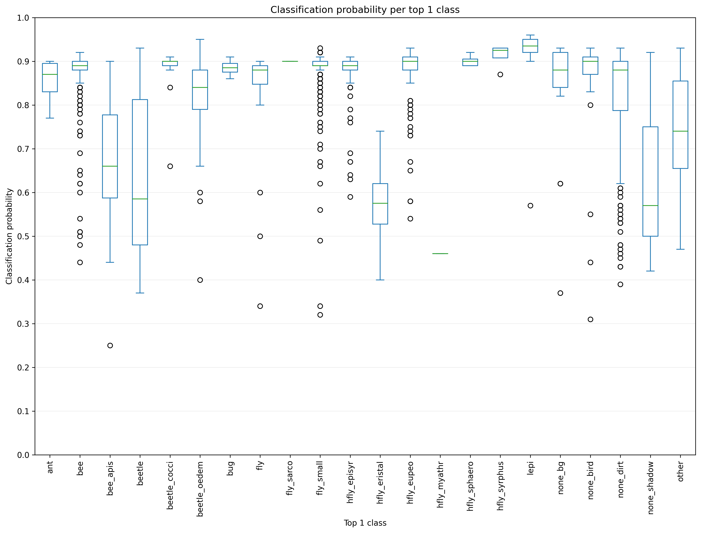
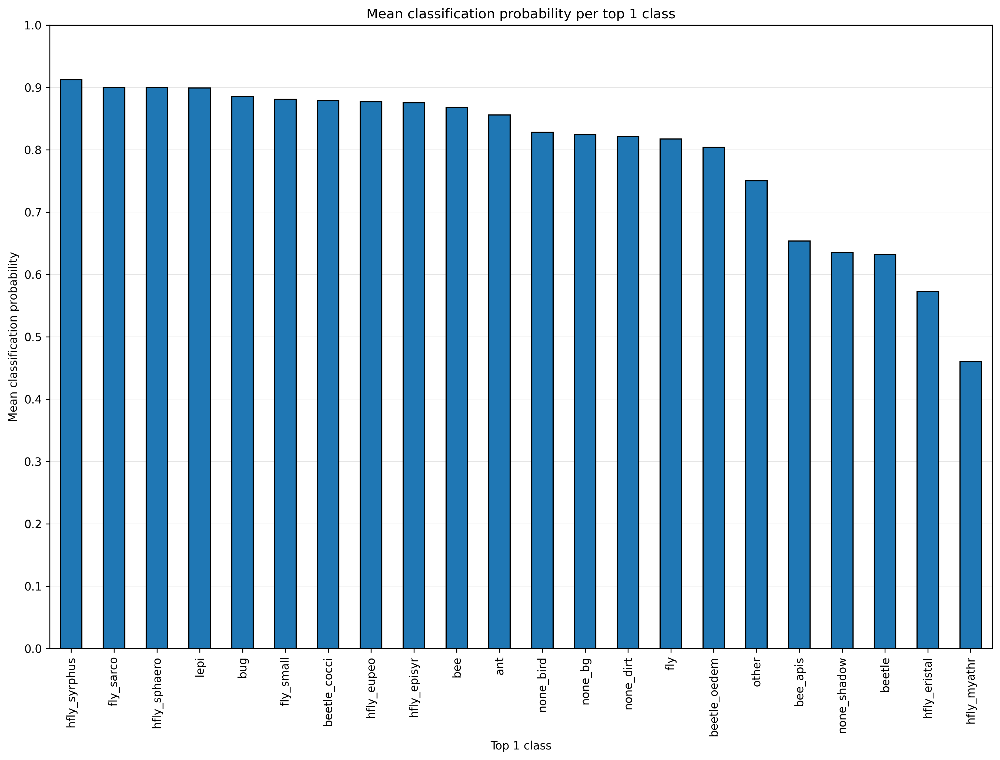

# Deployment: Analysis

As the `*metadata_classified.csv` file, generated during the
[classification](classification.md){target=_blank} step, still contains
multiple rows for each tracked insect (= `track_ID`), we will use the provided
[`csv_analysis.py`](https://github.com/maxsitt/insect-detect-ml/blob/main/csv_analysis.py){target=_blank}
script for metadata post-processing and analysis. The files generated by running
the script include a `*metadata_classified_top1_final.csv`, in which each row
corresponds to an individual tracked insect and its classification result with
the overall highest probability.

---

## Installation

It is assumed that you already followed the instructions in the
[classification](classification.md){target=_blank} step and successfully ran the
[`classify/predict.py`](https://github.com/maxsitt/yolov5/blob/master/classify/predict.py){target=_blank}
script to classify the cropped insect images and write the classification
results to `*metadata_classified.csv`.

- Navigate to the `YOLOv5-cls` folder, in which you downloaded the
  [`insect-detect-ml`](https://github.com/maxsitt/insect-detect-ml){target=_blank} repo.
- Install the required packages by running:

    ``` powershell
    py -m pip install -r insect-detect-ml-main/requirements.txt
    ```

---

## Run metadata analysis

- Navigate to the `YOLOv5-cls` folder and start the analysis script by running:

    ``` powershell
    py insect-detect-ml-main/csv_analysis.py -csv yolov5-master/runs/predict-cls/<name>/results -width 350 -height 200
    ```

    !!! tip ""

        Insert the correct name of your prediction run at `<name>`. If you used
        a platform with a different size as the small platform (350x200 mm),
        change `-width` and `-height` to your frame width/hight in mm.

    ??? info "Optional arguments"

        - `-csv` path to folder containing metadata .csv file(s)
        - `-width` absolute frame width in mm to calculate true
                   bbox size (default of 1 gives relative bbox size)
        - `-height` absolute frame height in mm to calculate true
                    bbox size (default of 1 gives relative bbox size)
        - `-min_tracks` remove tracking IDs with less than the
                        specified number of images (default = 3)
        - `-max_tracks` remove tracking IDs with more than the
                        specified number of images (default = 1800)

By default, all tracked insects (= `track_ID`) with less than 3 or more than 1800
images will be removed before saving the `*metadata_classified_top1_final.csv`.
This can exclude many false tracking IDs, e.g. insects moving too fast to be
correctly tracked ("jumping" IDs) or objects that are lying on the platform and
are incorrectly detected as insects. Depending on the speed and accuracy of the
deployed detection model, as well as the respective recording duration, adjusting
these thresholds by using the arguments `-min_tracks` and/or `-max_tracks` can result
in a more accurate estimation of insect abundance/activity (= platform visits).

---

## CSV analysis

The [`csv_analysis.py`](https://github.com/maxsitt/insect-detect-ml/blob/main/csv_analysis.py){target=_blank}
script will:

1.  **Sort metadata**:

    - read the `*metadata_classified.csv` file into pandas DataFrame
    - calculate the relative (or absolute, if frame width/height in mm is given)
      bounding box sizes and bbox length (= longer side) + bbox width (= shorter side)
    - save metadata sorted by recording ID, tracking ID and timestamp
      successively (ascending) to `*metadata_classified_sorted.csv`

2.  **Group metadata by tracking ID per recording ID and calculate for each tracking ID**:

    - number of images per top1 class
    - total number of images per tracking ID
    - mean classification probability for each top1 class
    - weighted mean classification probability for each top1 class
    - mean bbox length and bbox width for each top1 class
    - save metadata sorted by recording ID, tracking ID (ascending) and weighted
      probability (descending) successively to `*metadata_classified_top1_all.csv`

3.  **Group metadata by tracking ID per recording ID and calculate for each tracking ID**:

    - total number of images
    - date from first timestamp
    - first and last timestamp (start/end time)
    - duration [s] (end time - start time)
    - mean detection confidence
    - for the top1 class with the highest weighted probability:
        - number of images
        - name
        - mean classification probability
        - weighted classification probability
        - mean bounding box length and width
    - remove tracking IDs with less or more than the specified number of images
    - save metadata calculated for each tracking ID (per recording ID) to
      `*metadata_classified_top1_final.csv`

4.  **Save some info about the analysis run to** `*metadata_classified_analysis_info.csv`

5.  **Create and save some basic plots for a quick first data overview**

---

## Overview plots

Several plots are generated by the
[`csv_analysis.py`](https://github.com/maxsitt/insect-detect-ml/blob/main/csv_analysis.py){target=_blank}
script that can give a first overview of the post-processed metadata. For more
in-depth statistics, the final .csv file should be analyzed with software such
as [R + RStudio](https://posit.co/download/rstudio-desktop/){target=_blank}.

The plot `top1_mean_det_conf.png` can be used to find cases (e.g. small beetles
in the following example) for which the deployed detection model has a low
confidence score and additional annotated images could increase model accuracy.

{ width="700" }

The plot `top1_per_rec.png` gives a overview of the top1 classes per
recording. In the following example, lower numbers of insects at recordings
early in the day can be noticed. Also an increase of images classified as
dirt (`none_dirt`) can be observed in later recordings.

{ width="700" }

The plot `imgs_per_track.png` gives you information about the distribution of
the number of images (= tracking duration) per tracking ID. By default, all
tracked insects with less than 3 or more than 1800 images will be removed before
saving the final .csv file. You could run the `csv_analysis.py` script with the
arguments `-min_tracks 1` and `-max_tracks 9999` to plot all tracking IDs and
include them in the final .csv file.

{ width="700" }

To find cases where the accuracy of the classification model could be improved by
[retraining](../modeltraining/train_classification.md){target=_blank} with
additional images added to the basic dataset, you can inspect the plots
`top1_prob.png` and `top1_prob_mean.png`. In the following example, a relatively
low classification probability can be noticed for the classes `hfly_myathr` (but
also only few images), `hfly_eristal`, `beetle` and `bee_apis`. The classified
and sorted images in the folder `top1_classes` should be inspected in cases of
such low probabilities to find false classification results.

{ width="700" }

{ width="700" }
