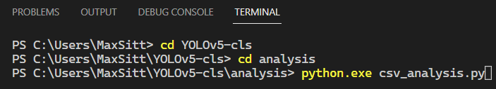
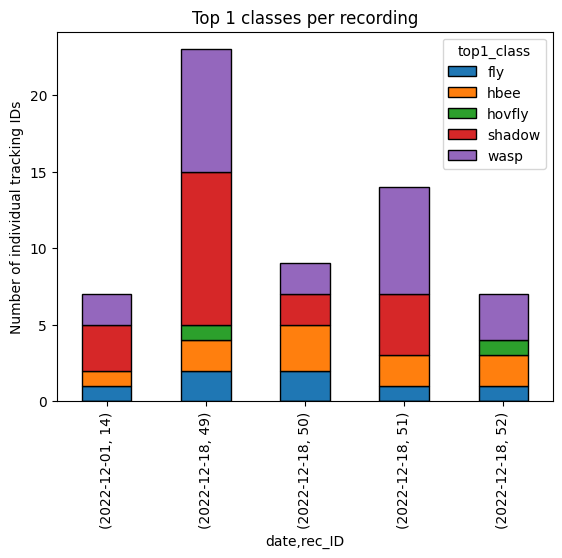
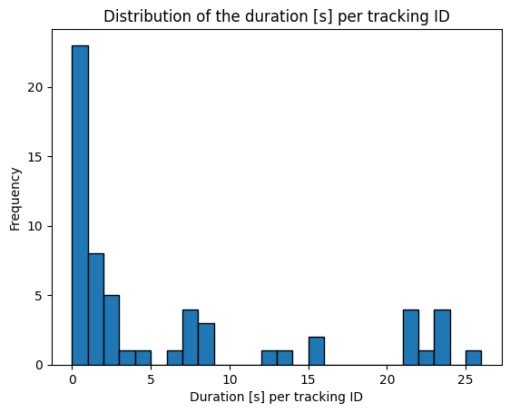
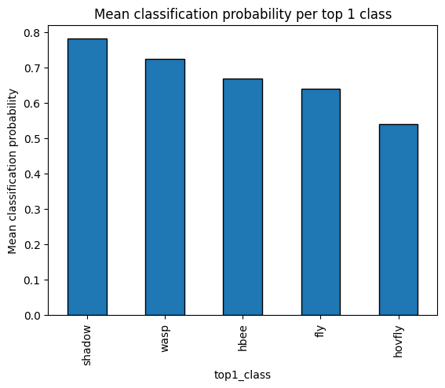

# Deployment: Analysis

As the `metadata_classified_{timestamp}.csv` file, generated during the
[classification](classification.md){target=_blank} step, still contains multiple
rows for each tracked insect (= `track_ID`), we will use the provided
[`csv_analysis.py`](https://github.com/maxsitt/insect-detect-ml/blob/main/csv_analysis.py){target=_blank}
script to automatically analyze the classified metadata .csv file. This final
processing step will yield a `metadata_classified_{timestamp}_top1.csv` file,
in which each row corresponds to an individual tracked insect and its
classification result with the overall highest probability.

It is assumed that you already followed the instructions in the
[classification](classification.md){target=_blank} step and successfully ran the
`predict_mod.py` script to classify the cropped insect detections and wrote the
classification results to `metadata_classified_{timestamp}.csv`.

- Create a new folder in your working directory, e.g. `YOLOv5-cls\analysis`.
- Copy the `metadata_classified_{timestamp}.csv` file to the `analysis` folder.
- Copy the `csv_analysis.py` script from the
  [`insect-detect-ml` GitHub repo](https://github.com/maxsitt/insect-detect-ml){target=_blank}
  to the `analysis` folder.
- Navigate to the `YOLOv5-cls\analysis` folder and start the analysis script by running:

    ``` powershell
    python.exe csv_analysis.py
    ```

{ width="600" }

!!! info "Optional arguments"

    - `-width` to set absolute ("true") frame width in mm to calculate
      absolute bbox size in mm (e.g. `-width 500` if you are using the provided
      [flower platform](https://github.com/maxsitt/insect-detect-docs/tree/main/PDF_templates/flower_platform/flower_platform_big_500x280){target=_blank}
      dimensions; default of 1 gives relative bbox size)
    - `-height` to set absolute ("true") frame height in mm to calculate
      absolute bbox size in mm (e.g. `-height 280` if you are using the provided
      [flower platform](https://github.com/maxsitt/insect-detect-docs/tree/main/PDF_templates/flower_platform/flower_platform_big_500x280){target=_blank}
      dimensions; default of 1 gives relative bbox size)
    - `-min_tracks` to remove tracking IDs with less than the specified number
      of images (e.g. `-min_tracks 1` to keep the original data; default = 3)
    - `-max_tracks` to remove tracking IDs with more than the specified number
      of images (default = 1800)

The `csv_analysis.py` script will automatically analyze the first
`metadata_classified_{timestamp}.csv` file in the current directory in alphabetical order.

---

## CSV analysis

The [`csv_analysis.py`](https://github.com/maxsitt/insect-detect-ml/blob/main/csv_analysis.py){target=_blank}
script will:

1.  **Sort metadata**:
    - read the `metadata_classified*.csv` file from the current directory into a
      pandas DataFrame
    - calculate the relative (or absolute, if frame width/height in mm is given)
      bounding box sizes and bbox length (= longer side) + bbox width (= shorter side)
    - save the metadata sorted by recording ID, tracking ID and timestamp
      successively (ascending) to `metadata_classified*_sorted.csv`

2.  **Group the metadata by tracking ID per recording ID and calculate for each tracking ID**:
    - total number of images
    - number of images per top1 class
    - mean classification probability for each top1 class
    - weighted mean classification probability for each top1 class
    - mean bbox length and bbox width for each top1 class
    - save the metadata sorted by recording ID, tracking ID and weighted
      probability successively (ascending) as `metadata_classified*_top1_all.csv`

3.  **Group the metadata by tracking ID per recording ID and calculate for each tracking ID**:
    - mean detection confidence score
    - first and last timestamp (start/end time)
    - duration [s] of the tracking (end time - start time)
    - for the top1 class with the highest weighted probability:
        - number of images
        - name
        - mean classification probability
        - weighted classification probability
        - mean bounding box length and width
    - remove tracking IDs with less or more than the specified number of images
    - save the metadata calculated for each tracking ID (per recording ID) as
      `metadata_classified*_top1.csv`

4.  **Save some info about the analysis run to** `metadata_classified*_analysis_info.csv`

5.  **Create and save some basic plots for a quick first data overview**

---

## Overview plots

Several plots are generated by the `csv_analysis.py` script that can give a
first overview of the analyzed data. This is however no alternative to a
thorough exploration and analysis of the data, e.g. with
[R](https://cran.r-project.org/){target=_blank}.

{ width="500" }

By default, all tracked insects (= unique `track_ID`) with less than 3 or more
than 1800 images will be removed from the final `metadata_classified*_top1.csv`.
This can exclude many false tracking IDs, e.g. insects moving too fast to be
correctly tracked or objects that are lying on the platform and are incorrectly
detected as insects. Depending on the speed and accuracy of the deployed
detection model and the respective recording duration, adjusting these thresholds
(by using the optional arguments `-min_tracks` and/or `-max_tracks`) can result
in more accurate data on insect abundance/activity. You could also run the
`csv_analysis.py` script with `-min_tracks 1` to keep the original data and
take a look at the distribution of the number of images per tracking ID.

{ width="500" }

The duration per tracking ID could additionally be used for filtering the data
in a subsequent step.

{ width="500" }

To find cases where the classification model could be further enhanced by
[retraining](../modeltraining/yolov5.md){target=_blank} with new image data,
you can take a look at the mean classification probability per top1 class.

{ width="500" }
