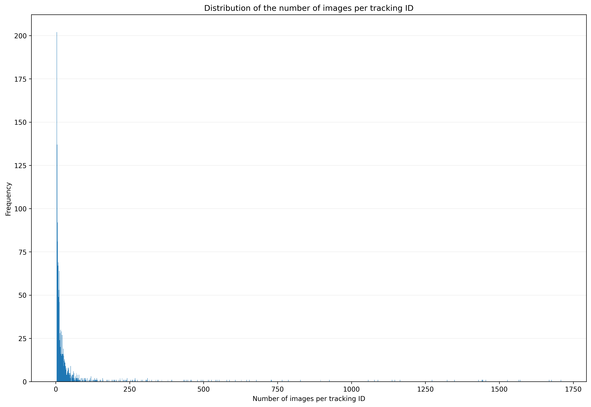

# Deployment: Analysis

As the classified metadata .csv file, generated during the
[classification step](classification.md){target=_blank}, still contains multiple
rows for each tracked insect (= track_ID), we will use the provided
`csv_analysis.py` script to automatically analyze the classified metadata .csv
file. This final processing step will yield a .csv file in which **each row
corresponds to an individual tracked insect and its classification result with
the overall highest probability**.

- Create a folder in your working directory, e.g. `YOLOv5-cls\analysis`.
- Paste the `metadata_classified*.csv` file from the
  [previous step](classification.md){target=_blank} into the `analysis` folder.
- Download the provided `csv_analysis.py` script from the
  [`insect-detect-ml` GitHub repo](https://github.com/maxsitt/insect-detect-ml){target=_blank}
  and paste it into the `analysis` folder.
- The `csv_analysis.py` script will automatically analyze the first
  `metadata_classified*.csv` file in the current directory in alphabetical order.

Open the Terminal (PowerShell) in VS Code, navigate to the
`YOLOv5-cls\analysis` folder and start the analysis script by running:

``` powershell
python.exe csv_analysis.py
```

{ width="600" }

---

## CSV analysis

The `csv_analysis.py` script will:

1.  **Sort metadata**:
    - read the `metadata_classified*.csv` file in the current directory into a
      pandas DataFrame
    - calculate the relative (or absolute, if frame width/height in mm is given)
      bounding box sizes and bbox length (= longer side) + bbox width (= shorter side)
    - save the metadata sorted by recording ID, tracking ID and timestamp
      successively (ascending) as `metadata_classified*_sorted.csv`

2.  **Group the metadata by tracking ID per recording ID and calculate for each
    tracking ID**:
    - total number of images
    - number of images per top1 class
    - mean classification probability for each top1 class
    - weighted mean classification probability for each top1 class
      (`(images_top1 class / images_tracking ID) * mean classification probability`)
    - mean bbox length and bbox width for each top1 class
    - save the metadata sorted by recording ID, tracking ID and weighted
      probability successively (ascending) as `metadata_classified*_top1_all.csv`

3.  **Group the metadata by tracking ID per recording ID and calculate for each
    tracking ID**:
    - mean detection confidence score
    - first and last timestamp (start/end time)
    - duration [s] of the tracking (end time - start time)
    - for the top1 class with the highest weighted probability:
        - number of images
        - name
        - mean classification probability
        - weighted classification probability
        - mean bounding box length and width
    - save the metadata calculated for each tracking ID (per recording ID) as
      `metadata_classified*_top1.csv`

4.  **Create and save some basic plots for a quick first data overview**

---

## Overview plots

Several plots are generated by the `csv_analysis.py` script that can give a
first overview of the analyzed data. This is however no alternative to a
thorough exploration and analysis of the data, e.g. with
[R](https://cran.r-project.org/){target=_blank}.

{ width="500" }

No data is filtered out during the automated analysis, but it is recommended to
omit individual insect detections/tracklets with less than two images per
tracking ID, which will make the subsequent analysis more robust against false
detections.

{ width="500" }

The duration per tracking ID could be also used for filtering the data.

{ width="500" }

To find cases where the classification model could be further enhanced by
[retraining](../modeltraining/yolov5.md){target=_blank} with new image data,
you could take a look at the mean classification probability per top1 class.

{ width="500" }
