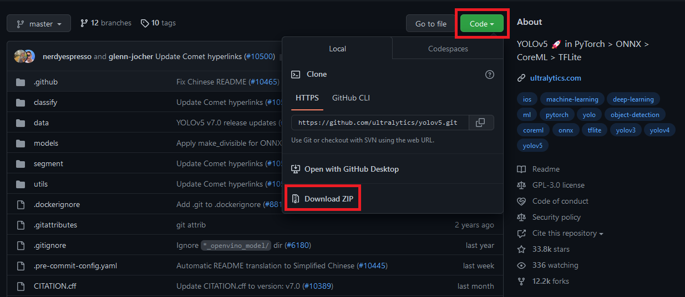
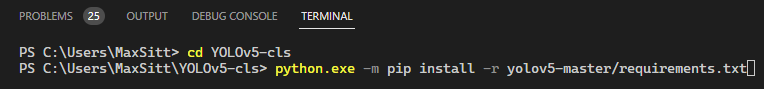
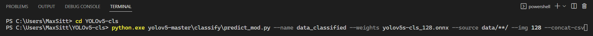

# Deployment: Classification

The **Insect Detect** DIY camera trap system for automated insect monitoring will
yield cropped detections of individual insects saved as .jpg files and relevant
[metadata](detection.md#metadata-csv){target=_blank} saved to .csv for each
recording event when using the provided script for
[automated monitoring](../software/programming.md#automated-monitoring-script){target=_blank}.

The recommended [processing pipeline](detection.md#processing-pipeline){target=_blank}
uses a [YOLOv5n](../index.md#detection-models){target=_blank} detection model with only
one generic class ("insect"), as the low input resolution would result in a low
classification accuracy in most cases. The detections are then cropped from HQ frames
with a high enough resolution to enable good classification results in a subsequent
step on your local PC, using a [YOLOv5s-cls](../index.md#classification-model){target=_blank}
image classification model exported to
[ONNX format](https://github.com/ultralytics/yolov5/issues/251){target=_blank}
for faster CPU inference.

---

## Local setup

??? warning "Local OS"

    All of the software and installation processes were only tested on a
    **Windows 11** computer. For Mac and Linux users some some steps might
    be different to what is shown in these instructions.
    
    If you run into any problems with the software setup, please
    [post an issue](https://github.com/maxsitt/insect-detect-ml/issues){target=_blank}
    at the GitHub repo.

To be able to run the image classification and subsequent
[analysis](analysis.md){target=_blank} Python scripts on your computer,
install [Python 3.11](https://www.python.org/downloads/windows/){target=_blank}
to your PC. If you followed the steps in the
[Software](../software/localsetup.md){target=_blank} section, you already have
VS Code installed together with the [Python](https://bit.ly/2Zm3Ypq){target=_blank}
extension. Activate Python in VS Code by pressing ++f1++ to open the Command Palette
and start typing the `Python: Select Interpreter` command and select it. You can find a
[Getting started tutorial](https://code.visualstudio.com/docs/python/python-tutorial){target=_blank}
and more information on
[Python in VS Code](https://code.visualstudio.com/docs/languages/python){target=_blank}
at the official VS Code website.

After VS Code and Python are installed on your system, download the
[YOLOv5 repository](https://github.com/ultralytics/yolov5){target=_blank}
from GitHub as .zip file or `git clone` it, if you have
[git](https://git-scm.com/){target=_blank} installed.

{ width="800" }

- Create the new folder `C:\Users\<username>\YOLOv5-cls`.
- Extract the `yolov5-master.zip` file to the folder `C:\Users\<username>\YOLOv5-cls`.
- Open a new Terminal (PowerShell) in VS Code, navigate to the `YOLOv5-cls` folder
  and install the required Python packages for YOLOv5 by running:

    ``` powershell
    python.exe -m pip install -r yolov5-master/requirements.txt
    ```

{ width="800" }

---

## Run image classification

To be able to use the direct output (.jpg images and .csv metadata) from the
[automated monitoring script](../software/programming.md#automated-monitoring-script){target=_blank},
download the [`insect-detect-ml` GitHub repo](https://github.com/maxsitt/insect-detect-ml){target=_blank}.
We will use the
[`predict_mod.py`](https://github.com/maxsitt/insect-detect-ml/blob/main/predict_mod.py){target=_blank}
script together with the `yolov5s-cls_128.onnx` image classification model
to classify all cropped insect images in the `data` folder from your
Raspberry Pi and append the classification results to the merged
metadata .csv files or write them to a new .csv file.

- Copy the `yolov5s-cls_128.onnx` model into the `YOLOv5-cls` folder.
- Copy your `data` folder, saved from the Raspberry Pi's SD card (e.g. with the
  [DiskInternals LinuxReader](../software/localsetup.md#diskinternals-linuxreader){target=_blank})
  into the `YOLOv5-cls` folder. Please make sure that **only cropped detections**
  are present, if you additionally saved full HQ frames (with `-raw` or
  `-overlay`), save them to a different directory and delete them before
  running the classification script.
- Copy the `predict_mod.py` script to `YOLOv5-cls\yolov5-master\classify`.
- Navigate to the `YOLOv5-cls` folder and start the classification script by running:

    ``` powershell
    python.exe yolov5-master\classify\predict_mod.py --name data_classified --weights yolov5s-cls_128.onnx --source data/**/ --img 128 --concat-csv
    ```

{ width="800" }

!!! info "Optional arguments"

    - `--concat-csv` to concatenate all metadata .csv files and
      append classification results to new columns
    - `--new-csv` to create a new .csv file with classification results,
      e.g. if no metadata .csv files are available
    - `--sort-top1` to sort classified images to folders with predicted top1
      class as folder name and do not write results on to image as text (which
      is the default configuration)
    - `--save-txt` to save the classification results to individual .txt files
      for each image

All metadata .csv files in the `data` folder will be concatenated,
classification results (top3 classes + probabilities) written to new columns
and saved as single `metadata_classified_{timestamp}.csv` file in the
`YOLOv5-cls` folder. If you used `--sort-top1` as optional argument, you will
find the images sorted to top1 class in the directory
`YOLOv5-cls\yolov5-master\runs\predict-cls\data_classified\top1_classes`. This
allows for a quick identification of edge cases (e.g. insect taxa that were
classified to the wrong class) and these images can be used to
[retrain](../modeltraining/yolov5.md){target=_blank} your classification model.

The classified metadata .csv file still contains multiple rows for each tracked insect
(= track_ID). In the [last processing step](analysis.md){target=_blank}, we will use the
[`csv_analysis.py`](https://github.com/maxsitt/insect-detect-ml/blob/main/csv_analysis.py){target=_blank}
script to automatically analyze the classified metadata .csv file and calculate
the respective class with the overall highest probability for each tracked insect.
This step will yield the final .csv file in which each row corresponds to an
individual tracked insect.
