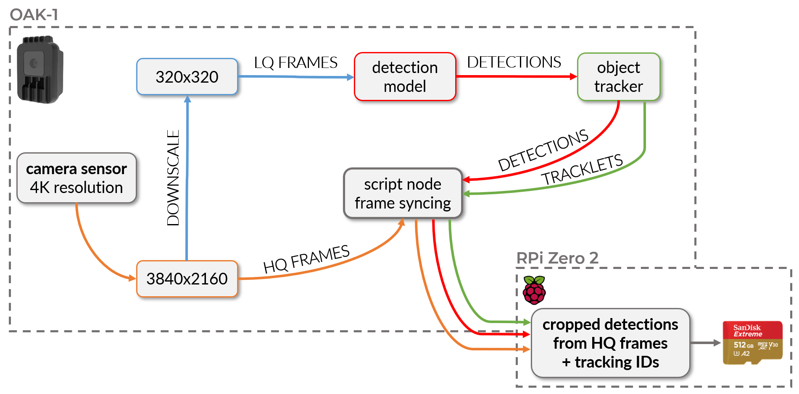
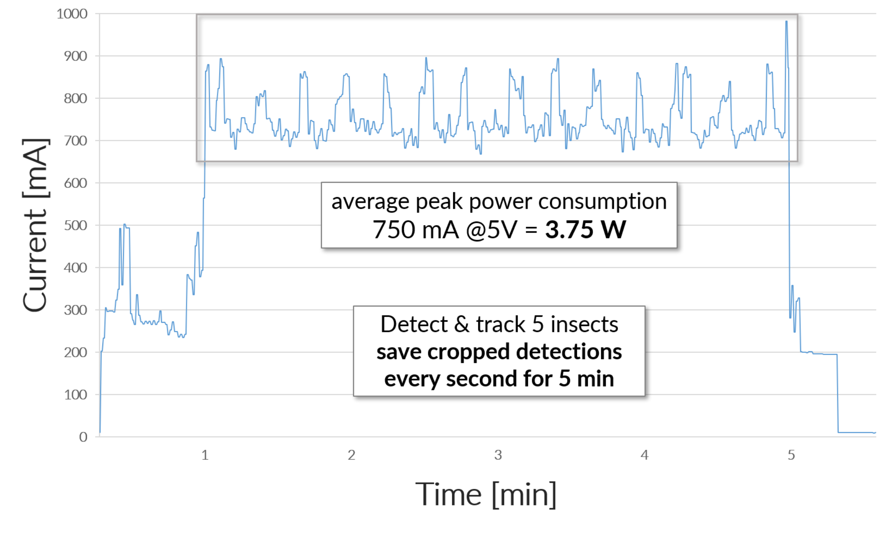

# Deployment: Detection

One of the biggest challenges for automated insect monitoring by running
model inference on devices with relatively low computational power, is to
find the right balance between speed (fps) and accuracy of the detection
and classification results. A high speed or image throughput is necessary
for the object tracker to work correctly, as it depends on the information
(bounding box coordinates) coming from the detection model. If the speed
(fps) of the model output is too low, fast moving insects can not be
properly tracked, which will lead to "jumping" tracking IDs and thereby
multiple counting of a single individual.

Model speed can be increased by choosing **small models** with fewer parameters
(e.g. YOLOv5n) and **decreasing the resolution** of frames that are used as
input for the model (e.g. 320x320 pixel). However, the reduced image resolution
can significantly decrease the detection and especially classification accuracy.
This effect is even stronger when dealing with very small objects like insects.

A possible solution to this problem could be to use a smaller field of view
(FOV), e.g. by using a small flower platform and short distance between
platform and camera. This would however decrease the efficiency of the visual
attraction and fewer insects could be recorded in the same time frame. In the
following, an alternative approach to this problem is proposed.

---

## Processing pipeline

The OAK-1 camera and
[DepthAI Python API](https://docs.luxonis.com/projects/api/en/latest/){target=_blank}
make it possible to run a low-quality (LQ) stream (e.g. 320x320 px) in parallel
with a high-quality (HQ) stream (e.g. 1920x1080 px) and
[synchronize the detections](../software/programming.md#automated-monitoring-script){target=_blank}
made on the LQ stream with the frames from the HQ stream on-device. This
approach enables the use of the LQ stream as input for a YOLO detection model
to increase the possible inference speed, which in turn also increases the
performance and accuracy of the
[object tracker](https://docs.luxonis.com/projects/api/en/latest/components/nodes/object_tracker/){target=_blank}.

<figure markdown>
  { width="800" }
  <figcaption>HQ frames are downscaled and used as model input, while detections are
              synchronized with and cropped from HQ frames to be saved to the RPi SD
              card together with all relevant metadata</figcaption>
</figure>

As the insects in these LQ frames often miss visual features that would be
important for a good classification accuracy, it is recommended to use
only **one generic class** ("insect") for the detection model training and
inference. To still be able to classify the detected insects in a subsequent
step, the detections (= bounding box coordinates) and tracklets (= tracking ID)
are synchronized with the HQ stream in real time on-device. In this way it is
possible to crop the detected insects (area of the bounding box) from the HQ
frames and save them as individual .jpg files (e.g. every second). The
**cropped detections** have a high enough resolution for accurate
[classification](classification.md){target=_blank} in a subsequent step on
your local PC.

{ width="800" }

Separating the detection and classification steps can also simplify dataset
management, annotation and model training. Overall less training data is
sufficient for good detection results, as no classes have to be distinguished
by the detection model. You can directly use the cropped detections as input
for a growing image dataset to [train](../modeltraining/train_classification.md){target=_blank}
new insect classification models, just by sorting them to folders with the
respective class name (e.g. insect taxon).

---

## Metadata .csv

For each cropped detection that is saved to .jpg, a new row with relevant
metadata is appended to a metadata .csv file that is created for each recording
event. This metadata includes:

- `rec_ID`, calculated with the number of already existing recording folders
  to distinguish each recording event. This is important, as the unique
  tracking IDs will restart from 1 for each recording interval and the metadata
  .csv files will be merged during the automated
  [classification step](classification.md){target=_blank}.
- `timestamp` with exact recording time.
- `label` is negligible if a detection model with only one class is used, but
  enables the deployment of a multi-class detection model.
- `confidence` score can be used to evaluate the quality of the detection
  results, e.g. to find examples where the model is uncertain or to filter only
  detections above a specific confidence score threshold.
- `track_ID` that is assigned by the object tracker node to each individual
  insect. As cropped detections are saved in short time intervals (e.g. every
  second), many images can exist of an individual tracked insect, dependent on
  its duration of stay on the flower platform. All of these images are classified
  in the [next step](classification.md){target=_blank} and the class with the
  highest weighted probability is then calculated in the final step by using the
  [`process_metadata.py`](https://github.com/maxsitt/insect-detect-ml/blob/main/process_metadata.py){target=_blank} script.
- `x_min`, `y_min`, `x_max`, `y_max` relative bounding box coordinates.
  These coordinates make it possible to calculate the relative bounding box
  size. If the absolute frame dimensions (e.g. size of the flower platform in mm)
  are used as argument for the
  [`process_metadata.py`](https://github.com/maxsitt/insect-detect-ml/blob/main/process_metadata.py){target=_blank}
  script, the absolute average bounding box size in mm is calculated for each detection.
- `file_path` to the cropped detection, saved as .jpg.

| rec_ID | timestamp                                                          | label  | confidence | track_ID | x_min  | y_min  | x_max  | y_max  | file_path                                                                                                                                    |
| ------ | ------------------------------------------------------------------ | ------ | ---------- | -------- | ------ | ------ | ------ | ------ | -------------------------------------------------------------------------------------------------------------------------------------------- |
| 1      | 20221201_16-41-02.393074 | insect | 0.87       | 1        | 0.5647 | 0.5357 | 0.6321 | 0.6132 | ./insect-detect/data/20221201/20221201_16-40/cropped/insect/20221201_16-41-02.393074_1_cropped.jpg |

---

## Power consumption

Due to a relatively low power consumption of the hardware components, the whole
camera trap system (OAK-1 + Raspberry Pi Zero 2 W + PiJuice Zero pHAT) has a
mean peak power consumption of **~4.4 W** under full load, when running the provided
[monitoring script](../software/programming.md#automated-monitoring-script){target=_blank}.

<figure markdown>
  { width="700" }
  <figcaption>Power consumption of the whole system during a 5 min recording
              interval, while constantly detecting and tracking 5 individual
              insects and saving the cropped detections to .jpg every second</figcaption>
</figure>
