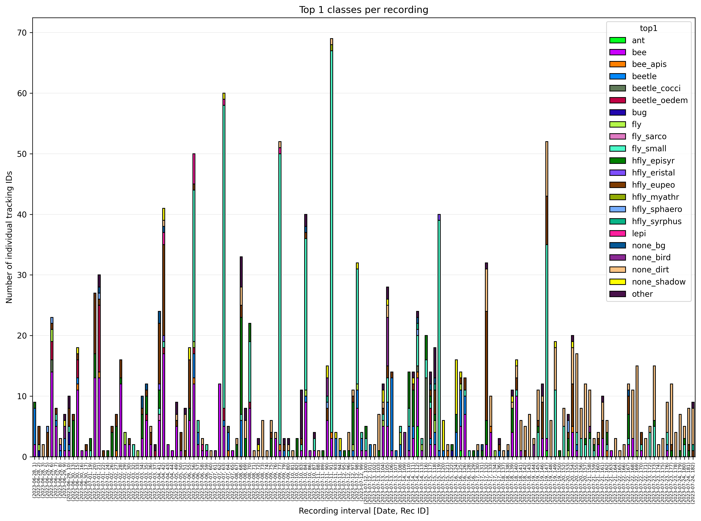

# Deployment: Post-Processing

As the `*metadata_classified.csv` file, generated during the
[classification](classification.md){target=_blank} step, still contains
multiple rows for each tracked insect (= `track_ID`), we will use the
[`process_metadata.py`](https://github.com/maxsitt/insect-detect-ml/blob/main/process_metadata.py){target=_blank}
script for metadata post-processing.

The output of the script includes a `*top1_final.csv` file in which each row
corresponds to an individual tracked insect and its classification result
with the highest weighted probability.

---

## Installation

It is assumed that you already followed the instructions in the
[classification](classification.md){target=_blank} step and successfully ran the
[`classify/predict.py`](https://github.com/maxsitt/yolov5/blob/master/classify/predict.py){target=_blank}
script to classify the cropped insect images and write the classification
results to `*metadata_classified.csv`.

- Navigate to the `YOLOv5-cls` folder, in which you downloaded the
  [`insect-detect-ml`](https://github.com/maxsitt/insect-detect-ml){target=_blank} repo.
- Install the required packages by running:

    ``` powershell
    py -m pip install -r insect-detect-ml-main/requirements.txt
    ```

---

## Run metadata post-processing

- Navigate to the `YOLOv5-cls` folder and start the post-processing script by running:

    ``` powershell
    py insect-detect-ml-main/process_metadata.py -source yolov5-master/runs/predict-cls/<NAME>/results -size 350 200 -images 3 1800
    ```

    !!! tip ""

        Insert the correct name of your prediction run at `<NAME>`. If you used
        a platform with a different size as the small platform (350x200 mm),
        change `-size` to your frame width + hight in mm accordingly.

    ??? info "Optional arguments"

        - `-source` set path to directory containing metadata
                    .csv file(s) with classification results
        - `-size` set absolute frame width and height in mm to calculate
                  true bbox size (default: relative bbox size)
        - `-images` remove tracking IDs with less or more
                    than the specified number of images
        - `-duration` remove tracking IDs with less or more
                      than the specified duration in seconds

When using the default capture frequency of one second, it is highly recommended
to use `-images 3 1800` to remove all tracked insects (= `track_ID`) with less
than 3 or more than 1800 images before saving the `*top1_final.csv`.

This can exclude many false tracking IDs, e.g. insects moving too fast to be
correctly tracked ("jumping" IDs) or objects that are lying on the platform and
are incorrectly detected as insects. Depending on the speed and accuracy of the
deployed detection model, as well as the capture frequency and respective recording
duration, adjusting these thresholds or using the `-duration` argument instead, can
result in a more accurate estimation of insect abundance/activity (= platform visits).

---

## Overview plots

Several plots are generated by the
[`process_metadata.py`](https://github.com/maxsitt/insect-detect-ml/blob/main/process_metadata.py){target=_blank}
script that can give a first overview of the post-processed metadata. For more
in-depth statistics, the final .csv file should be analyzed with software such
as [R + RStudio](https://posit.co/download/rstudio-desktop/){target=_blank}.

The plot `top1_mean_det_conf.png` can be used to find cases (e.g. small beetles
in the following example) for which the deployed detection model has a low
confidence score and additional annotated images could increase model accuracy.

{ width="700" }

The plot `rec_id_top1.png` gives a overview of the top1 classes per
recording. In the following example, lower numbers of insects at recordings
early in the day can be noticed. Also an increase of images classified as
dirt (`none_dirt`) can be observed in later recordings.

{ width="700" }

The plot `track_images.png` gives you information about the distribution of
the number of images (= tracking duration) per tracking ID. It is recommended
to remove all tracked insects with less than 3 or more than 1800 images before
saving the final .csv file. You can also run the `process_metadata.py` script
without the argument `-images` or `-duration` to plot all tracking IDs and
include them in the final .csv file.

{ width="700" }

To find cases where the accuracy of the classification model could be improved by
[retraining](../modeltraining/train_classification.md){target=_blank} with
additional images added to the basic dataset, you can inspect the plots
`top1_prob.png` and `top1_prob_mean.png`. In the following example, a relatively
low classification probability can be noticed for the classes `hfly_myathr` (but
also only few images), `hfly_eristal`, `beetle` and `bee_apis`. The classified
and sorted images in the folder `top1_classes` should be inspected in cases of
such low probabilities to find false classification results.

{ width="700" }

{ width="700" }
