# Mounting Setup

??? abstract "Required Tools & Components"

    **Tools**

    1. Rubber Hammer
    2. Allen Keys (3 mm, 5 mm, 6 mm)
    3. Crosshead Screwdriver
    4. Drilling Machine + 8 mm Metal Drill Bit (if holes in Steel L-profile are smaller than 8 mm)
    5. Metal Saw (if Steel L-profile needs to be cut to 50 cm length)

    **Components**

    1. Insect Detect 2024 Aluminium Mount (multiple parts)
    2. Steel L-profile (50 cm)
    3. Electronics Enclosure (with integrated hardware and attached to HPL sheet)
    4. Camera Enclosure (with integrated OAK camera and attached to HPL sheet)
    5. Voltaic Solar Panel 5 Watt 6 Volt
    6. Voltaic Solar Panel Bracket - Medium
    7. Voltaic ETFE Panel Screws & Washers
    8. **5x** Screw M4, internal hexagon (16 mm)
    9. **2x** Screw M8, internal hexagon (16 mm)
    10. **5x** Washer (4.3x15x1 mm)
    11. **2x** Washer (8.4x24x2 mm)
    12. **2x** Alu Square Tube, 13.5 mm (250 mm)
    13. **5x** Alu Square Tube, 13.5 mm (120 mm)
    14. **4x** Connector, 13.5 mm (right angle)
    15. **2x** Connector, 13.5 mm (+ outlet)
    16. HPL Sheet, green (14x14 cm)
    17. **~720 mm** Magnetic Tape, <13.5 mm
    18. [Components for Platform Design](#2-platform)

## 1 Insect Detect 2024 Mount

We recommend our field-tested mounting solution for highly customizable camera
trap setups, using either easily exchangeable platforms as attractant and
background for insect detection & tracking, or optionally any other background
of choice, e.g. real flowers (suitable detection model required!). The Insect
Detect 2024 Mount is based on robust high-quality aluminium components and can
be easily modified in many ways. It enables free adjustment of the camera
height/angle and is stabilized with a soil anchor.

The [item project](https://i24.ws/0rN9vuwC){target=_blank} includes all required
components including necessary machining (account required, but you can also
download the
[project overview](https://github.com/maxsitt/insect-detect-docs/blob/main/PDF_templates/Insect_Detect_mount_2024.pdf){target=_blank}
first). You can use the item Engineeringtool to easily edit the proposed mounting
solution and adapt it to your needs.

<figure markdown="span">
  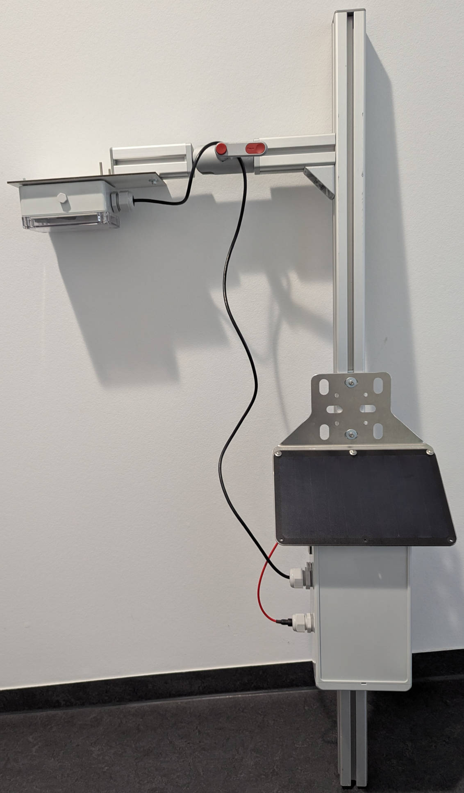{ width="400" }
  <figcaption>Fully assembled Insect Detect 2024 Mount</figcaption>
</figure>

### 1.1 Camera Holder

We will start with putting the two caps on one of the end faces of the longer
profile and on the end face **without** drilled M8 thread of one of the shorter
profiles. Position the caps and use a rubber hammer to fix them to the profiles.

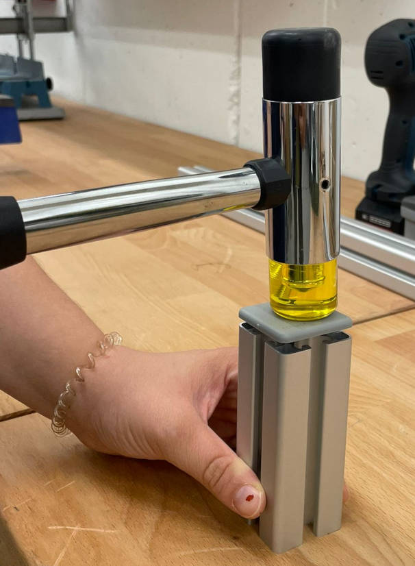{ width="400" }

Take the short profile with cap and slide one of the M4 T-Slot nuts into the groove.

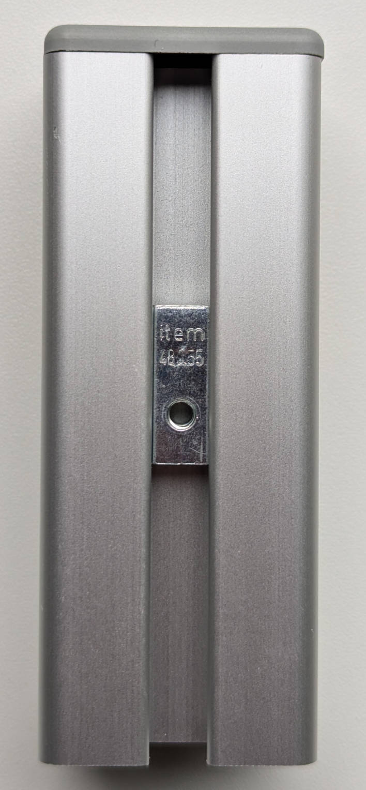{ width="600" }

Get the two ball joints + M8 screws and use a 6 mm allen key to connect them to
the side of the short profiles with drilled M8 thread.

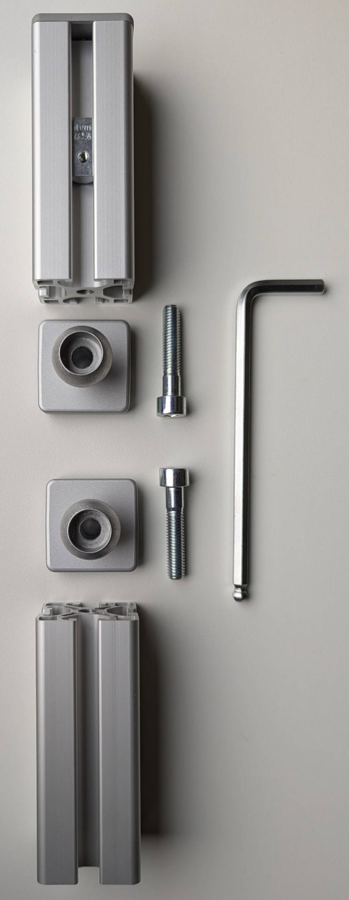{ width="600" }

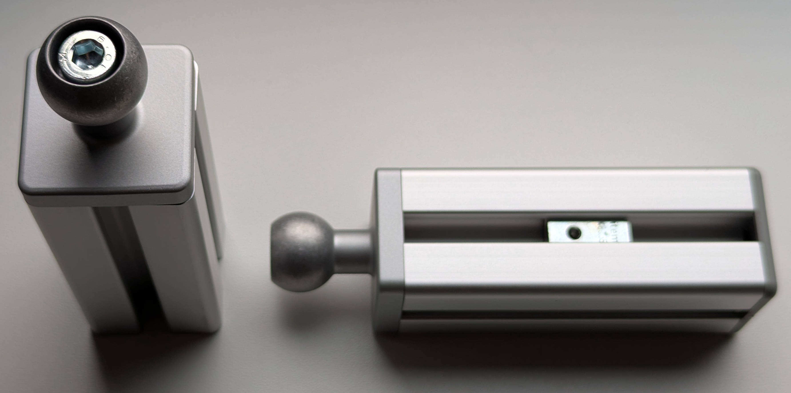{ width="600" }

For the next step, get the angle bracket set and the short profile without cap.
Slide one of the M8 T-Slot nuts into the groove of the profile and use a 5 mm
allen key to connect the angle bracket to it with one of the M8 screws + square
washer. Don't fasten it too tight yet, we will do this in the next step.
We won't use the grey cap that comes with the set, but you can optionally put
it on the angle bracket later for long-term field deployment.

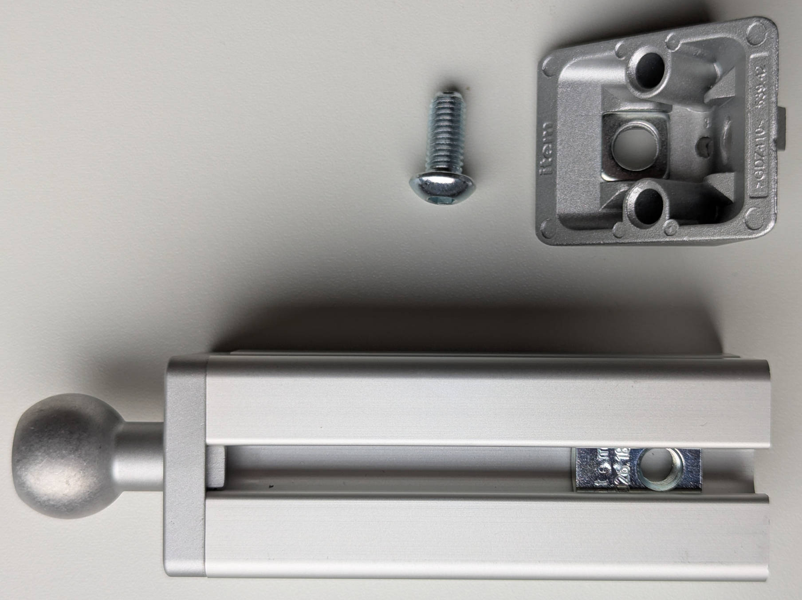{ width="600" }

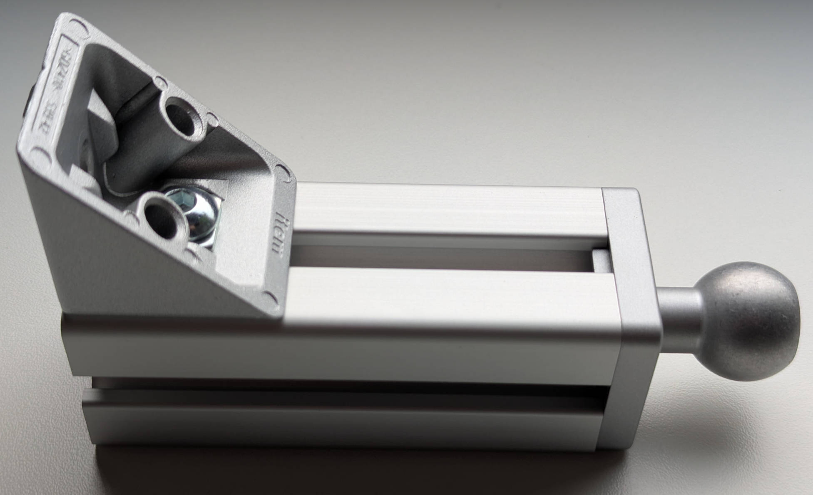{ width="600" }

Slide the second M8 T-Slot nut into any groove of the long profile and connect
the angle bracket (+ short profile) to it with the second M8 screw + square
washer. Loosen the angle bracket screw in the short profile a little bit and
push the short profile towards the long profile, so that it sits flush. Now you
can fasten both screws. In the field, you will only need to loosen the screw
that is connected to the long profile to set the height of the camera.

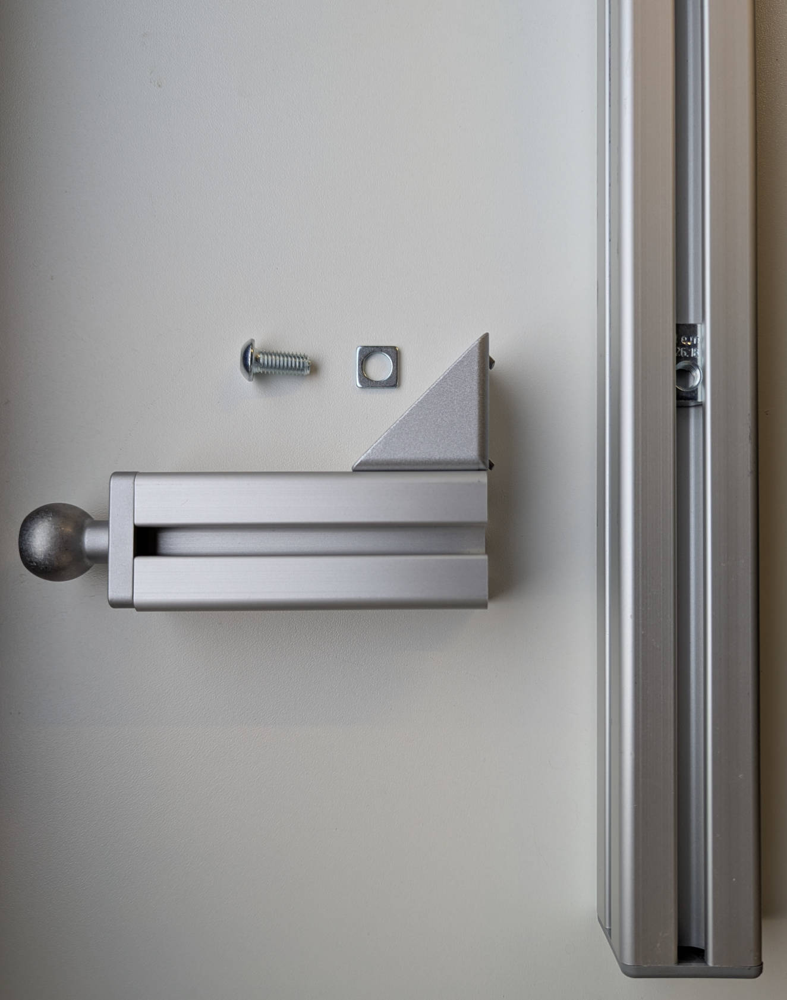{ width="600" }

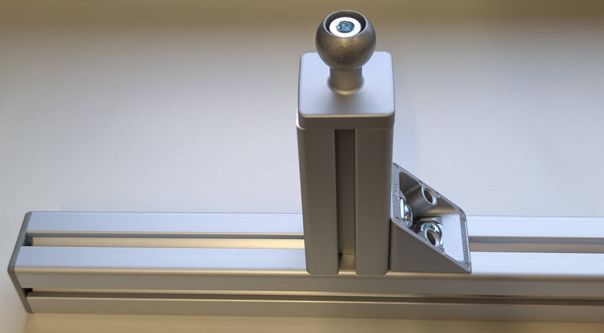{ width="600" }

Get the ball joint basic unit and unscrew the clamp lever to separate both
halves. Put them around both ball joints while making sure that the open end is
facing towards the short profile with cap. Screw the clamp lever into the basic
unit again to connect both of the short profiles. By pushing the red button on
the lever, you can change its position without loosening the screw.

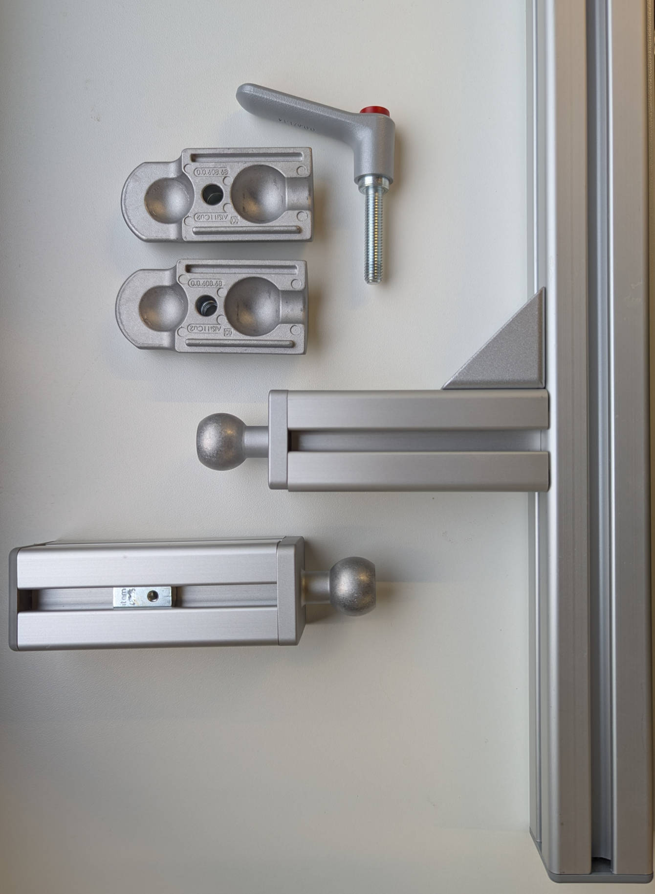{ width="600" }

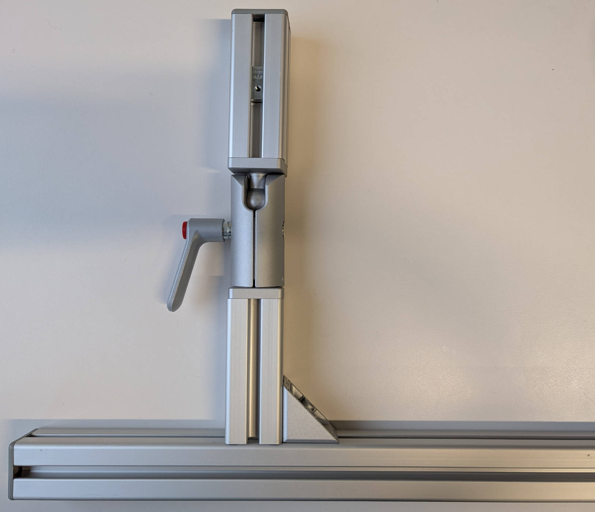{ width="600" }

---

### 1.2 Soil Anchor

We are using a 50 cm perforated steel L-profile as soil anchor for the camera
trap mount. Depending on the length of your L-profile, you might need to cut it
to 50 cm using a metal saw. You may find a L-profile with 8 mm (or larger) holes,
which is perfect. If the holes are smaller, you will need to drill two holes with
a 8 mm metal drill bit, as shown in the following image.

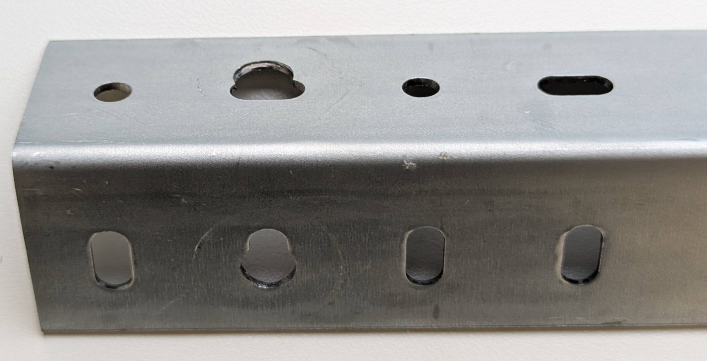{ width="600" }

Slide one of the M8 heavy-duty T-Slot nuts into the groove on the opposite side
of the camera holder. Slide the other M8 T-Slot nut into the groove on the right
side of the camera holder.

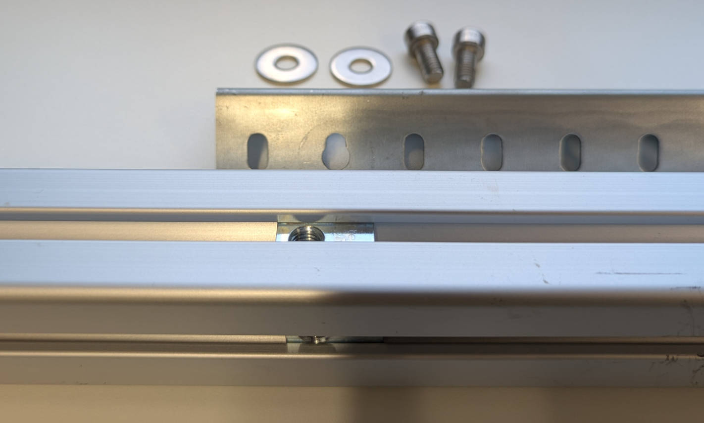{ width="600" }

Put the steel L-profile on the long aluminium profile and align the T-Slot nuts
with the holes in the L-profile. Use a 6 mm allen key to fix the L-profile to
the aluminium profile with the two M8 16 mm screws + 8.4 mm washers.

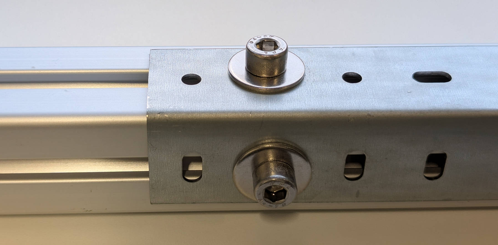{ width="600" }

By loosening the screws, you can slide the soil anchor in or out and determine
its length, e.g. depending on the type of soil (shallow/deep). For storage and
transportation, slide the soil anchor completely onto the aluminium profile.

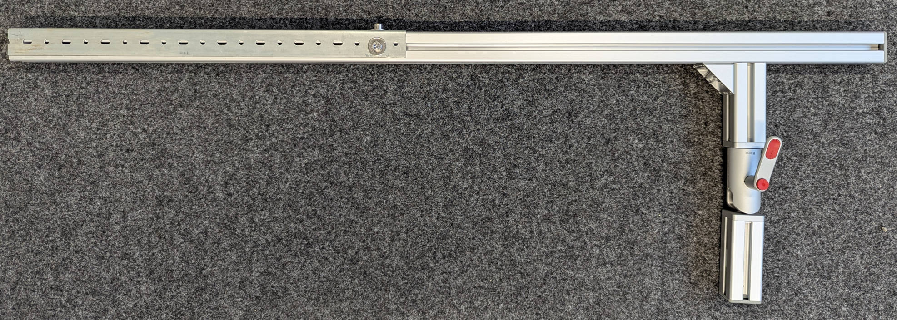{ width="750" }

---

## 2 Platform

At the moment we are using a green 14x14 cm platform with
[round stickers](https://www.avery-zweckform.com/blanko-etiketten/rund-51-mm){target=_blank}
("Folie Wetterfest Weiß") which were painted with three different colors that
already proved their attraction efficiency in multiple studies (e.g.
[Krahner et al., 2021](https://doi.org/10.1016/j.ecolind.2021.107573){target=_blank};
[Westphal et al., 2008](https://doi.org/10.1890/07-1292.1){target=_blank}).
We first used "Sparvar 1315 Grundierung Weiß" as primer and then "Sparvar 3104
Gelb Leuchtspray" for the yellow, "Sparvar 3107 Blau Leuchtspray" for the blue
and "Sparvar 3108 Weiß Leuchtspray" for the white stickers. All stickers were
finally sprayed with clear varnish ("Sparvar 1301 Klarlack").

{ width="500" }

The current design of the platform frame is adapted to this 14x14 cm platform.
It is planned that instructions for various sizes, also including 16:9 aspect
ratio will be published in the future.

---

### 2.1 Platform Frame

You should have five shorter aluminium square tubes, one with two drilled 4 mm
holes, and two longer square tubes. We will start with the four shorter tubes
**without** drilled holes. Push two of the angled connectors on both sides of
one short square tube and the two angled connectors + outlet on another one.
Use a rubber hammer if it is too difficult to push in the connectors.

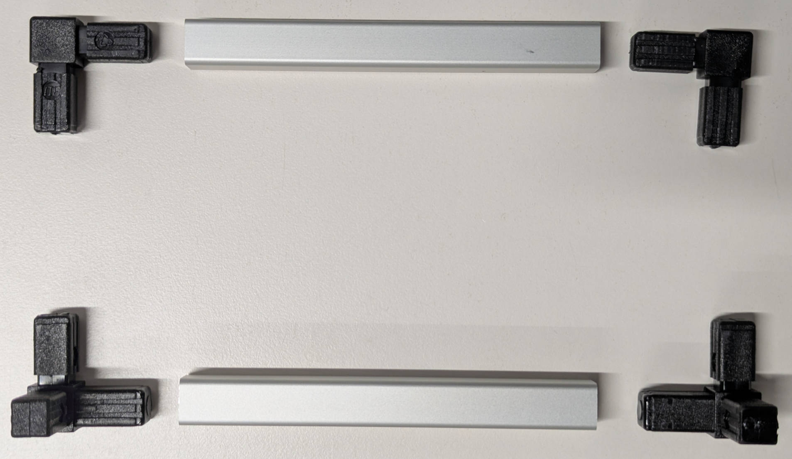{ width="500" }

Connect the prepared square tubes to the two remaining short square tubes
without holes.

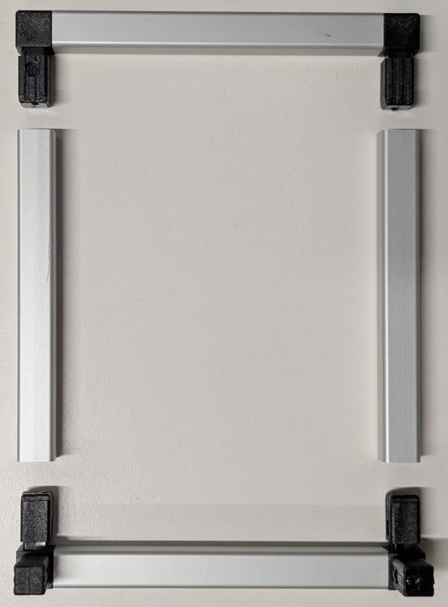{ width="500" }

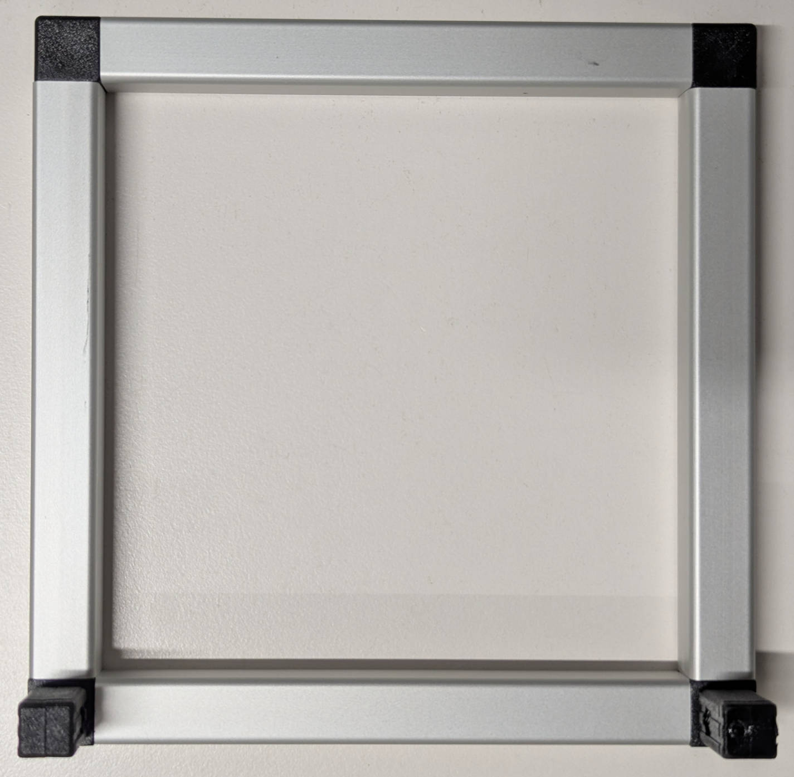{ width="500" }

Take the last short square tube with drilled holes and push the two remaining
angled connectors on both sides while making sure that the holes are oriented
as shown in the following image.

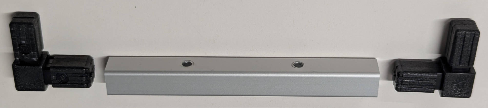{ width="500" }

Connect the two long square tubes to the square frame and the square tube with
holes.

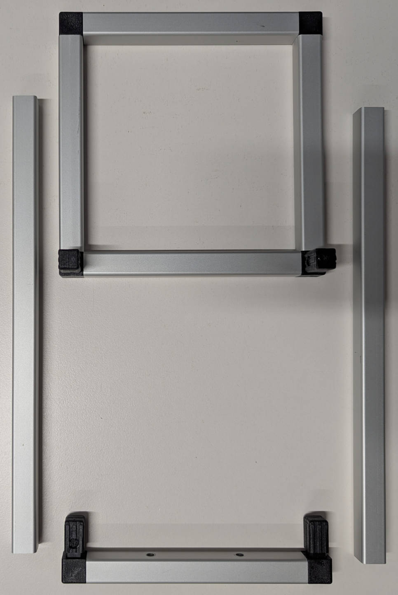{ width="500" }

{ width="500" }

---

### 2.2 Attach Platform

We are going to use magnetic tape to attach the platform to the frame. This
enables easy exchangeability of different platforms. However, you could also
use double-sided adhesive tape.

The magnetic tape comes in an A and B type, in our example marked with a straight
line in the middle of type A. Cut off three pieces of about 12 cm from type A
and stick them to the underside of the platform. Leave about 5 mm space on one
side, as shown in the following image. Cut off three corresponding pieces in the
same length from type B.

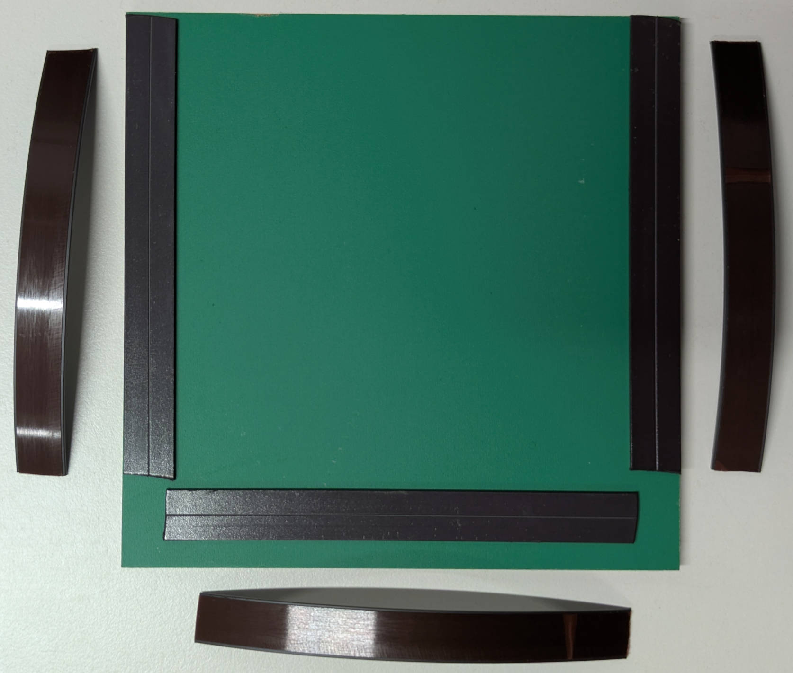{ width="500" }

Place the three pieces from type B on the pieces already attached to the platform
with the adhesive side facing towards you. Strip off the film.

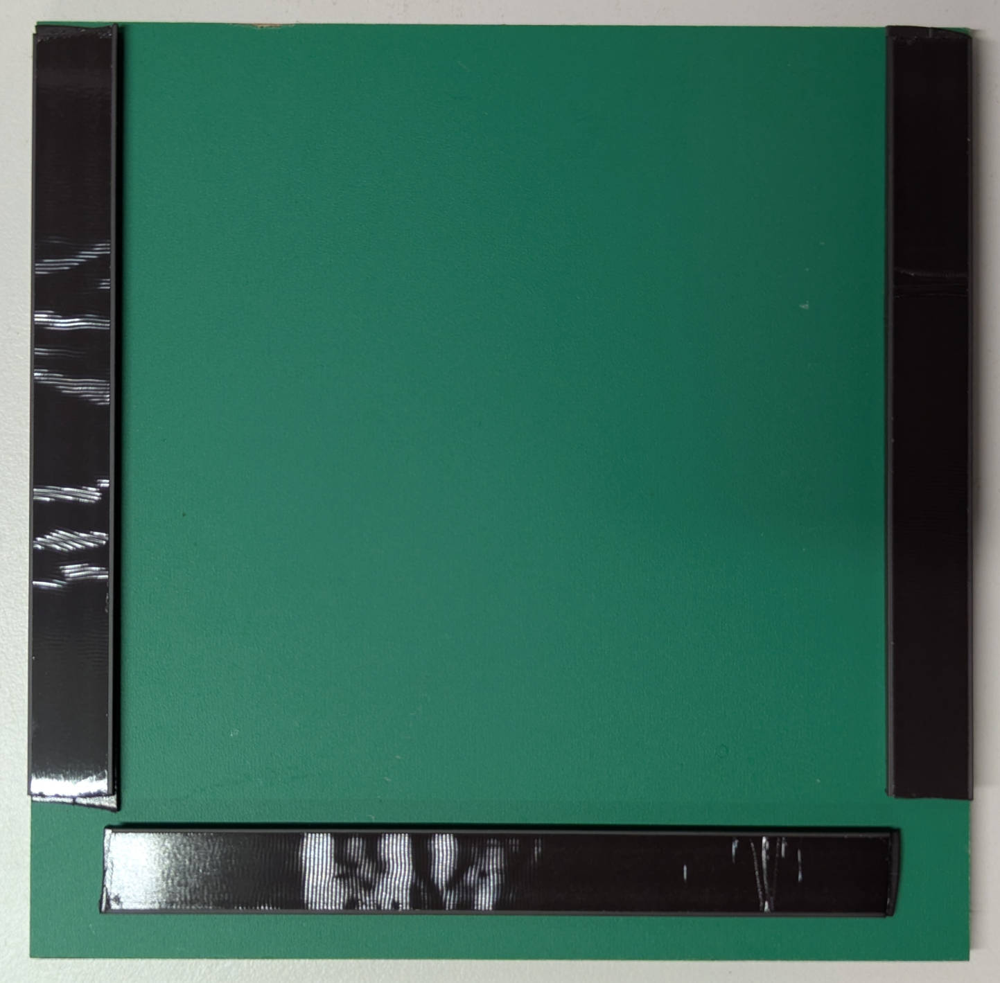{ width="500" }

Push the platform with the magnetic tape firmly onto the frame, so that the
adhesive side of type B is glued to the frame in the optimal position.

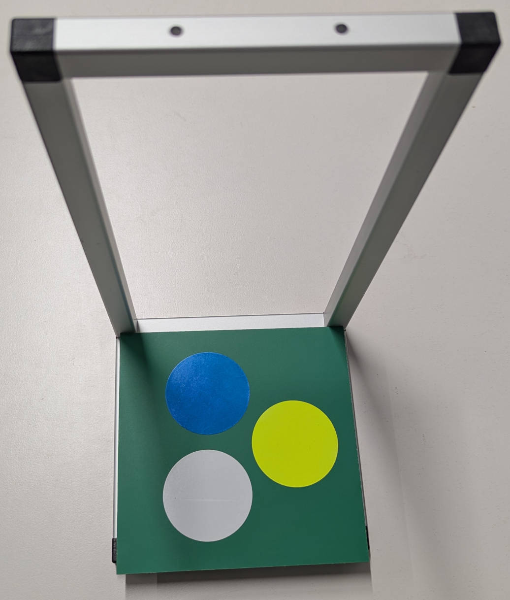{ width="500" }

Now you can remove the platform and the magnetic tape will stick to the frame.

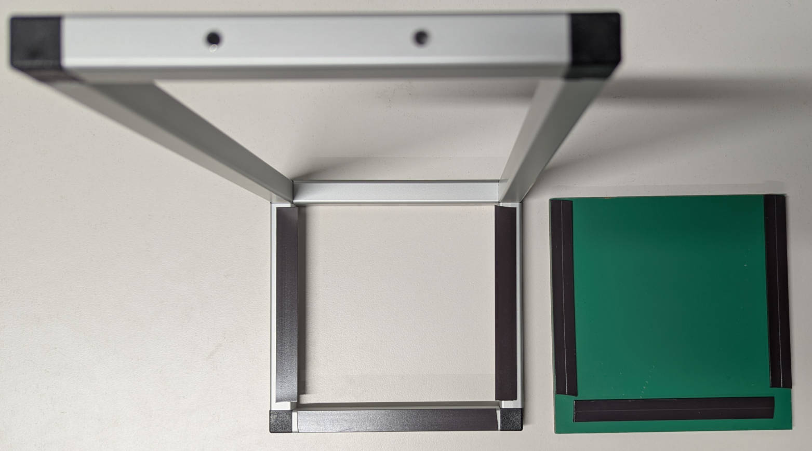{ width="600" }

---

## 3 Mount Components

The following steps can be used to test the mounting of all components, normally
you would do this [in the field](2024_field_deployment.md#camera-trap-setup)
when setting up the camera trap.

Fix the solar panel to the solar panel bracket with the three ETFE panel screws
and washers.

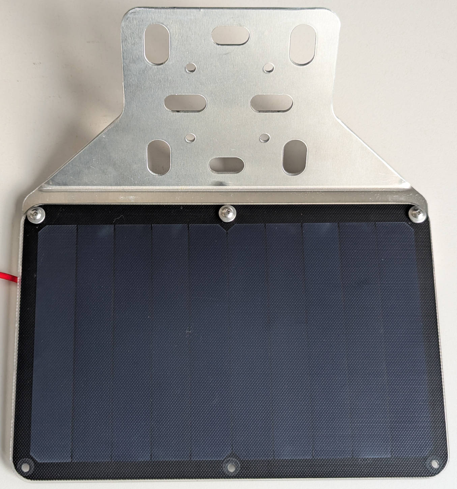{ width="600" }

To mount the solar panel and electronics enclosure to the aluminium profile,
slide four M4 T-Slot nuts into the groove on the left side of the camera holder.

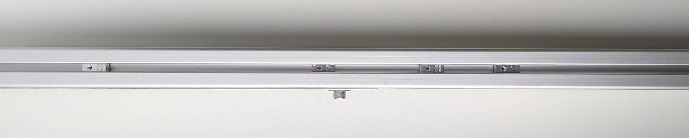{ width="700" }

Attach the HPL sheet that is fixed to the electronics enclosure to the two
T-Slot nuts facing towards the profile side without cap with two 16 mm M4 screws
and washers.

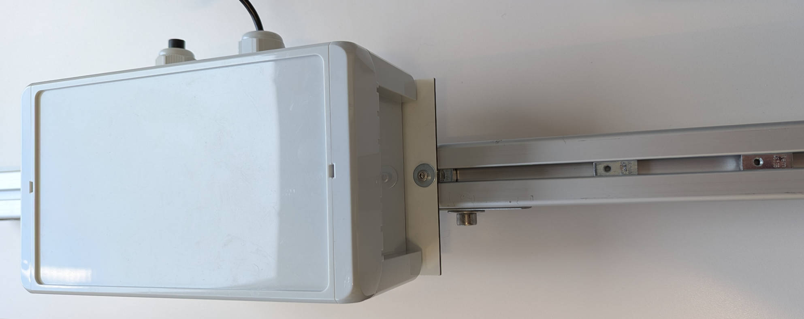{ width="700" }

Attach the solar panel bracket to the other two T-Slot nuts above the electronics
enclosure with two 16 mm M4 screws and washers. Connect the solar panel cable to
the solar panel input of the electronics enclosure.

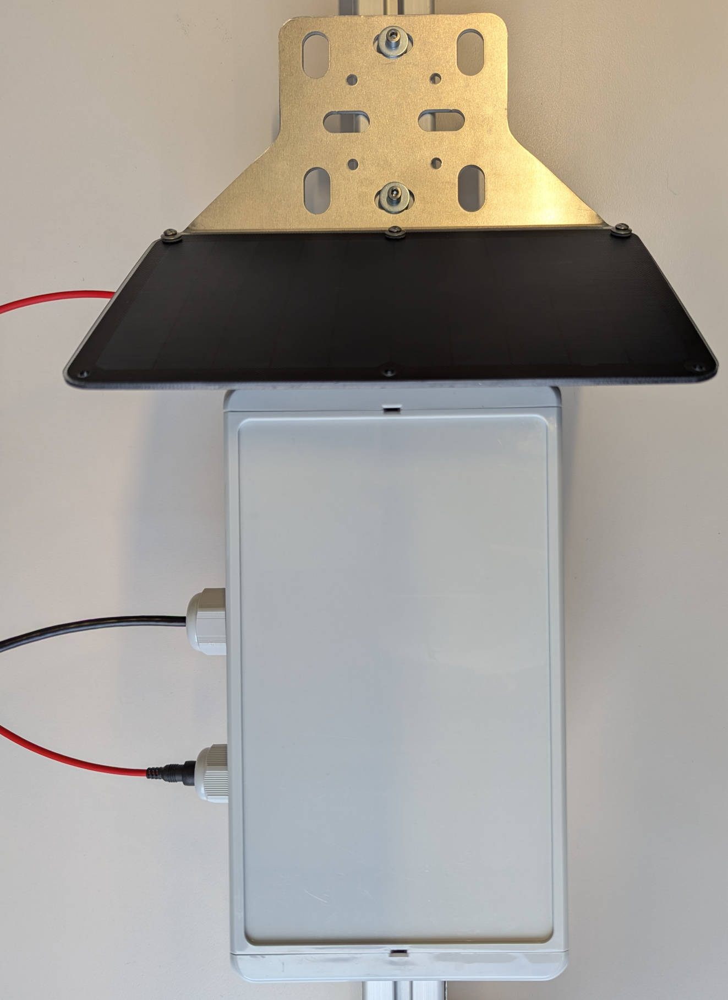{ width="700" }

Mount the camera enclosure to the camera holder with a 16 mm M4 screw and washer.

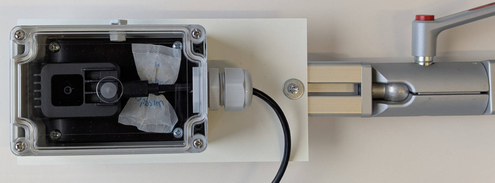{ width="700" }
