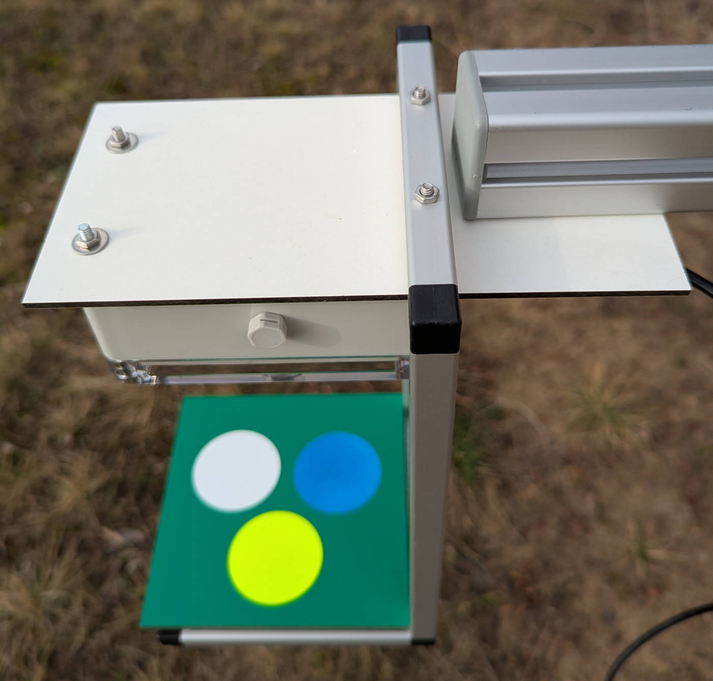

# Field Deployment

??? abstract "Required Tools & Components"

    **Tools**

    1. Spade
    2. Allen Keys (3 mm, 5 mm, 6 mm)

    **Components**

    1. Insect Detect 2024 Mount (fully assembled)
    2. Electronics & Camera Enclosures (with integrated hardware)
    3. Voltaic Solar Panel 5 Watt 6 Volt (attached to solar panel bracket)
    4. Platform Frame + Platform
    5. **5x** Screw M4, internal hexagon (16 mm)
    6. **5x** Washer (4.3x15x1 mm)
    7. **2x** Hex Nut M4, flat

## Camera Trap Setup

!!! warning "Soil Anchor"

    It is highly recommended to use a spade to pre-dig a slit in the soil where
    the soil anchor can be more easily inserted. Mount the enclosures and solar
    panel only **after** stabilizing the camera trap mount in the soil.

Use a 6 mm allen key to slightly loosen the two M8 screws and extend the soil
anchor. Fasten the screws again and push the anchor into the soil as deep as
possible. In most cases you probably won't be able to insert it all the way
which is fine as long as the mount is stable.

{ width="500" }

Loosen the two M8 screws again and slide down the long aluminium profile until
it sits flush on the soil. Finally, fasten the screws tightly again.

{ width="500" }

Use the 16 mm M4 screws and washers to mount the electronics enclosure, solar
panel and camera enclosure, more details [here](2024_buildinstructions_mounting.md#3-mount-components).
If you need to do this more frequently, using wing screws will make the setup
process faster.

To attach the platform frame to the camera, slide the aluminium square tube with
the two 4 mm holes onto the 30 mm screws and fix it with two M4 nuts. Use wing
nuts if you want to mount or remove the platform frame faster.

{ width="500" }

You can use the lever to manage the camera USB cable. Press the red button on
the lever to change its position without loosening the clamp.

{ width="600" }

You can optionally omit the platform and monitor any other background of choice,
e.g. real flowers (suitable detection model required!). Change the height of the
camera holder by loosening the screw that connects the angle bracket to the long
aluminium profile with a 5 mm allen key. Adjust the position of the camera by
moving the HPL sheet and/or loosening the clamp of the ball joints to change
the angle.

{ width="600" }
