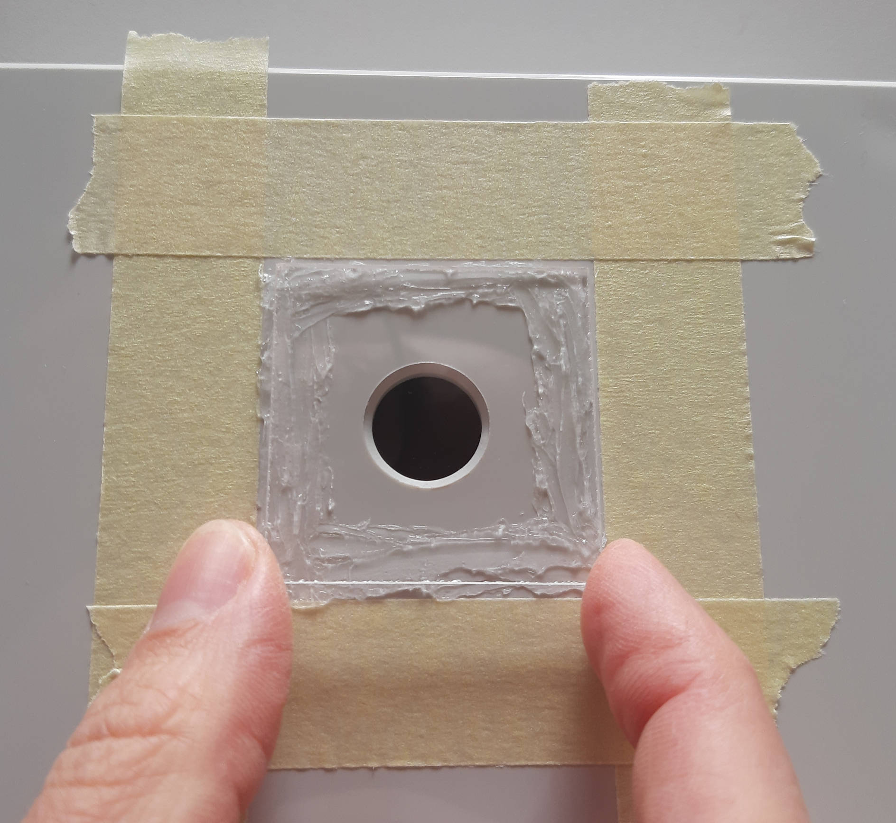

# Preparing the enclosure

## What you will need

??? abstract "Required tools & components"

    1. **Drilling machine**
    2. **Metal Drill Bit 3 mm**
    3. **Metal Step Drill Bit (with 14 and 20 mm step)**
    4. **Crepe tape**
    5. **Sealing Glue**
    6. **Scissors**
    7. **14 mm Hole Punch**
    8. **Hammer**
    9. Fibox TM 1625 Mounting Plate
    10. Fibox PC 162513 Enclosure
    11. Cable Gland + Locknut PG 13.5
    12. Acrylic Glas (2 mm) 40x40 mm
    13. EPDM Sealing Strip 20x5 mm

---

## Drilling the mounting plate holes

You could start by marking the four holes where the Raspberry Pi Zero 2 W and
the PiJuice Zero will be fixed with the spacer bolts. Instead of measuring and
marking the drilling holes, you can print the provided
[mounting_plate_drill_template.pdf](githublink) (original size!) and attach it
to the mounting plate. Use a strong nail and hammer to mark the drilling
positions. This will also help to align the drill bit when placing it on the
otherwise smooth surface of the plate.

{ width="600" }

{ width="600" }

One hard hit with the hammer will slightly puncture the mounting plate at the
correct positions for drilling the holes.

{ width="500" }

In the next step we will drill the holes with a 3 mm metal drill bit. It is
recommended to drill rather slow to avoid overheating of the drill bit.

{ width="500" }

{ width="500" }

After the holes are drilled, you might notice sharp edges (burrs) around them.
We are going to deburr the holes with the step drill bit on both sides of the
mounting plate. Be careful to not apply too much pressure!

{ width="500" }

---

## Drilling the enclosure holes

We are finished preparing the mounting plate, so let's move on to the
enclosure. First, we are going to mark the 14 mm hole in the lid of the
enclosure, where the camera will see through.

{ width="600" }

While drilling with the step drill bit, be cautious to stop at the 14 mm mark.
An assistant will come in helpful here!

{ width="500" }

You can carefully go a little bit deeper to the next drill bit step to
automatically deburr the camera hole.

{ width="500" }

Only one more hole to drill! We will attach the cable gland to this 20 mm hole
at the shorter side of the enclosure. First, let's mark the hole.

{ width="600" }

{ width="600" }

While drilling we will go a little bit deeper this time, to the 20 mm step. If
you have someone to watch from the side and tell you when to stop this will be
easier. Again, you can go a little bit deeper to the next drill bit step to
deburr the hole.

{ width="500" }

{ width="500" }

---

## Attaching the cable gland

You can put aside the drilling machine for now, as we are finished with
preparing the holes in the mounting plate and enclosure. In the next step, we
will attach the PG 13.5 cable gland with the locknut at the side of the
enclosure.

{ width="500" }

{ width="500" }

---

## Preparing the camera hole: Protection glass

To completely water-proof the enclosure, we will glue a 40x40 mm piece of 2 mm
thick acrylic glass in front of the camera hole. You will need crepe tape,
sealing glue, some kind of spatula (e.g. end of a zip tie) and a microfiber
cloth for cleaning the acrylic glass piece.

{ width="600" }

First, put the glass piece on top of the enclosure lid so that the camera hole
will be in its center. Now you can mark the position with crepe tape. This will
also help to prevent spilling of glue around the glass.

{ width="500" }

Leave about 1-2 mm of free space between the glass piece and the crepe tape. We
will use this area for sealing of the glass later.

{ width="500" }

Use the DIY-spatula to apply the sealing glue. Be careful not to use too much
glue and omit the area near the camera hole.

{ width="500" }

{ width="500" }

Make sure to clean the glass piece thoroughly immediately before putting it
onto the glued surface.

{ width="500" }

Press down the glass piece and carefully squeeze out as much air as possible,
while preventing glue to reach the camera hole.

{ width="500" }

After the acrylic glass is attached to the enclosure lid, we can add some
sealing glue to the edges and even it out with the spatula. Make sure to put a
little bit more of the glue at the corners of the glass piece.

{ width="500" }

Wipe down excess glue that might have gathered on top of the glass piece.

{ width="500" }

After the acrylic glass piece is properly sealed, slowly remove the crepe tape.
Do not wait too long or the glue will harden and will make removing the tape
more difficult. Be very careful to not smear the glue while removing the tape.

{ width="500" }

After we fixed the acrylic glass piece to the top of the lid, let it sit for
some time to make sure the glue is hard enough to proceed. Check the
instructions of the glue you used for the minimum amount of time required to
harden.

{ width="600" }

---

## Preparing the camera hole: Inside sealing

In the next step, we are going to cut a 30 mm long piece from the 20x5 mm EPDM
sealing strip.

{ width="600" }

Place the 14 mm Hole Punch in the center of the piece of sealing strip and hit
it with the hammer about two to three times. It is recommended to put a piece
of wood or something similar underneath.

{ width="500" }

Now that the piece of sealing strip has a 14 mm wide hole in its middle, we can
align it with the 14 mm hole we drilled before and attach it to the inside of
the enclosure lid.

{ width="500" }

And that's it! Everything is now prepared for the next steps where we will
[integrate the hardware](buildinstructions_hardware.md) into the enclosure.
