# Integrating the Hardware

## What you will need

??? abstract "Required tools & components"

    1. **Soldering Iron (+ Solder)** or **Hammer Header**
    2. **Pliers**
    3. 8x Cable Tie Mount
    4. 8x Stainless Steel Cable Tie
    5. Silica Gel Pack 50 g
    6. OAK-1 (OpenCV AI Kit)
    7. Raspberry Pi Zero 2 W (+ SD card)
    8. RPi CPU Heatsink
    9. RPi Header
    10. RPi Stacking Header
    11. RPi Spacer Bolts 10 mm
    12. RPi Spacer Bolts 20 mm
    13. PiJuice Zero UPS pHAT
    14. Solar Panel Extension Cable, 1 ft
    15. Voltaic 12,800 mAh Li-Ion Battery (Full Setup only)
    16. *2x Thermal Pad (1 mm) 50x50 mm* (optional)
    17. *2x Heatsink 40x30 mm* (optional)
    18. Solar Panel Micro USB Adapter
    19. PiJuice 12,000 mAh LiPo Battery
    20. Micro USB to USB A Adapter, angled
    21. USB A to micro USB cable, 20 cm, angled (Full Setup only)
    22. Solar Panel 6V 9W

---

## OAK-1 and silica gel fixing

As we just finished preparing the lid of the enclosure, we can continue with
fixing the cable tie mounts to the inside of the lid. The OAK-1 and a pack of
silica gel will be attached to the inside of the lid with the stainless steel
cable ties.

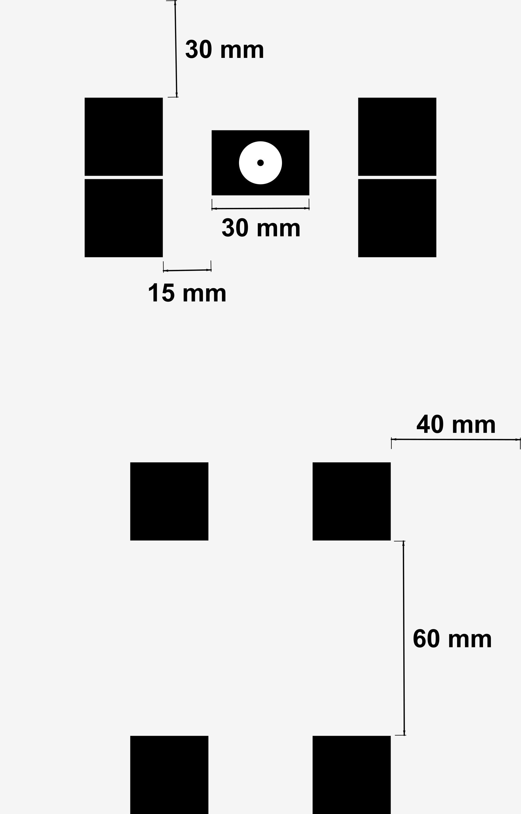{ width="500" }

After marking the location where the four cable tie mounts, holding the OAK-1
in place, will be attached to the inside of the enclosure lid, we can stick
them to their positions with the included adhesive pads.

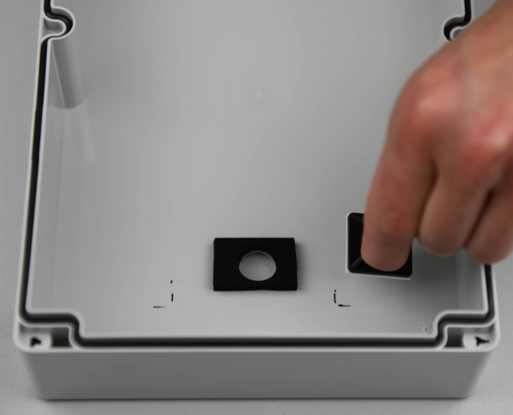{ width="500" }

Repeat this step for the other four cable tie mounts, that will keep the pack
of silica gel in place.

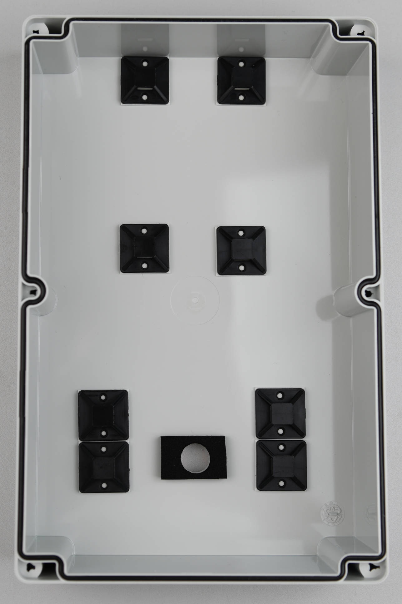{ width="500" }

Now we are going to put the stainless steel cable ties through the holes of the
cable tie mounts. You can bend the tip of the cable ties a little bit to make
them go through the cable tie mounts easier.

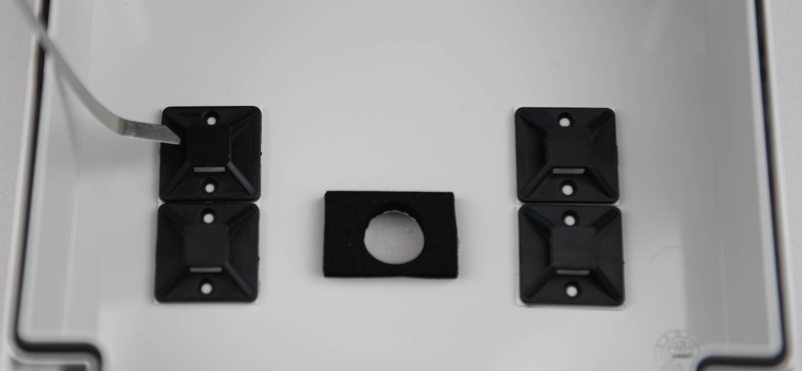{ width="500" }

After attaching and connecting the cable ties you can bend them a litte bit to
make it easier to put the silica gel pack and the OAK-1 under them.

{ width="500" }

While attaching the OAK-1 camera, please make sure to center the camera lens
with the hole in the lid. After that you can tighten the cables ties. The lid
of the enclosure is finished now and we are going to move on with attaching the
rest of the hardware to the mounting plate of the enclosure!

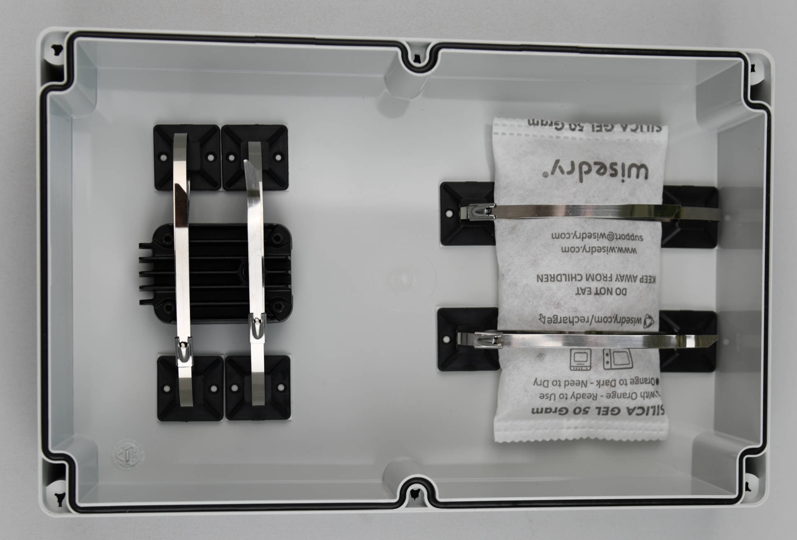{ width="600" }

---

## RPi and PiJuice fixing

But first we will have to prepare the Raspberry Pi Zero 2 W. If you don't
already have a device with attached header, you will have to solder a header to
the Raspberry Pi. But before that make sure to stick the heatsink on the CPU of
your Raspberry. This will keep the header to sit flush against the Raspberry Pi
as you solder it. If this is your first time soldering you can find detailed
instructions [here](https://bit.ly/3AsZMdg){target=_blank} and
[here](https://bit.ly/3pr6kCO){target=_blank}. As alternative to soldering the
header, you could also use a
[Hammer Header](https://shop.pimoroni.com/products/gpio-hammer-header){target=_blank}.

After attaching the CPU heatsink and soldering or hammering the header, your
Raspberry Pi should look like this:

{ width="500" }

{ width="500" }

Now we can put the stacking header on top of the freshly soldered header.

{ width="500" }

The Raspberry Pi is now prepared to be attached to the mounting plate together
with the PiJuice Zero pHAT. For this, we will need the 10 mm and 20 mm spacer
bolts, as well as the four washers and four screws that came with the bolts.

{ width="600" }

We are going to put the smaller 10 mm spacer bolts into the four holes we
previously drilled.

{ width="500" }

Then fasten the bolts with the washers at the backside of the mounting plate.
But don't tighten them yet! We will need a little bit of space to align the
components on the other side of the mounting plate in the following steps.

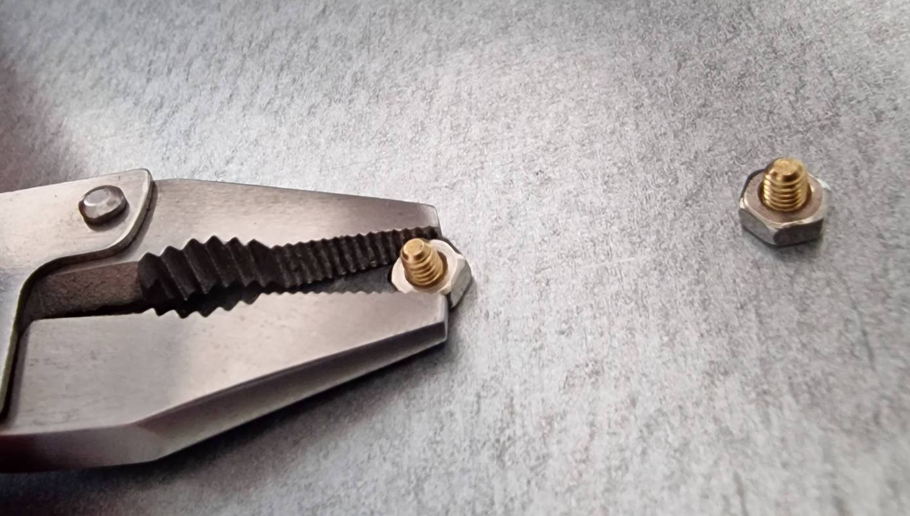{ width="500" }

Place your Raspberry Pi on top of the spacer bolts. Make sure that the ports
are pointing towards the edge of the mounting plate.

{ width="500" }

You can now screw the longer 20 mm spacer bolts into the 10 mm bolts to fix the
Raspberry Pi to the mounting plate. Again, don't tighten too much as we will
need some space to align everything at the end.

{ width="500" }

In the last step, we are going to connect the PiJuice Zero pHAT with the GPIO
pins of the RPi stacking header. If you have some trouble with this, you can
check if some of the pins are not properly aligned and adjust them carefully
before trying again. Finally, fasten the screws on top of the PiJuice board.
Now you can properly tighten all bolts and the washers on the backside of the
mounting plate.

{ width="600" }

---

## Inserting the mounting plate

Before we insert the mounting plate into the enclosure, the 2x2 cable ties have
to be aligned with the positions where the batteries will be. If your cable
ties are too short, you can connect two ties for extension, which will also
work fine. In the following pictures, the batteries are hold in place with only
one cable tie. However, it is recommended to use two cable ties for each
battery, as described in the text.

Do not directly screw the mounting plate to the enclosure, to be able to adjust
the cable ties later, so that they are in the respective centers of the
batteries.

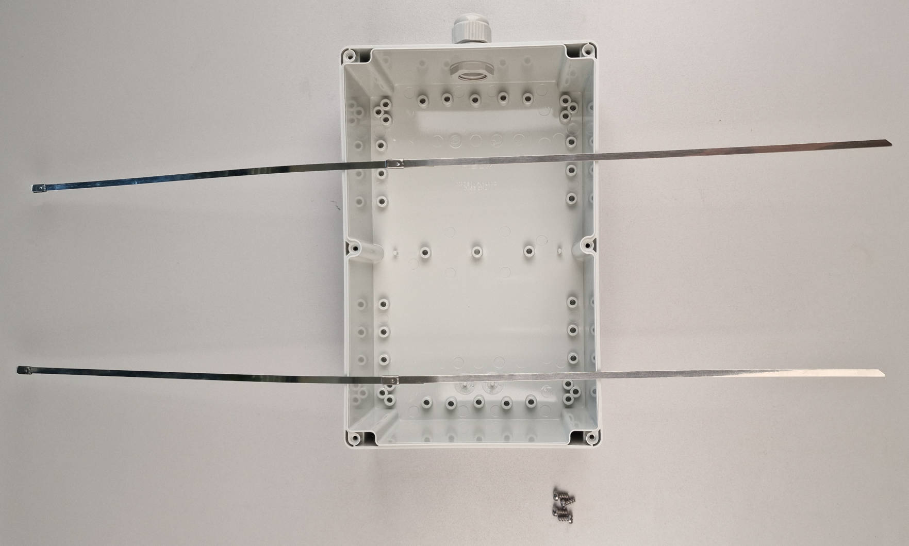{ width="600" }

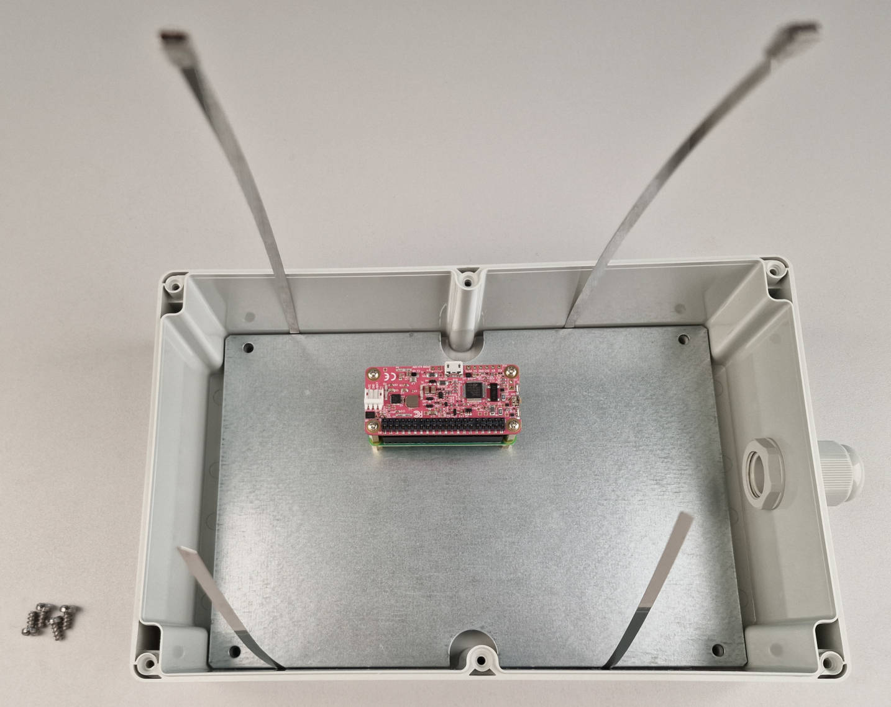{ width="600" }

---

## Integrating the batteries

In the next step, we are going to put the extension cable of the solar panel
through the cable gland. In the following pictures, the 4 foot (120 cm) Voltaic
extension cable is used. This will also work, but if you can get the shorter 1
foot (30 cm) cable, you won't have to roll it up in the enclosure.

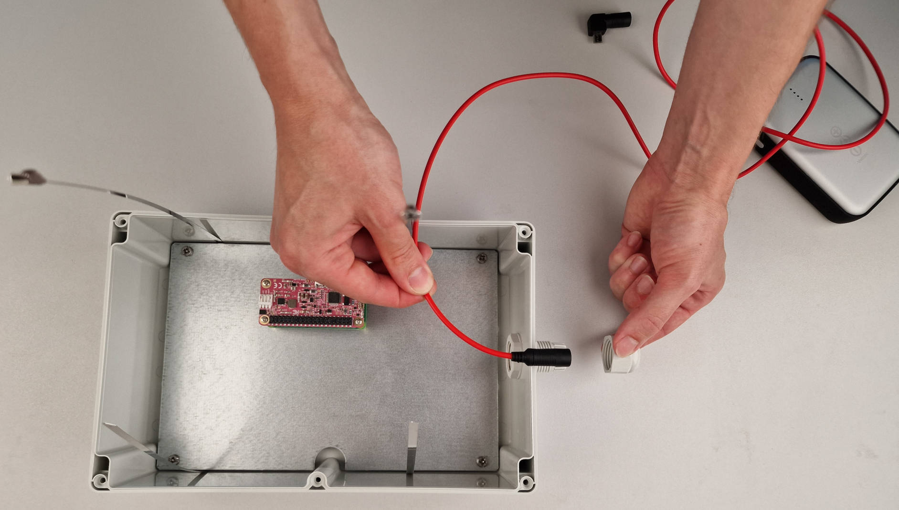{ width="600" }

Push the female port though the cable gland until the overmold is approximately
2/3 of the way in. Tighten the sealing nut properly to make sure that
everything will be waterproof.

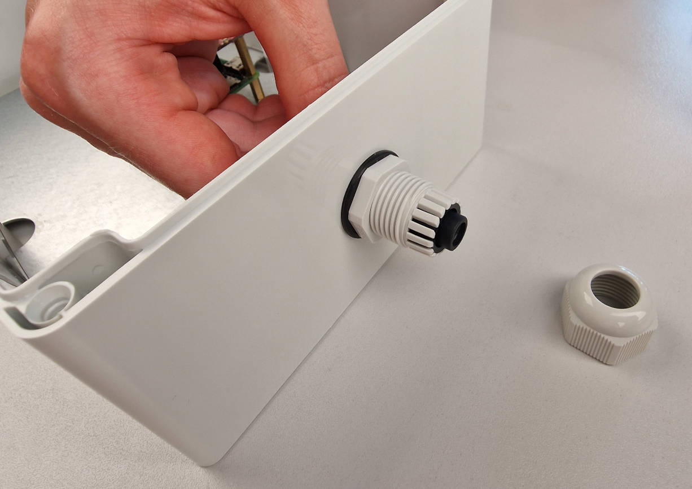{ width="500" }

{ width="400" }

{ width="400" }

The [Voltaic V50 battery](https://bit.ly/3psf8bA){target=_blank} that we are
using in this example, has an integrated over temperature protection, which
means that it will stop charging at 45°C. To improve the heat dissipation, we
can stick the battery to the mounting plate with a thermal pad and add two
heatsinks to the top of the battery. This step is optional and only recommended
if your camera trap will be exposed to high temperatures in summer. Instead of
the thermal pad, you could also use two small pieces of double-sided tape or
velcro strips to attach the batteries to the mounting plate.

{ width="500" }

{ width="400" }

{ width="400" }

Next, we are going to plug the micro USB adapter into the male port of the
solar panel extension cable and connect it to the battery.

{ width="500" }

You can stick the PiJuice battery to the mounting plate with the second Thermal
pad or some double-sided tape/velcro strips.

{ width="400" }

{ width="600" }

After both batteries are attached to the mounting plate, we can connect the
PiJuice battery to the PiJuice Zero pHAT. Please make sure that the holes for
the connection pins are facing downwards.

{ width="500" }

---

## Connecting everything

Plug the angled micro USB to USB A adapter into the micro USB port of the
Raspberry Pi Zero 2 W. This adapter is necessary for the connection with the
OAK-1 USB cable.

{ width="500" }

In the next step, we will connect the solar panel battery to the PiJuice Zero
pHAT with the angled USB A to micro USB cable. Now you could already connect
the solarpanel, but if you want to continue with the following steps for
[mounting](buildinstructions_mounting.md){target=_blank} the camera trap, it is
recommended to connect the solar panel only at the end of the mounting process.

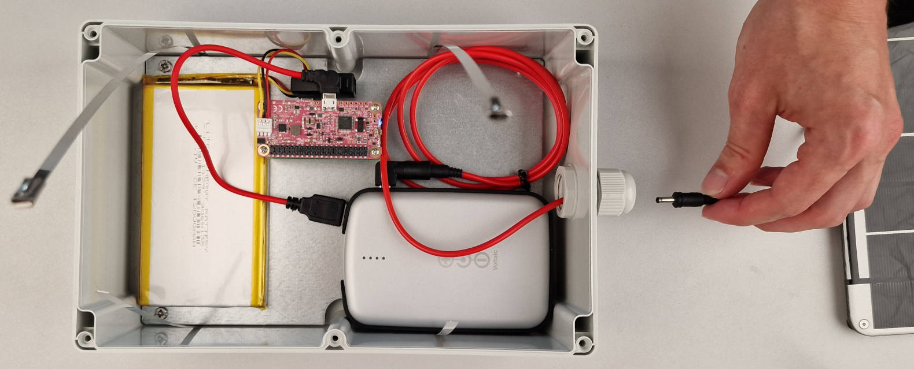{ width="600" }

Now that everything is in place, tighten the cable ties to keep the batteries
secure, as the enclosure will be turned over for mounting and the thermal pads
alone would not guarantee a secure fixture. If you didn't do it already, you
can now tighten the screws that are holding the mounting plate in place.

{ width="600" }

If you are going for the [Minimal Setup](components.md#minimal-setup){target=_blank}
you are now finished! Just connect the USB 3 Type-A to Type-C cable, which was
included in the OAK-1 kit, to the micro USB adapter of the Raspberry Pi and
your good to go! Don't close the lid yet, as we need to
[set up the software](../software/index.md) in the next steps. If you want to
build the [Full Setup](components.md#full-setup){target=_blank}, continue with
the next step for mounting the camera trap and the artificial flower platform.
