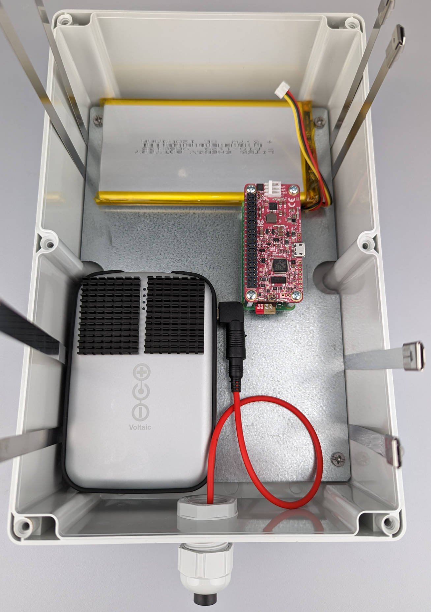
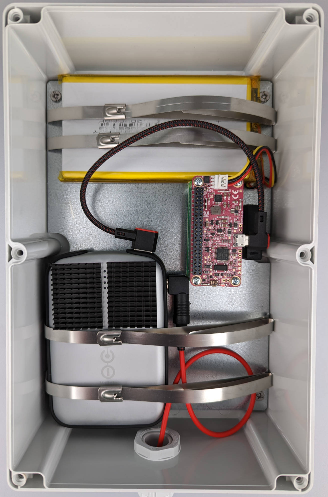

# Integrating the Hardware

## What you will need

??? abstract "Required tools & components"

    1. **Soldering Iron (+ Solder)** or **Hammer Header**
    2. **Pliers**
    3. 6x Cable Tie Mount
    4. 6x Stainless Steel Cable Ties
    5. 1x releasable Cable Tie
    6. Silica Gel Pack 50 g
    7. OAK-1 (OpenCV AI Kit)
    8. Raspberry Pi Zero 2 W (+ microSD card)
    9. RPi CPU Heatsink
    10. RPi Header
    11. RPi Stacking Header
    12. RPi Spacer Bolts 10 mm
    13. RPi Spacer Bolts 20 mm
    14. PiJuice Zero UPS pHAT
    15. Solar Panel Extension Cable, 1 ft
    16. Voltaic 12,800mAh Li-Ion Battery (Full Setup only)
    17. *2x Thermal Pad (1 mm) 50x50 mm* (optional)
    18. *2x Heatsink 40x30 mm* (optional)
    19. Solar Panel Micro USB Adapter
    20. PiJuice 12,000mAh LiPo Battery
    21. Micro USB to USB A Adapter, angled
    22. USB A to micro USB cable, 20 cm, angled (Full Setup only)
    23. Solar Panel 6V 9W

---

## OAK-1 and silica gel fixing

As we just finished preparing the lid of the enclosure, we can continue with
sticking the cable tie mounts to the inside of the lid to attach the OAK-1
and a pack of silica gel. Clean the surface with some alcohol and mark the
positions of the cable tie mounts before attaching them.

{ width="700" }

Now we are going to put the stainless steel cable ties through the cable tie
mounts after bending the tip of the cable ties a little bit.

{ width="500" }

After attaching and connecting the cable ties, bend them a litte bit to make it
easier to put the OAK-1 under them in the next step.

{ width="500" }

{ width="500" }

Make sure to center the lens of the OAK-1 camera before you tighten the cable ties.

{ width="500" }

If you used the suggested 52 cm long steel cable ties, cut off or bend the
protruding ends after tightening.

{ width="500" }

While you could also use one of the stainless steel cable ties to fix the silica
gel pack, we will use a shorter releasable plastic cable tie to make exchanging
of the silica pack easier. Raise the end of the cable tie with e.g. a screwdriver
if it does not bend when touching the side of the lid.

{ width="500" }

Connect the cable tie loosely and bend it to put the silica gel pack underneath.

{ width="500" }

The lid of the enclosure is finished now and we are going to move on with
attaching the rest of the hardware to the mounting plate of the enclosure.

{ width="600" }

---

## RPi and PiJuice fixing

If you don't already have a Raspberry Pi Zero 2 W with attached header, you
will have to solder a header to it. Before doing that, make sure to stick the
heatsink on the CPU of your Raspberry. This will keep the header sitting flush
against the Raspberry Pi as you solder it. If this is your first time soldering,
you can find detailed instructions [here](https://bit.ly/3AsZMdg){target=_blank}
and [here](https://bit.ly/3pr6kCO){target=_blank}. As alternative to soldering
the header, you could also use a
[Hammer Header](https://shop.pimoroni.com/products/gpio-hammer-header){target=_blank}.

After attaching the CPU heatsink and soldering or hammering the header, your
Raspberry Pi should look like this:

{ width="500" }

{ width="500" }

Now we can put the stacking header on top of the freshly soldered header.

{ width="500" }

The Raspberry Pi is now prepared to be attached to the mounting plate together
with the PiJuice Zero pHAT. For this, we will need the 10 mm and 20 mm spacer
bolts, as well as the four screws and nuts that came with the bolts.

{ width="600" }

We are going to put the smaller 10 mm spacer bolts into the four holes we
previously drilled.

{ width="500" }

Then fasten the bolts with the nuts at the backside of the mounting plate.
But don't tighten them yet! We will need a little bit of space to align the
components on the other side of the mounting plate in the following steps.

{ width="500" }

Place your Raspberry Pi on top of the spacer bolts. Make sure that the ports
are pointing towards the edge of the mounting plate.

{ width="500" }

You can now screw the longer 20 mm spacer bolts into the 10 mm bolts to fix the
Raspberry Pi to the mounting plate. Don't tighten too much as we will need some
space to align everything later.

{ width="500" }

In the last step, connect the PiJuice Zero pHAT to the GPIO pins of the RPi
stacking header. If you have trouble with this, you can check if some of the
pins are not properly aligned and adjust them carefully before trying again.
Finally, fasten the screws on top of the PiJuice board and properly tighten
all bolts and the nuts on the backside of the mounting plate.

{ width="600" }

---

## Inserting the mounting plate

Before inserting the mounting plate into the enclosure, the four cable ties have
to be aligned with the positions where the batteries will be. If you only have
shorter cable ties, you can connect two ties for extension. Bend the cable ties
at **12 cm**, measured from the head of the cable tie (right side in image). Put
them into the enclosure, between the mounting threads as shown in the following
image, and bend the cable ties at the other side of the enclosure bottom.

{ width="600" }

Insert the mounting plate into the enclosure while keeping the cable ties in
position. Screw the plate to the enclosure with the included screws.

{ width="600" }

---

## Integrating the batteries

The [Voltaic V50 battery](https://bit.ly/3psf8bA){target=_blank} has an integrated
over temperature protection, which means that it will stop charging at 45 °C.
To improve the heat dissipation, you can attach two heatsinks to the top of the
battery and stick the battery to the mounting plate with a thermal pad. This step
is recommended if your camera trap will be exposed to high temperatures in summer.

{ width="500" }

{ width="400" }

{ width="400" }

Plug the micro USB adapter into the male port of the solar panel extension
cable and connect it to the battery.

{ width="600" }

Now you can integrate the battery into the enclosure and put the female end of
the extension cable through the opened cable gland. While the two cable ties
should be sufficient to keep the battery in place even if you are not using the
thermal pad, you could use two small pieces of double-sided tape or velcro
strips to more securely attach the batteries to the mounting plate.

{ width="500" }

Push the female port of the solar panel extension cable through the cable gland
until the overmold is approximately 2/3 of the way in. Tighten the sealing nut
properly to make sure that the enclosure will be waterproof.

{ width="400" }

{ width="400" }

Optionally, you can stick the PiJuice battery to the mounting plate with the
second thermal pad or some double-sided tape/velcro strips.

{ width="400" }

{ width="600" }

Now that all of the hardware components are integrated into the enclosure, we
will connect everything in the next step before tightening the cable ties.

---

## Connecting everything

Plug the angled micro USB to USB A adapter into the micro USB port of the
Raspberry Pi Zero 2 W. This adapter is necessary to connect the OAK-1 USB cable.

{ width="500" }

Connect the PiJuice battery with the PiJuice Zero pHAT. Please make sure that
the holes for the connection pins are facing downwards.

{ width="500" }

In the next step, we will connect the solar panel battery to the PiJuice Zero
pHAT with the angled USB A to micro USB cable. Now you could already connect
the solarpanel, but if you want to continue with the following steps for
[mounting](buildinstructions_mounting.md){target=_blank} the camera trap, it is
recommended to connect the solar panel only at the end of the mounting process.

{ width="600" }

Now that everything is in place, tighten the cable ties to keep the batteries
secure, as the enclosure will be turned over for mounting. Cut off or bend the
protruding ends after tightening.

{ width="600" }

In the last step, connect the OAK-1 camera to the micro USB adapter in the
Raspberry Pi with the USB 3 Type-A to Type-C cable, which was included in
the OAK-1 package.

{ width="700" }

If you are going for the [Minimal Setup](components.md#minimal-setup){target=_blank}
you are now finished! Don't close the lid yet, as we need to
[set up the software](../software/index.md){target=_blank} in the next steps.
If you want to build the [Full Setup](components.md#full-setup){target=_blank},
continue with the next step for mounting of the camera trap and flower platform.
