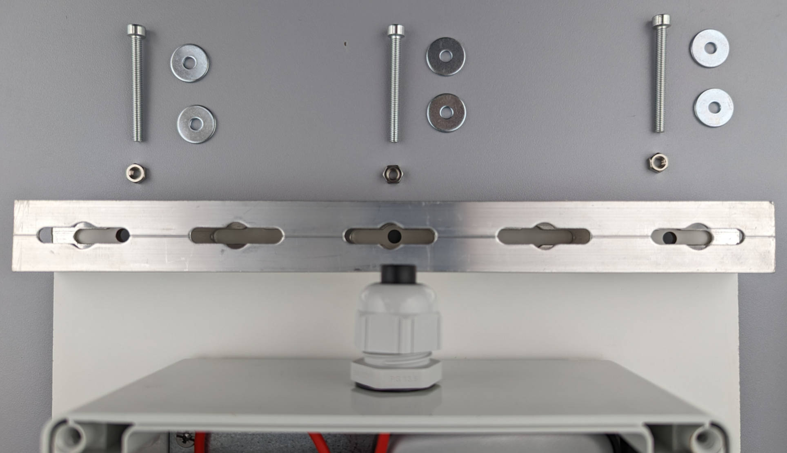
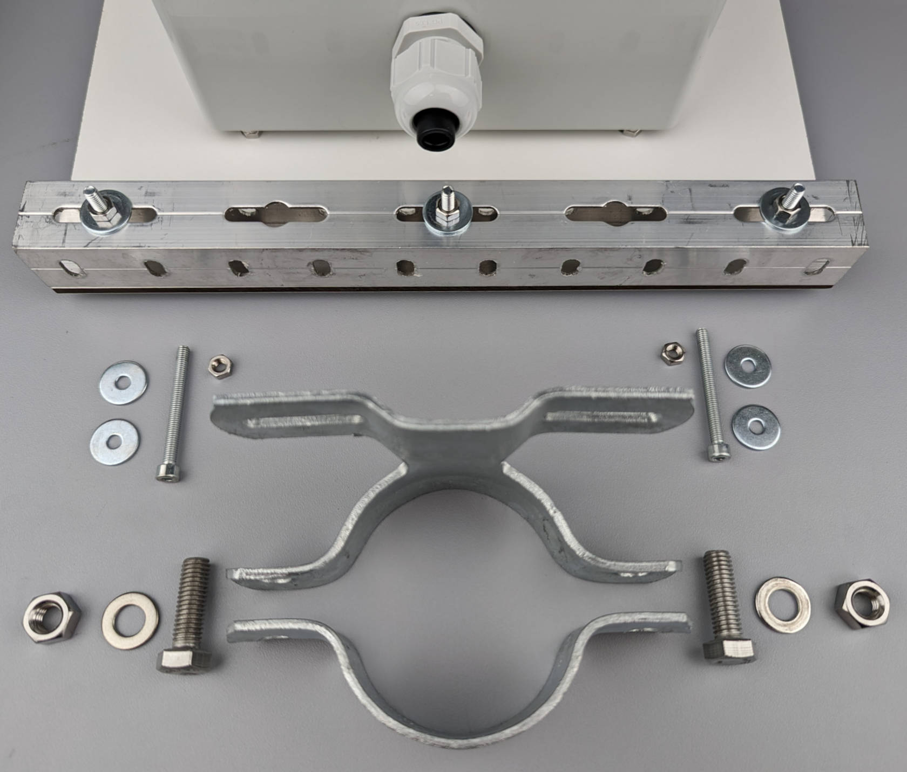

# Mounting Setup

## What you will need

??? abstract "Required tools & components"

    1. **Drilling machine**
    2. **Metal Drill Bit 4 mm**
    3. **Allen wrench 3 mm**
    4. **Metal saw**
    5. HPL Sheet (4 mm) 350x250 mm
    6. 4x M4 20 mm Screws (internal hexagon)
    7. 21x M4 Hex Nuts
    8.  Aluminium Square Tube (23.5x23.5 mm), 1.5 m
    9.  7x M4 40 mm Screws
    10. 2x M4 60 mm Screws
    11. 18x Flat Washer (e.g. M4 15 mm)
    12. Pipe Clamp (60.3mm) 70 mm + screws & nuts
    13. Pipe Clamp (60.3 mm) 350 mm + screws & nuts
    14. Flower Platform (e.g. 500x280 mm)
    15. *Solar Panel Bracket, Medium* (optional)

---

## Drilling the HPL sheet

We are going to start by marking the four positions where the enclosure will be
fixed in the center of the HPL sheet and the three positions where the
aluminium tube and pipe clamp will be attached for mounting on a tubular post.

{ width="600" }

Drill the seven 4 mm holes at the marked positions with a 4 mm metal drill bit.
The drilling might take some time, as HPL is a very dense material.

{ width="500" }

{ width="500" }

---

## Enclosure to HPL connection

Now that we have prepared the HPL sheet, we can put the four M4 20 mm screws
through the holes of the enclosure for fixing it to the HPL sheet.

{ width="600" }

Be sure to keep the M4 screws in place with the 3 mm allen wrench, while
tightening them with two of the M4 hex nuts per screw. This will allow air to
flow between the enclosure and the HPL sheet to increase heat dissipation.

{ width="500" }

{ width="500" }

After the four M4 screws are fixed with the eight hex nuts, we can put them
through the holes of the HPL sheet. Please make sure that the cable gland is
pointing towards the other three holes.

{ width="500" }

Now you can fasten the hex nuts on the other side of the HPL sheet to securely
attach the enclosure to it.

{ width="500" }

---

## Attaching the aluminium tube

We are going to attach a 250 mm piece of the aluminium tube to the short side
of the HPL sheet, which will serve as connection for the pipe clamp. Put your
aluminium tube flush on the HPL sheet and make sure that the openings line up
with the holes in the HPL sheet to put the screws through in the next step. Now
you can draw a marking line at the correct position, to saw the aluminium tube
to the required length.

{ width="500" }

For the kind of aluminium tube that we are using in this example, with a
material thickness of 1.5 mm, a small metal saw is sufficient to cut the tube
to the required length of 250 mm.

{ width="500" }

To attach the 250 mm piece of aluminium tube to the HPL sheet, we will need
three of the M4 40 mm screws and hex nuts, as well as six of the flat washers.

{ width="600" }

Put a washer under each of the screws and under each of the hex nuts to ensure
a good stability.

{ width="600" }

---

## Attaching the pipe clamp

In the last step, we are going to attach the pipe clamp to the aluminium tube,
to later mount the camera trap on a tubular post.

{ width="600" }

Use two of the M4 40 mm screws and hex nuts together with four of the washers
(one on each side) to fix the pipe clamp to the aluminium tube.

{ width="600" }

Your ready-to-mount camera trap should look like this:

{ width="700" }

---

## Preparing the flower platform

You can download the PDF templates for two different sizes of the artifical
flower platform at the
[`insect-detect-docs` GitHub repo](https://github.com/maxsitt/insect-detect-docs/tree/main/PDF_templates/flower_platform){target=_blank}.
You will also find the [Inkscape](https://inkscape.org/){target=_blank} .svg files
in the same folder, which you could use as template for your own platform design.

The bigger platform (500x280 mm) should be mounted at a distance of **40 cm**
from camera to platform, when using 4K (3840x2160 px) resolution for the HQ
frames. The smaller platform (350x200 mm) should be mounted at a distance of
**28 cm** from camera to platform, when using 4K resolution. The decreased
distance will result in a higher resolution of the cropped insect images, which
is especially useful if your group of interest is rather small (< 1 cm).

If you want to use different platform sizes or distances from camera to your
platform or other background, the aspect ratio of the frame where insects will
be detected (e.g. for 4K resolution ~1:1.78) should be considered for planning.

It is recommended to print the templates on a weather- and UV-resistant
material, e.g. [lightweight foam board](https://bit.ly/3VATW2b){target=_blank}.
There are many online print shops that can do this for you. If it is possible
to add a matt UV coating (e.g. at this [print shop](https://bit.ly/3QlFJTA){target=_blank}),
this is also recommended.

---

Drill two 4 mm holes at the center of the short sides of your flower platform.
In the following picture, we are using a platform with the dimensions of
500x280 mm, which will fill the whole 4K frame of the OAK-1 camera at a
distance of 40 cm from camera to platform. We are going to mark the positions
for drilling at 140 mm, measured from the long side (280 mm / 2) and at 12 mm,
measured from the short side (23.5 mm wide aluminium tube / 2).

{ width="600" }

For the smaller platform, the positions for drilling should be marked at 100 mm,
measured from the long side (200 mm / 2) and at 12 mm, measured from the short
side (23.5 mm wide aluminium tube / 2).

{ width="600" }

To build the frame, which will hold the flower platform and can be adjusted to
different platform sizes, we will need one aluminium tube with the length of
the long side of your biggest platform (in our case 500 mm) and two aluminium
tubes with a length of about 350-400 mm. If you have a 750 mm piece left from
the 1 m tube of which you saw off the 250 mm piece for the HPL plate mounting,
you can just cut this leftover piece in half to get 2x 375 mm tube pieces,
which will have the optimal length.

{ width="600" }

First, we are going to place the longer piece of aluminium tube on top of the
two shorter pieces and connect them with the two M4 60 mm screws, two M4 nuts
and four washers. Don't tighten too much yet, as we will have to align
everything at the end.

{ width="600" }

{ width="600" }

After the frame is prepared, place the flower platform on top of the two short
tube pieces and align them with the holes you drilled. If your are using the
same platform dimension and pipe clamps as in our example, you can already
adjust the platform at 55 mm, measured from the aluminium tube to the platform.
For the smaller platform (350x200 mm) this distance should be 115 mm. Otherwise
you can adjust the platform after everything is mounted with the provided
[cam_preview.py script](../software/programming.md#oak-camera-preview){target=_blank}.
Attach the platform to the shorter aluminium tubes with two M4 40 mm screws,
two M4 nuts and four washers.

{ width="600" }

{ width="600" }

Now all we have to do is to connect the pipe clamp with two M4 40 mm screws,
two M4 nuts and four washers for mounting the platform on a wooden/steel post.
Make sure to align the pipe clamp center with the center of your long aluminium
tube piece.

{ width="600" }

{ width="600" }

You can now mount the platform on any standard wooden or steel post! Tighten
the screws (if you didn't do this already) after you checked the correct
position with the
[cam_preview.py script](../software/programming.md#oak-camera-preview){target=_blank}.
If possible, slightly tilt the post and camera trap system forwards, that
rainwater can run off the platform.

{ width="700" }

If you want to change the bigger platform with the smaller platform, you only
have to adjust the smaller aluminium tube pieces and decrease the distance from
camera (= enclosure) to the platform to 28 cm.

{ width="500" }

---

## Mounting the solar panel

There are many possible DIY solutions to mount the solar panel at the
[best angle](https://bit.ly/3CrEAEh){target=_blank} for your location. In our
case this is about 30° (southwestern Germany). In the following picture, we
used two wooden wedges fixed with some double-sided tape.

{ width="500" }

If you want a prettier mounting solution, you can get the
[medium mounting bracket](https://bit.ly/3Ths3tK){target=_blank}, which will
fit perfectly for the 6V 9W Voltaic panel and allow more airflow above the
enclosure to potentially keep it cooler during hot days.

{ width="600" }

If you are using the 500x280 mm platform, make sure that the distance between
the camera (measured from the enclosure) to the flower platform surface is
**40 cm**. For the smaller 350x200 mm platform, the distance between camera and
platform should be **28 cm**. With these distances and platform sizes, the 4K
frame in which insects are detected, will be completely filled out by the
platform. This will make sure that insects can not move in and out of the
frame, while walking on the platform. This would cause the object tracker to
count every insect coming back into the frame as new individual (new tracking
ID).

{ width="500" }

After that your Insect Detect DIY camera trap for automated insect monitoring
is finished! Let's move on to the next steps and
[set up the Software](../software/index.md).

{ width="600" }
