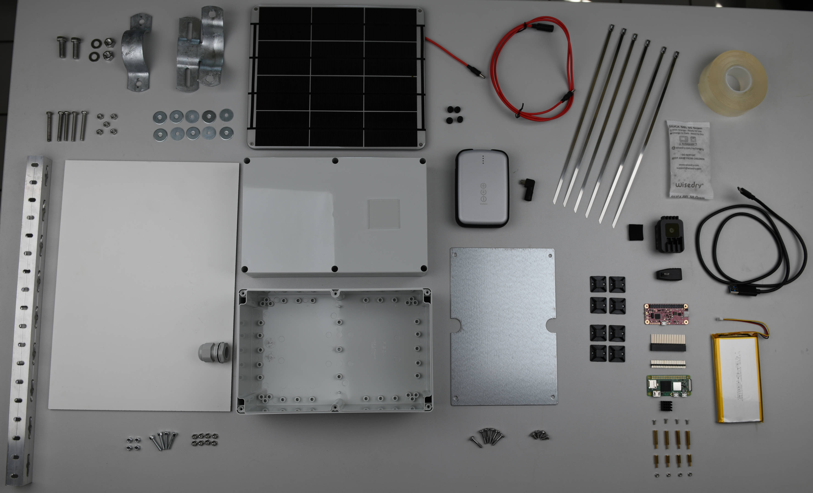

# Components

!!! tip "Choose your Hardware Setup"

    Depending on your field of application, several variations of the hardware
    setup with different scopes and required components are possible. Three
    setups are presented in the following, but you can always create your own!

## Full Setup

For a total cost of about **730 &euro;**, the full hardware setup includes all
necessary components for self-sufficient continuous monitoring of insects in
the field over long time periods.

With a SD card size of 256 GB, about 12 million images (cropped detections) of
individual insects can be stored (at 40 cm distance from camera to object). Two
batteries with a combined capacity of 24,800 mAh enable a continuous monitoring
of about 20 hours (e.g. 4 hours/day for 5 days), independent of the amount of
sunlight available to charge the batteries. The plastic enclosure which
contains all electronic parts is attached to a HPL sheet and can be mounted on
e.g. a steel or wooden post with a standard pipe clamp. The artificial flower
platform can be printed with the provided
[PDF template](https://github.com/maxsitt/insect-detect-docs/tree/main/PDF_templates/flower_platform){target=_blank}
or with your own design and will be mounted on the same post with a pipe clamp
connected to aluminium square tubes.

---

## Minimal Setup

For a total cost of about **510 &euro;**, the minimal hardware setup includes
all necessary components for self-sufficient continuous monitoring of insects
in the field.

Due to a smaller SD card size of 32 GB, recorded images and data have to be
collected more frequently. The single battery with a capacity of 12,000 mAh
enables a continuous monitoring of about 10 hours (e.g. 2 hours/day for 5
days), independent of the amount of sunlight available to charge the battery.
The artificial flower platform and components for mounting the camera trap are
not included, it is assumed that you want to try your own ideas, e.g. set up
the camera on a tripod and focus it on a particular flower or other background.

---

## Test Setup

If you only want to test the basic hardware and software capabilities in the
lab, for about **200 &euro;** you can already get started. As there is no
PiJuice Zero pHAT and battery included in this setup, an additional power
supply will be necessary. To test the
[automated monitoring script](../software/programming.md#automated-monitoring-script){target=_blank}
without the PiJuice Zero pHAT connected to the Raspberry Pi, please use the
`yolov5_tracker_save_hqsync_nopj.py` script, available at the
[`insect-detect` GitHub repo](https://github.com/maxsitt/insect-detect){target=_blank}.

---

## List of components

??? attention "Component costs"

    All prices are shown with **19% VAT** (for Germany) and **without**
    shipping costs. Depending on your country the VAT may differ and additional
    shipping costs may increase the total cost of the components.

    **The prices for specific components may change and this list is only a
    snapshot in time of the situation in December 2022.**

??? info "OAK USB cable"

    A USB 3 Type-A to Type-C cable is normally included in the OAK-1 kit and is
    therefore not listed in the components.

=== "Full Setup"

    | Component                                       | Price              | Product Link                                                                                                               |
    | ----------------------------------------------- | ------------------ | -------------------------------------------------------------------------------------------------------------------------- |
    | OAK-1 (OpenCV AI Kit)                           | 156.98 &euro;      | e.g. [Luxonis shop](https://bit.ly/3Ew7PbM){target=_blank} or [Mouser](https://bit.ly/3dl8ukF){target=_blank}              |
    | Raspberry Pi Zero 2 W                           | 22.50 &euro;       | [rpilocator](https://rpilocator.com/?cat=PIZERO){target=_blank}                                                            |
    | Micro SDXC card 256 GB                          | 71.95 &euro;       | e.g. [Reichelt](https://bit.ly/3w1VuXz){target=_blank}                                                                     |
    | Micro USB to USB A adapter, angled              | 5.50 &euro;        | e.g. [Reichelt](https://bit.ly/3SIgDjk){target=_blank}                                                                     |
    | USB A to micro USB cable, 20 cm, angled         | 5.60 &euro;        | e.g. [Reichelt](https://bit.ly/3VnO3VS){target=_blank}                                                                     |
    | RPi CPU Heatsink                                | 1.20 &euro;        | e.g. [Reichelt](https://bit.ly/3zTKIUA){target=_blank}                                                                     |
    | RPi Header                                      | 0.95 &euro;        | e.g. [Reichelt](https://bit.ly/3SIdSyu){target=_blank}                                                                     |
    | RPi Stacking Header                             | 1.60 &euro;        | e.g. [Reichelt](https://bit.ly/3VeXdDW){target=_blank}                                                                     |
    | RPi Spacer Bolts 10 mm                          | 3.50 &euro;        | e.g. [Reichelt](https://bit.ly/3zVuSbM){target=_blank}                                                                     |
    | RPi Spacer Bolts 20 mm                          | 4.20 &euro;        | e.g. [Reichelt](https://bit.ly/3QCdFuT){target=_blank}                                                                     |
    | **2x** *Thermal Pad (1 mm) 50x50 mm* (optional) | *4.79 &euro; x2*   | e.g. [Reichelt](https://bit.ly/3QCnkSb){target=_blank}                                                                     |
    | PiJuice Zero UPS pHAT                           | 50.86 &euro;       | e.g. [Pi Supply](https://bit.ly/3rMiKXb){target=_blank} or [Distrelec](https://bit.ly/3dtoC3K){target=_blank}              |
    | PiJuice 12,000 mAh LiPo Battery                 | 35.55 &euro;       | e.g. [Pi Supply](https://bit.ly/3fT0Sak){target=_blank} or [Distrelec](https://bit.ly/3vZGiKw){target=_blank}              |
    | Fibox PC 162513 Enclosure                       | 59.99 &euro;       | e.g. [Conrad](https://bit.ly/3hOlOR3){target=_blank} or [Distrelec](https://bit.ly/3JX82FC){target=_blank}                 |
    | Fibox TM 1625 Mounting Plate                    | 6.12 &euro;        | e.g. [Distrelec](https://bit.ly/3QmVhqf){target=_blank} or [Conrad](https://bit.ly/3BVGf5t){target=_blank}                 |
    | Cable Gland PG 13.5                             | 1.29 &euro;        | e.g. [Distrelec](https://bit.ly/3zVQQvD){target=_blank}                                                                    |
    | Cable Gland PG 13.5 Locknut                     | 0.53 &euro;        | e.g. [Distrelec](https://bit.ly/3AkbMOh){target=_blank}                                                                    |
    | **8x** Stainless Steel Cable Tie                | 1.07 &euro; **x8** | e.g. [Distrelec](https://bit.ly/3C3XC5a){target=_blank}                                                                    |
    | **8x** Cable Tie Mount                          | 0.83 &euro; **x8** | e.g. [Distrelec](https://bit.ly/3C1RESg){target=_blank}                                                                    |
    | Acrylic Glas (2 mm) 40x40 mm                    | ~5.00 &euro;       | e.g. [S-Polytec](https://bit.ly/3dkMGWh){target=_blank}                                                                    |
    | EPDM Sealing Strip 20x5 mm                      | 5.35 &euro;        | e.g. [Amazon](https://amzn.to/3pcBM7J){target=_blank}                                                                      |
    | Silica Gel Pack 50 g                            | 13.99 &euro;       | e.g. [Amazon](https://amzn.to/3JR5zfV){target=_blank}                                                                      |
    | Solar Panel 6V 9W                               | 98.30 &euro;       | e.g. [Voltaic Systems](https://bit.ly/3VdIyZN){target=_blank} or [Kiwi Electronics](https://bit.ly/3QI5AVl){target=_blank} |
    | *Solar Panel Bracket, Medium* (optional)        | *11.75 &euro;*     | e.g. [Voltaic Systems](https://bit.ly/3Ths3tK){target=_blank} or [Kiwi Electronics](https://bit.ly/3v5NWCb){target=_blank} |
    | Solar Panel Extension Cable, 1 ft               | 6.85 &euro;        | e.g. [Voltaic Systems](https://bit.ly/3CRUGZm){target=_blank} or [Funky Leisure](https://bit.ly/3CTGAqs){target=_blank}    |
    | Solar Panel Micro USB Adapter                   | 3.88 &euro;        | e.g. [Voltaic Systems](https://bit.ly/3s237et){target=_blank} or [Kiwi Electronics](https://bit.ly/3Ew9FJB){target=_blank} |
    | Voltaic 12,800 mAh Li-Ion Battery               | 83.55 &euro;       | e.g. [Voltaic Systems](https://bit.ly/3MjlGDU){target=_blank} or [Kiwi Electronics](https://bit.ly/3enRbjF){target=_blank} |
    | **2x** *Heatsink 40x30 mm* (optional)           | *2.35 &euro; x2*   | e.g. [Reichelt](https://bit.ly/3SIrxFM){target=_blank}                                                                     |
    | HPL Sheet (4 mm) 350x250 mm                     | ~5.00 &euro;       | e.g. [HPL shop](https://bit.ly/3C5zsqK){target=_blank}                                                                     |
    | Aluminium Square Tube (23.5x23.5 mm), 1.5 m     | ~16.00 &euro;      | Local hardware store (e.g. [Bauhaus](https://bit.ly/3duFdUV){target=_blank})                                               |
    | **4x** M4 20 mm Screws (internal hexagon)       | ~2.00 &euro;       | Local hardware store (e.g. [Connex screws](https://bit.ly/3MiC9IL){target=_blank})                                         |
    | **7x** M4 40 mm Screws                          | ~3.00 &euro;       | Local hardware store (e.g. [Connex screws](https://bit.ly/3MiC9IL){target=_blank})                                         |
    | **2x** M4 60 mm Screws                          | ~2.00 &euro;       | Local hardware store (e.g. [Bauhaus](https://bit.ly/3rP6c17){target=_blank})                                               |
    | **21x** M4 Hex Nuts                             | ~3.00 &euro;       | Local hardware store (e.g. [Bauhaus](https://bit.ly/3MlymKv){target=_blank})                                               |
    | **18x** Flat Washer (e.g. M4 15 mm)             | ~3.00 &euro;       | Local hardware store (e.g. [Bauhaus](https://bit.ly/3VgD7Jn){target=_blank})                                               |
    | Pipe Clamp (60.3 mm) 70 mm + screws & nuts      | 5.09 &euro;        | e.g. [Traffic sign shop](https://bit.ly/3zVOYCK){target=_blank}                                                            |
    | Pipe Clamp (60.3 mm) 350 mm + screws & nuts     | 7.81 &euro;        | e.g. [Traffic sign shop](https://bit.ly/3zVOYCK){target=_blank}                                                            |
    | Flower Platform (e.g. 500x280 mm)               | ~24.00 &euro;      | e.g. [Print shop](https://bit.ly/3QlFJTA){target=_blank}                                                                   |
    | **Total cost**                                  | **~731 &euro;**    |                                                                                                                            |
    | *Total cost with optional components*           | *~757 &euro;*      |                                                                                                                            |

=== "Minimal Setup"

    | Component                                | Price              | Product Link                                                                                                               |
    | ---------------------------------------- | ------------------ | -------------------------------------------------------------------------------------------------------------------------- |
    | OAK-1 (OpenCV AI Kit)                    | 156.98 &euro;      | e.g. [Luxonis shop](https://bit.ly/3Ew7PbM){target=_blank} or [Mouser](https://bit.ly/3dl8ukF){target=_blank}              |
    | Raspberry Pi Zero 2 W                    | 22.50 &euro;       | [rpilocator](https://rpilocator.com/?cat=PIZERO){target=_blank}                                                            |
    | Micro SDHC Card 32 GB                    | 8.95 &euro;        | e.g. [Reichelt](https://bit.ly/3QghI06){target=_blank}                                                                     |
    | Micro USB to USB A Adapter, angled       | 5.50 &euro;        | e.g. [Reichelt](https://bit.ly/3SIgDjk){target=_blank}                                                                     |
    | RPi CPU Heatsink                         | 1.20 &euro;        | e.g. [Reichelt](https://bit.ly/3zTKIUA){target=_blank}                                                                     |
    | RPi Header                               | 0.95 &euro;        | e.g. [Reichelt](https://bit.ly/3SIdSyu){target=_blank}                                                                     |
    | RPi Stacking Header                      | 1.60 &euro;        | e.g. [Reichelt](https://bit.ly/3VeXdDW){target=_blank}                                                                     |
    | RPi Spacer Bolts 10 mm                   | 3.50 &euro;        | e.g. [Reichelt](https://bit.ly/3zVuSbM){target=_blank}                                                                     |
    | RPi Spacer Bolts 20 mm                   | 4.20 &euro;        | e.g. [Reichelt](https://bit.ly/3QCdFuT){target=_blank}                                                                     |
    | *Thermal Pad (1 mm) 50x50 mm* (optional) | *4.79 &euro;*      | e.g. [Reichelt](https://bit.ly/3QCnkSb){target=_blank}                                                                     |
    | PiJuice Zero UPS pHAT                    | 50.86 &euro;       | e.g. [Pi Supply](https://bit.ly/3rMiKXb){target=_blank} or [Distrelec](https://bit.ly/3dtoC3K){target=_blank}              |
    | PiJuice 12,000 mAh LiPo Battery          | 35.55 &euro;       | e.g. [Pi Supply](https://bit.ly/3fT0Sak){target=_blank} or [Distrelec](https://bit.ly/3vZGiKw){target=_blank}              |
    | Fibox PC 162513 Enclosure                | 59.99 &euro;       | e.g. [Conrad](https://bit.ly/3hOlOR3){target=_blank} or [Distrelec](https://bit.ly/3JX82FC){target=_blank}                 |
    | Fibox TM 1625 Mounting Plate             | 6.12 &euro;        | e.g. [Distrelec](https://bit.ly/3QmVhqf){target=_blank} or [Conrad](https://bit.ly/3BVGf5t){target=_blank}                 |
    | Cable Gland PG 13.5                      | 1.29 &euro;        | e.g. [Distrelec](https://bit.ly/3zVQQvD){target=_blank}                                                                    |
    | Cable Gland PG 13.5 Locknut              | 0.53 &euro;        | e.g. [Distrelec](https://bit.ly/3AkbMOh){target=_blank}                                                                    |
    | **6x** Stainless Steel Cable Tie         | 1.07 &euro; **x6** | e.g. [Distrelec](https://bit.ly/3C3XC5a){target=_blank}                                                                    |
    | **8x** Cable Tie Mount                   | 0.83 &euro; **x8** | e.g. [Distrelec](https://bit.ly/3C1RESg){target=_blank}                                                                    |
    | Acrylic Glas (2 mm) 40x40 mm             | ~5.00 &euro;       | e.g. [S-Polytec](https://bit.ly/3dkMGWh){target=_blank}                                                                    |
    | EPDM Sealing Strip 20x5 mm               | 5.35 &euro;        | e.g. [Amazon](https://amzn.to/3pcBM7J){target=_blank}                                                                      |
    | Silica Gel Pack 50 g                     | 13.99 &euro;       | e.g. [Amazon](https://amzn.to/3JR5zfV){target=_blank}                                                                      |
    | Solar Panel 6V 9W                        | 98.30 &euro;       | e.g. [Voltaic Systems](https://bit.ly/3VdIyZN){target=_blank} or [Kiwi Electronics](https://bit.ly/3QI5AVl){target=_blank} |
    | *Solar Panel Bracket, Medium* (optional) | *11.75 &euro;*     | e.g. [Voltaic Systems](https://bit.ly/3Ths3tK){target=_blank} or [Kiwi Electronics](https://bit.ly/3v5NWCb){target=_blank} |
    | Solar Panel Extension Cable, 1 ft        | 6.85 &euro;        | e.g. [Voltaic Systems](https://bit.ly/3CRUGZm){target=_blank} or [Funky Leisure](https://bit.ly/3CTGAqs){target=_blank}    |
    | Solar Panel Micro USB Adapter            | 3.88 &euro;        | e.g. [Voltaic Systems](https://bit.ly/3s237et){target=_blank} or [Kiwi Electronics](https://bit.ly/3Ew9FJB){target=_blank} |
    | **Total cost**                           | **~506 &euro;**    |                                                                                                                            |
    | *Total cost with optional components*    | *~523 &euro;*      |                                                                                                                            |

=== "Test Setup"

    | Component             | Price             | Product Link                                                                                                  |
    | --------------------- | ----------------- | ------------------------------------------------------------------------------------------------------------- |
    | OAK-1 (OpenCV AI Kit) | 156.98 &euro;     | e.g. [Luxonis shop](https://bit.ly/3Ew7PbM){target=_blank} or [Mouser](https://bit.ly/3dl8ukF){target=_blank} |
    | Raspberry Pi Zero 2 W | 22.50 &euro;      | [rpilocator](https://rpilocator.com/?cat=PIZERO){target=_blank}                                               |
    | Micro SDHC Card 32 GB | 8.95 &euro;       | e.g. [Reichelt](https://bit.ly/3QghI06){target=_blank}                                                        |
    | RPi Micro USB Adapter | 1.85 &euro;       | e.g. [Reichelt](https://bit.ly/3pbJPlp){target=_blank}                                                        |
    | RPi Power Supply      | 7.25 &euro;       | e.g. [Reichelt](https://bit.ly/3w30QBV){target=_blank}                                                        |
    | **Total cost**        | **~198 &euro;**   |                                                                                                               |

<figure markdown>
  { width="700" }
  <figcaption>Overview of the components required for the Full Setup
              (without flower platform)</figcaption>
</figure>

---

## Alternative components

While the
[OAK-1](https://docs.luxonis.com/projects/hardware/en/latest/pages/BW1093.html){target=_blank}
device probably has the best value for money (149 $), other versions are
available with different camera sensors. The cheaper
[OAK-1 Lite](https://docs.luxonis.com/projects/hardware/en/latest/pages/NG9096.html){target=_blank}
(99 $) has a lower quality
[camera sensor](https://docs.luxonis.com/projects/hardware/en/latest/pages/articles/sensors/imx214.html){target=_blank},
which however might be good enough depending on your use case. From my
experience the image quality is similar to the OAK-1 under optimal conditions,
but noticeably worse under challenging conditions (e.g. low light). The more expensive
[OAK-1 MAX](https://docs.luxonis.com/projects/hardware/en/latest/pages/NG9096max.html){target=_blank}
(199 $), with a
[48 MP sensor](https://docs.luxonis.com/projects/hardware/en/latest/pages/articles/sensors/lcm48.html){target=_blank},
can take still images with a resolution of up to 5312x6000 pixel. However, the
video output that is used for the HQ frames in the
[automated monitoring script](../software/programming.md#automated-monitoring-script){target=_blank}
is still limited to a maximum resoltion of 3840x2160 pixel (4K). Which means
that, at the moment, the OAK-1 MAX will only be worth the higher price if you
are using e.g. the
[time-lapse image capture script](../software/programming.md#time-lapse-image-capture){target=_blank}
to take still images at the highest possible sensor resolution. The also more
expensive [OAK-1 W](https://docs.luxonis.com/projects/hardware/en/latest/pages/NG9096w.html){target=_blank}
(199 $) includes an
[IMX378](https://docs.luxonis.com/projects/hardware/en/latest/pages/articles/sensors/imx378.html){target=_blank}
wide FOV 120° sensor, which might be beneficial depending on your camera trap
setup. We did not test the OAK-1 W variant, so there is no guarantee that all
provided Python scripts will work in the same way as for the OAK-1, OAK-1 Lite
and OAK-1 MAX, which were all tested and will work with the scripts without any
problems.

The [Witty Pi 4 Mini](https://www.uugear.com/product/witty-pi-4-mini/){target=_blank}
or the newer version
[Witty Pi 4 L3V7](https://www.uugear.com/product/witty-pi-4-l3v7/){target=_blank},
with the ability to connect 3.7V Li-Ion or LiPo batteries, could be used as
alternative component to the PiJuice Zero pHAT, especially if your camera trap
is connected to the power grid without the need of solar power input and the
power management capabilities of the PiJuice Zero. Both were not (yet) tested,
so no guarantee can be given at the moment for their full functionality.
