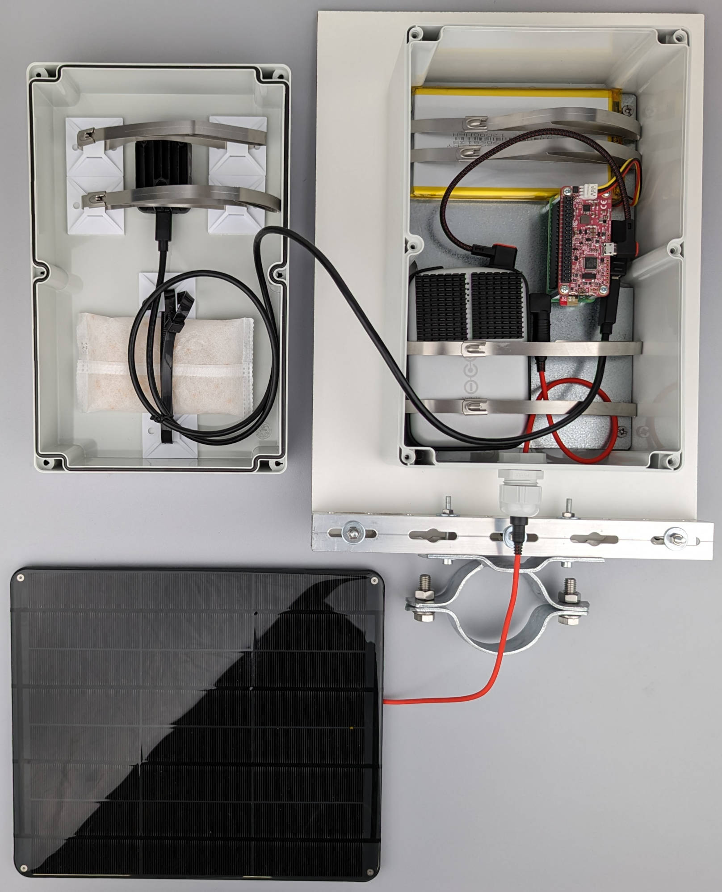

# Hardware

In this first main section, you will find detailed instructions on how to build
your own weatherproof and solar-powered camera trap with automated real-time
insect detection and tracking. In the [components](components.md){target=_blank}
section, all required parts are listed, including example product links. You
will also need some tools and equipment, which are shown in the
[overview](buildinstructions_overview.md){target=_blank} section of the
building instructions. If you don't own these tools yourself, you could lend
them from someone or go to your local Fablab/Makerspace, where all required
tools should be available.

We will start with [preparing the enclosure](buildinstructions_enclosure.md){target=_blank},
where all of the electronic parts will be mounted inside to protect them from
weather and humidity. In the next step, we are going to
[integrate the hardware](buildinstructions_hardware.md){target=_blank} into
the enclosure. For the [**Full Setup**](components.md#full-setup){target=_blank},
we will prepare everything for [mounting](buildinstructions_mounting.md){target=_blank}
the camera trap and the flower platform in the last section. If you are going
for the [**Minimal Setup**](components.md#minimal-setup){target=_blank},
you can skip this step and use your own mounting option.

??? warning "Disclaimer"

    Every effort has been made to check the instructions for accuracy and
    completeness. However, the author cannot be held responsible for any errors
    or omissions. The readers remain responsible for their safety when using the
    tools, hardware and software described in the instructions for building
    and deploying the Insect Detect camera trap. The readers must also comply
    with all applicable laws and regulations regarding the deployment of the
    camera trap system including the associated software and deep learning models.
    The author of these instructions cannot be held responsible for the results
    of action, inaction, or otherwise taken as a consequence of the information
    provided in the instructions. All products, brands and product links to any
    online shops are mentioned for illustration purposes only and do not denote
    a commercial relationship between the author and the products/brands/shops.

<figure markdown>
  { width="700" }
  <figcaption>Fully assembled Insect Detect camera trap system
              after following the provided instructions</figcaption>
</figure>

<figure markdown>
  { width="700" }
  <figcaption>Hardware schematic to illustrate connections between components</figcaption>
</figure>
