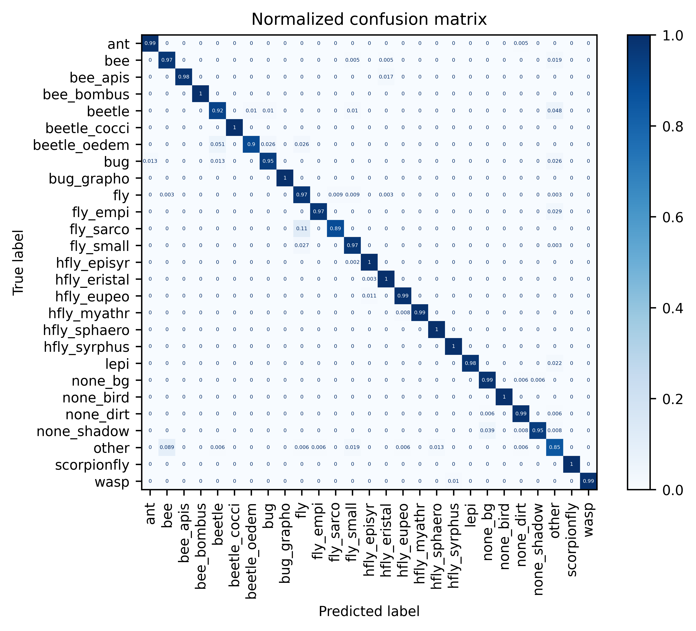

# Introduction

{ width="500" }

<span style="font-size: 140%; font-weight: bold">
Build your own insect-detecting camera trap!
</span>

This website provides instructions on hardware assembly, software setup,
programming, model training and deployment of a DIY camera trap that can
be used for automated insect monitoring.

---

## Background

Long-term monitoring data at a high spatiotemporal resolution is essential to
investigate potential drivers and their impact on the widespread insect decline
([Wagner, 2020](https://doi.org/10.1146/annurev-ento-011019-025151){target=_blank}),
as well as to design effective conservation strategies
([Samways et al., 2020](https://doi.org/10.1016/j.biocon.2020.108427){target=_blank}).
Automated monitoring methods can extend the ecologists' toolbox and acquire
high-quality data with less time/labor input compared to traditional methods
([Besson et al., 2022](https://doi.org/10.1111/ele.14123){target=_blank}).
If standardized, easily accessible and reproducible, these methods could
furthermore decentralize monitoring efforts and strengthen the integration
of independent biodiversity observations (Citizen Science)
([K&uuml;hl et al., 2020](https://doi.org/10.1016/j.oneear.2020.09.010){target=_blank}).

A range of different sensors can be used for automated insect monitoring
([van Klink et al., 2022](https://doi.org/10.1016/j.tree.2022.06.001){target=_blank}).
These include acoustic
(e.g. [Kawakita & Ichikawa, 2019](https://doi.org/10.1007/s13592-018-0619-6){target=_blank})
and opto-electronic sensors
(e.g. [Potamitis et al., 2015](https://doi.org/10.1371/journal.pone.0140474){target=_blank};
[Rydhmer et al., 2022](https://doi.org/10.1038/s41598-022-06439-6){target=_blank}),
as well as cameras (overview in
[H&oslash;ye et al., 2021](https://doi.org/10.1073/pnas.2002545117){target=_blank}).
Several low-cost DIY camera trap systems for insects use scheduled video or image
recordings, which are analyzed in a subsequent processing step
(e.g. [Droissart et al., 2021](https://doi.org/10.1111/2041-210X.13618){target=_blank};
[Geissmann et al., 2022](https://doi.org/10.1371/journal.pbio.3001689){target=_blank}).
Other systems utilize motion detection software as trigger for the image capture
(e.g. [Bjerge et al., 2021a](https://doi.org/10.3390/s21020343){target=_blank}; overview in
[Pegoraro et al., 2020](https://www.researchgate.net/publication/339227061_Automated_video_monitoring_of_insect_pollinators_in_the_field){target=_blank}).
As for traditional camera traps used for monitoring of mammals, the often large
amount of image data that is produced in this way can be most efficiently processed
and analyzed by making use of machine learning (ML) and especially deep
learning (DL) algorithms ([Borowiec et al., 2022](https://doi.org/10.1111/2041-210X.13901){target=_blank})
to automatically extract information such as species identity, abundance and behaviour
([Tuia et al., 2022](https://doi.org/10.1038/s41467-022-27980-y){target=_blank}).

Small DL models with relatively low computational costs can be run on suitable devices
[on the edge](https://docs.edgeimpulse.com/docs/concepts/what-is-edge-machine-learning){target=_blank},
to enable real-time detection of objects the model was trained on.
[Bjerge et al. (2021b)](https://doi.org/10.1002/rse2.245){target=_blank} developed
a camera trap for automated pollinator monitoring, which combines scheduled
time-lapse image recordings with subsequent on-device insect detection/classification
and tracking implemented during post-processing. The appearance and detection of
an insect can be also used as trigger to automatically start a recording. This can
drastically reduce the amount of data that has to be stored, by integrating the
information extraction into the recording process. The hereafter presented DIY
camera trap supports on-device detection and tracking of insects, combined with
high-resolution frame synchronization in real time.

??? quote "The necessity of automated biodiversity monitoring"

    "We believe that the fields of ecology and conservation biology are in the
    midst of a rapid and discipline-defining shift towards technology-mediated,
    indirect biodiversity observation. [...] Finally, for those who remain
    sceptical of the value of indirect observations, it is also useful to
    remember that we can never predict the advances in methods that may occur
    in the future. Unlike humans in the field, automated sensors produce a
    permanent visual or acoustic record of a given location and time that is
    far richer than a simple note that 'species X was here at time Y'. Similar
    to museum specimens, these records will undoubtedly be reanalysed by future
    generations of ecologists and conservation biologists using better tools
    than we have available now in order to extract information and answer
    questions that we cannot imagine today. And these future researchers will
    undoubtedly thank us, as we thank previous generations of naturalists, for
    having the foresight to collect as many observations as possible of the
    rapidly changing species and habitats on our planet."
    ([Kitzes & Schricker, 2019](https://drive.google.com/file/d/17m2EBSERWSUtM9c5eAE_hhknDJjhZ37F/view?usp=sharing){target=_blank})

---

## Overview

<figure markdown>
  { width="540" }
  <figcaption>The solar-powered DIY camera trap can be used for continuous
              automated monitoring of flower-visiting insects</figcaption>
</figure>

The **Insect Detect** DIY camera trap for automated insect monitoring is
composed of low-cost off-the-shelf hardware
[components](hardware/components.md#list-of-components){target=_blank},
combined with open-source [software](https://github.com/maxsitt/insect-detect){target=_blank}
and can be easily assembled and set up with the provided instructions. All
[Python scripts](software/programming.md){target=_blank} for testing and
deploying the system can be customized to different use cases by changing only
a few lines of code. The labeled [datasets](#datasets) and provided [models](#models)
for insect detection and classification can be used as starting point to
[train](modeltraining/train_detection.md){target=_blank} your own models,
e.g. adapted to different backgrounds or insect taxa.

The use of an artificial
[flower platform](https://github.com/maxsitt/insect-detect-docs/tree/main/PDF_templates/flower_platform){target=_blank}
provides a homogeneous and constant background, which standardizes the visual
attraction for insects and leads to higher detection and tracking accuracy with
less data requirement for model training. Because of the flat design, the posture
of insects landing on the platform is more uniform, which can lead to better
classification results and less images required for model training. In ongoing
research efforts, different materials, shapes and colors are tested to enhance
the visual attraction for specific pollinator groups.

!!! success "Implemented functions"

    - non-invasive, continuous automated monitoring of flower-visiting insects
    - standardized artificial flower platform as visual attractant
    - on-device detection and tracking with provided YOLO models (up to 60 fps)
    - save images of detected insects cropped from high-resolution frames (~12 fps)
    - low power consumption (~4.4 W) and fully solar-powered
    - automated classification and analysis in subsequent step on local PC
    - weatherproof enclosure
    - easy to build and deploy with low-cost off-the-shelf hardware components
    - completely open-source software with detailed documentation
    - instructions and notebooks to train and deploy custom models

!!! failure "Not implemented (yet)"

    - on-device classification and analysis
    - real-time data transfer (e.g. via LTE/LoRaWAN module)
    - comparison with traditional monitoring methods (validation)

---

Especially when deploying the camera trap system in new environments, edge
cases (low confidence score or false detection/classification) should be
identified and models [retrained](modeltraining/train_classification.md){target=_blank}
with new data (correctly annotated images). This iterative Active Learning loop
of retraining and redeploying can ensure a high detection and classification
accuracy over time. With the combination of
[Roboflow](https://roboflow.com/){target=_blank} for annotation and dataset
management and [Google Colab](https://colab.research.google.com/){target=_blank}
as cloud training platform, this can be achieved in a straightforward way, even
without prior knowledge or specific hardware requirements and free of charge.

<figure markdown>
  { width="800" }
  <figcaption>An Active Learning loop can increase detection and classification
              accuracy if real-world data is integrated to train new models</figcaption>
</figure>

---

In the [**Hardware**](hardware/index.md){target=_blank} section of this website,
you will find a list with all required [components](hardware/components.md){target=_blank}
and detailed [instructions](hardware/buildinstructions_enclosure.md){target=_blank}
on how to assemble the camera trap system. Only some standard tools are necessary, which
are listed in the Hardware [overview](hardware/buildinstructions_overview.md){target=_blank}.

In the [**Software**](software/index.md){target=_blank} section, all steps to
get the camera trap up and running are explained. You will start with installing
the necessary software on your [local PC](software/localsetup.md){target=_blank},
to communicate with the Raspberry Pi. After the Raspberry Pi is
[configured](software/pisetup.md){target=_blank}, details about the Python
scripts and tips on customization to different use cases can be found in the
[Programming](software/programming.md){target=_blank} part.

The **Model Training** section will show you tools to
[annotate](modeltraining/annotation.md){target=_blank} your own images and use
these to train your custom [object detection models](modeltraining/train_detection.md){target=_blank}
that can be deployed on the [OAK-1](https://docs.luxonis.com/projects/hardware/en/latest/pages/BW1093.html){target=_blank}
camera. To classify the cropped insect images, you can train your custom
[image classification model](modeltraining/train_classification.md){target=_blank}
in the next step that can be run on your local PC (no GPU necessary). All of the model
training can be done in [Google Colab](https://colab.research.google.com/){target=_blank},
where you will have access to a free cloud GPU for fast training. This means
all you need is a Google account, no special hardware is required.

The **Deployment** section contains details about each step of the processing
pipeline, from on-device [detection](deployment/detection.md){target=_blank}
and tracking, to [classification](deployment/classification.md){target=_blank}
of the cropped insect images on your local PC and subsequent automated
post-processing and [analysis](deployment/analysis.md){target=_blank} of the
combined results.

<figure markdown>
  { width="540" }
  <figcaption>The OAK-1 camera, Raspberry Pi Zero 2 W and PiJuice Zero pHAT
              provide all necessary hardware functions in a tiny form factor</figcaption>
</figure>

---

## GitHub repositories

- [`insect-detect`](https://github.com/maxsitt/insect-detect){target=_blank} &nbsp;
  [](https://zenodo.org/badge/latestdoi/580886977){target=_blank}

    > YOLOv5/v6/v7/v8 insect detection models and Python scripts for testing and
      deploying the Insect Detect DIY camera trap system for automated insect monitoring.

      [Download :fontawesome-brands-github:](https://github.com/maxsitt/insect-detect/archive/refs/heads/main.zip){ .md-button }

- [`insect-detect-ml`](https://github.com/maxsitt/insect-detect-ml){target=_blank} &nbsp;
  [](https://zenodo.org/badge/latestdoi/580963598){target=_blank}

    > Notebooks for object detection and image classification model
      training. Insect classification model. Python scripts for
      automated post-processing and analysis of the camera trap data.

      [Download :fontawesome-brands-github:](https://github.com/maxsitt/insect-detect-ml/archive/refs/heads/main.zip){ .md-button }

- [`insect-detect-docs`](https://github.com/maxsitt/insect-detect-docs){target=_blank} &nbsp;
  [](https://zenodo.org/badge/latestdoi/580908850){target=_blank}

    > Source files and assets of this documentation website, based on
      [Material for MkDocs](https://github.com/squidfunk/mkdocs-material){target=_blank}.

      [Download :fontawesome-brands-github:](https://github.com/maxsitt/insect-detect-docs/archive/refs/heads/main.zip){ .md-button }

- [`yolov5`](https://github.com/maxsitt/yolov5){target=_blank}

    > YOLOv5 fork with modifications to improve classification model training, validation
      and prediction. Adapted to data captured with the Insect Detect DIY camera trap.

      [Download :fontawesome-brands-github:](https://github.com/maxsitt/yolov5/archive/refs/heads/master.zip){ .md-button }

---

## Datasets

- [**Insect Detection Dataset**](https://universe.roboflow.com/maximilian-sittinger/insect_detect_detection){target=_blank} &nbsp;
  [](https://doi.org/10.5281/zenodo.7725941){target=_blank}

    > Dataset to train insect detection models. Contains annotated images collected in
      2022 with the DIY camera trap and the proposed flower platform as background.

- [**Insect Classification Dataset**](https://universe.roboflow.com/maximilian-sittinger/insect_detect_classification_v2){target=_blank} &nbsp;
  [](https://doi.org/10.5281/zenodo.8325384){target=_blank}

    > Dataset to train insect classification models. Contains images mostly
      collected in 2023 with several DIY camera traps.

---

## Models

### Detection models

| Model      | size<br><sup>(pixels) | mAP<sup>val<br>50-95 | mAP<sup>val<br>50 | Precision<sup>val<br> | Recall<sup>val<br> | Speed<sup>OAK<br>(fps) |
| ---------- | --------------------- | -------------------- | ----------------- | --------------------- | ------------------ | ---------------------- |
| YOLOv5n    | 320                   | 53.8                 | 96.9              | 95.5                  | 96.1               | 49                     |
| YOLOv6n    | 320                   | 50.3                 | 95.1              | 96.9                  | 89.8               | 60                     |
| YOLOv7tiny | 320                   | 53.2                 | 95.7              | 94.7                  | 94.2               | 52                     |
| YOLOv8n    | 320                   | 55.4                 | 94.4              | 92.2                  | 89.9               | 39                     |

??? note "Table Notes"

    - All [models](https://github.com/maxsitt/insect-detect/tree/main/models){target=_blank} were trained
      to 300 epochs with batch size 32 and default hyperparameters. Reproduce the model training with
      the provided [Google Colab notebooks](https://github.com/maxsitt/insect-detect-ml#model-training).
    - Trained on [Insect_Detect_detection](https://universe.roboflow.com/maximilian-sittinger/insect_detect_detection)
      dataset [version 7](https://universe.roboflow.com/maximilian-sittinger/insect_detect_detection/dataset/7)
      with only 1 class ("insect").
    - Model metrics (mAP, Precision, Recall) are shown for the original PyTorch (.pt) model before conversion
      to ONNX -> OpenVINO -> .blob format. Reproduce metrics by using the respective model validation method.
    - Speed (fps) is shown for the converted models (.blob), running on OAK-1 connected to RPi Zero 2 W
      (~2 fps slower with object tracker). Set `cam_rgb.setFps()` to the respective fps shown for each
      model to reproduce the speed measurements.
    - While connected via SSH (X11 forwarding of the frames), print fps to the console and comment out `cv2.imshow()`,
      as forwarding the frames will slow down the received message output and thereby fps. If you are using a
      Raspberry Pi 4 B connected to a screen, fps will be correctly shown in the livestream (see gif).

{ width="300" }

---

### Classification model

| Model<br><sup>(.onnx) | size<br><sup>(pixels) | Top1 Accuracy<sup>val<br> | Precision<sup>val<br> | Recall<sup>val<br> | F1 score<sup>val<br> |
| --------------------- | --------------------- | ------------------------- | --------------------- | ------------------ | -------------------- |
| EfficientNet-B0       | 128                   | 0.978                     | 0.979                 | 0.972              | 0.975                |

??? note "Table Notes"

    - The [model](https://github.com/maxsitt/insect-detect-ml/tree/main/models){target=_blank}
      was trained with image size 128 to 15 epochs with batch size 64 and default
      settings and hyperparameters. Reproduce the model training with the provided
      [Google Colab notebook](https://colab.research.google.com/github/maxsitt/insect-detect-ml/blob/main/notebooks/YOLOv5_classification_training.ipynb){target=_blank}.
    - Trained on [Insect Detect - insect classification dataset v2](https://doi.org/10.5281/zenodo.8325383){target=_blank}
      with 27 classes. To reproduce the dataset split, keep the default settings in the Colab notebook
      (train/val/test ratio = 0.7/0.2/0.1, random seed = 1).
    - Dataset can be explored at [Roboflow Universe](https://universe.roboflow.com/maximilian-sittinger/insect_detect_classification_v2){target=_blank}.
      Export from Roboflow compresses the images and can lead to a decreased model accuracy.
      It is recommended to use the uncompressed dataset from [Zenodo](https://doi.org/10.5281/zenodo.8325383){target=_blank}.
    - Full model metrics are available in the [`insect-detect-ml`](https://github.com/maxsitt/insect-detect-ml/tree/main#classification-model){target=_blank}
      GitHub repo.

{ width="700" }

---

## License

{ align=right }

This documentation website and its content is licensed under the Creative
Commons Attribution-ShareAlike 4.0 International License
([CC BY-SA 4.0](http://creativecommons.org/licenses/by-sa/4.0/){target=_blank}).

All Python scripts are licensed under the GNU General Public License v3.0
([GNU GPLv3](https://choosealicense.com/licenses/gpl-3.0/){target=_blank}).

---

## Citation

Until the corresponding paper will be published, you can cite this project as:

``` text
Sittinger, M. (2022). Insect Detect - Software for automated insect monitoring
with a DIY camera trap system (v1.6). Zenodo. https://doi.org/10.5281/zenodo.7472238
```

[](https://zenodo.org/badge/latestdoi/580886977){target=_blank}

---

## Acknowledgements

Many thanks to:

- [**Dr. Annette Herz**](https://www.julius-kuehn.de/en/bi/staff/p/s/annette-herz/){target=_blank}
  and all lab members for constant feedback and support.
- [**Simon Feiertag**](https://www.selvavida.com/){target=_blank} for taking
  many of the pictures shown on this website.
- [**Sebastian Sittinger**](https://de.linkedin.com/in/sebastian-sittinger-a29183b9){target=_blank}
  for helping with the design and build of the first prototype.
- [**Jana Weber**](https://www.researchgate.net/profile/Jana-Weber-6){target=_blank}
  for drawing the hoverfly
  ([*Scaeva pyrastri*](https://en.wikipedia.org/wiki/Scaeva_pyrastri){target=_blank})
  in the Insect Detect logo.
- Everyone in the
  [**automated monitoring community**](https://www.wildlabs.net/groups/autonomous-camera-traps-insects){target=_blank}
  for inspiring ideas and feedback.

Funding for this work was provided by the German Federal Ministry of Food and
Agriculture in the scope of the research project
[**MonViA**](https://www.agrarmonitoring-monvia.de/en/monitoring-of-insects/beneficial-insects-in-refuge-habitats){target=_blank}.
