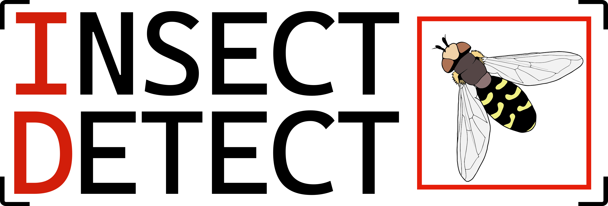
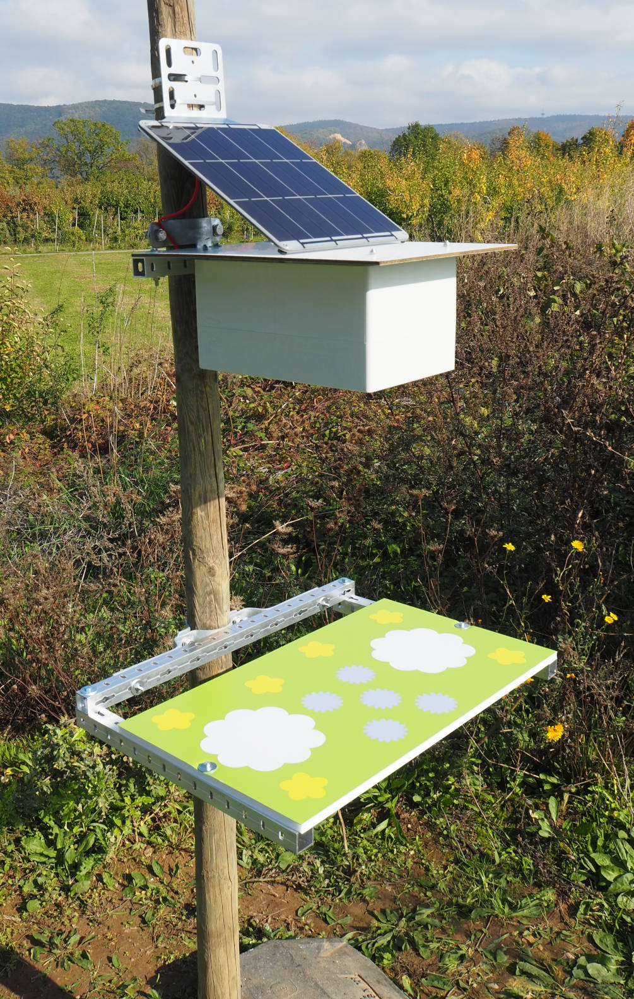
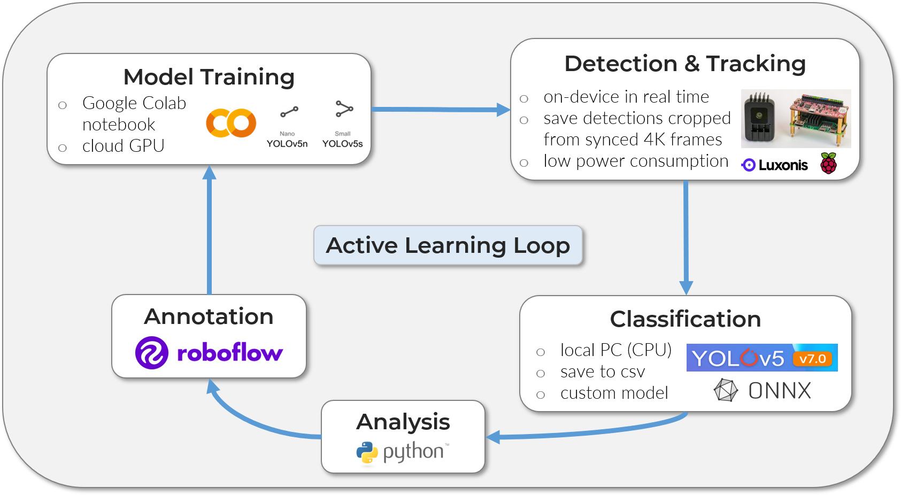
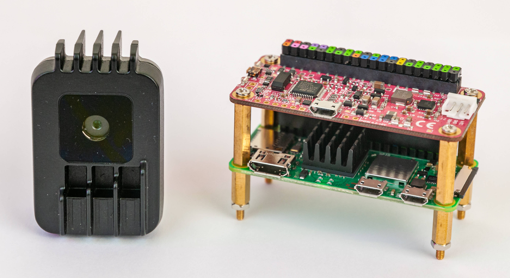

# Introduction

{ width="500" }

## Background

Long-term monitoring data at a high spatiotemporal resolution is essential to
investigate potential drivers and their impact on the widespread decline of
insect abundance and diversity
([Wagner, 2020](https://doi.org/10.1146/annurev-ento-011019-025151)), as well
as to design effective conservation strategies
([Harvey et al., 2020](https://doi.org/10.1038/s41559-019-1079-8)). Automated
monitoring methods can extend the ecologists' toolbox and yield
multidimensional data as output, with a comparatively low time and labor input
([Besson et al., 2022](https://doi.org/10.1111/ele.14123)). Standardized
methods that are easily accessible and reproducible could furthermore
decentralize monitoring efforts and strengthen the integration of independent
biodiversity observations (Citizen Science)
([K&uuml;hl et al., 2020](https://doi.org/10.1016/j.oneear.2020.09.010)).

A range of different sensors can be used for automated insect monitoring
([van Klink et al., 2022](https://doi.org/10.1016/j.tree.2022.06.001)). These
include acoustic
(e.g. [Kawakita & Ichikawa, 2019](https://doi.org/10.1007/s13592-018-0619-6))
and opto-electronical sensors
(e.g. [Potamitis et al., 2015](https://doi.org/10.1371/journal.pone.0140474);
[Rydhmer et al., 2022](https://doi.org/10.1038/s41598-022-06439-6)), as well as
cameras (overview in
[H&oslash;ye et al., 2021](https://doi.org/10.1073/pnas.2002545117)).
Several low-cost DIY camera trap systems for insects use video or time-lapse
recordings, which are analyzed in a subsequent processing step
(e.g. [Droissart et al., 2021](https://doi.org/10.1111/2041-210X.13618);
[Geissmann et al., 2022](https://doi.org/10.1371/journal.pbio.3001689)).
Other systems utilize motion detection software as trigger for the image
capture (e.g. [Bjerge et al., 2021a](https://doi.org/10.3390/s21020343);
overview in [Pegoraro et al., 2020](https://doi.org/10.1042/ETLS20190074)). As
for traditional camera traps used for monitoring of mammals, the large amount
of image data that is produced in this way can be most efficiently processed
and analyzed by making use of machine learning (ML) and especially deep
learning (DL) methods, to extract information such as species identity,
abundance and behaviour
([Tuia et al., 2022](https://doi.org/10.1038/s41467-022-27980-y)).

Small DL models with relatively low computational costs can be run on suitable
devices "on the edge", to enable real-time detection of objects the model was
trained on. The appearance and detection of an insect can thereby be used as a
kind of trigger to start a recording. This can drastically reduce the amount of
data that has to be stored, by integrating the information extraction into the
recording process. A "smart" camera trap for automated monitoring of
pollinators was developed by
[Bjerge et al. (2021b)](https://doi.org/10.1002/rse2.245) using the
[NVIDIA Jetson Nano](https://developer.nvidia.com/embedded/jetson-nano-developer-kit)
in combination with a HD webcam. A custom trained
[YOLOv3](https://doi.org/10.48550/arXiv.1804.02767) model is run in parallel
with the time-lapse image recording and can thereby detect and classify insects
in each image in real-time on the device (~0.5 fps). Filtering of false
detections and the tracking of insects was performed in a subsequent step on a
remote computer. An updated [dataset](https://doi.org/10.5281/zenodo.7395751)
is presented in a preprint by
[Bjerge et al. (2022)](https://doi.org/10.1101/2022.10.25.513484) and can be
seen as an important benchmark for insect detection and classification models
with complex background. The smaller versions of the
[YOLOv5](https://github.com/ultralytics/yolov5) models that were trained on
this dataset (available in the same Zenodo repository) could also be used on
edge devices to detect insects in real-time with similar backgrounds.

??? quote "The necessity of automated biodiversity monitoring"

    "We believe that the fields of ecology and conservation biology are in the
    midst of a rapid and discipline-defining shift towards technology-mediated,
    indirect biodiversity observation. [...] Finally, for those who remain
    sceptical of the value of indirect observations, it is also useful to
    remember that we can never predict the advances in methods that may occur
    in the future. Unlike humans in the field, automated sensors produce a
    permanent visual or acoustic record of a given location and time that is
    far richer than a simple note that 'species X was here at time Y'. Similar
    to museum specimens, these records will undoubtedly be reanalysed by future
    generations of ecologists and conservation biologists using better tools
    than we have available now in order to extract information and answer
    questions that we cannot imagine today. And these future researchers will
    undoubtedly thank us, as we thank previous generations of naturalists, for
    having the foresight to collect as many observations as possible of the
    rapidly changing species and habitats on our planet."
    ([Kitzes & Schricker, 2019](https://doi.org/10.1017/S0376892919000146))

---

## Overview

<figure markdown>
  { width="540" }
  <figcaption>The solar-powered DIY camera trap can be used for continuous
              automated monitoring of flower-visiting insects</figcaption>
</figure>

The proposed DIY camera trap for automated insect monitoring is composed of
low-cost off-the-shelf hardware [components](hardware/components.md), combined
with completely open source software and can be easily assembled and set up
with the provided instructions. All [Python scripts](software/programming.md)
for testing the system, data collection and continuous automated monitoring can
be adapted to different use cases by changing only a few lines of code. The
labeled datasets and trained models for insect detection and classification
that are provided should be seen as a starting point to train your own models,
e.g. adapted to different backgrounds or insect taxa (classes for
detection/classification). Especially when deploying the camera trap system in
new environments, edge cases (low confidence score or false
detection/classification) should be identified and models
[retrained](modeltraining/yolov5.md) with this new data. This iterative Active
Learning loop of retraining and redeploying can ensure a high detection and
classification accuracy over time. With the combination of
[Roboflow](https://roboflow.com/) for annotation and dataset management and
[Google Colab](https://colab.research.google.com/) as cloud training platform,
this can be achieved in a straightforward way, even without prior knowledge or
specific hardware and free of charge.

<figure markdown>
  { width="800" }
  <figcaption>The proposed processing pipeline can increase detection and
              classification accuracy over time if new real-world data is
              integrated via an Active Learning loop</figcaption>
</figure>

The use of an artificial flower platform provides a homogenous, constant
background, which standardizes the visual attraction for insects and leads to
higher detection and tracking accuracy with less data requirement for model
training. Because of the flat platform design, the posture of insects landing
on the platform will be more uniform, which can lead to better classification
results with less data input. The biggest disadvantage at the moment is the
bias in attraction for different insect groups. We are currently studying
various shapes, colors and materials to enhance the visual attraction for
specific pollinator groups and are testing the possible use of dispensers with
artificial floral scent bouquets, to add an olfactorial component to the
attraction.

!!! success "Implemented functions"

    - non-invasive, continuous automated monitoring of flower-visiting insects
    - standardized artificial flower platform as visual attractant
    - on-device detection and tracking with custom trained YOLOv5 model (4-5 fps)
    - save images of detected insects cropped from high-resolution frames (4K)
      to .jpg
    - easy to build and deploy with low-cost off-the-shelf hardware components
    - low power consumption (< 4 W) and fully solar-powered
    - weatherproof enclosure
    - automated classification and analysis in subsequent step on local PC
    - completely open source software with detailed documentation

!!! failure "Not implemented (yet)"

    - high attraction for a wide range of insect taxa or specific groups
    - selection of different detection model architectures (coming soon)
    - on-device classification and analysis
    - real-time data transfer (e.g. via LTE stick/module)
    - validation with traditional monitoring methods

In the [**Hardware**](hardware/index.md) section of this website you will find
a list with all required [components](hardware/components.md) and detailed
[instructions](hardware/buildinstructions_enclosure.md) on how to build and
assemble the camera trap system. Only some standard tools are necessary which
are listed in the Hardware [overview](hardware/buildinstructions_overview.md).

In the [**Software**](software/index.md) section, all steps to get the camera
trap up and running are explained. We will start with installing the necessary
software on your [local PC](software/localsetup.md), to communicate with the
Raspberry Pi Zero 2 W. After the Raspberry Pi is
[configured](software/pisetup.md), you can go deeper into the Python scripts if
you want, with details on [adapting the scripts](software/programming.md) to
your use case.

The **Model Training** section will show you tools to
[annotate](modeltraining/annotation.md) your own images and use these to train
your custom [YOLOv5](modeltraining/yolov5.md) object detection model that can
be deployed on the [OAK-1](https://bit.ly/3Ew7PbM) camera. To classify the
cropped insect images, you can also train your custom classification model in
the next step that can be run on your local PC (no GPU necessary). All of the
model training can be done in [Google Colab](https://colab.research.google.com/),
where you will have access to a free cloud GPU for fast training. This means
all you need is a Google account, no special hardware is required.

The **Deployment** section will give you details on each step of the processing
pipeline, from on-device [detection](deployment/detection.md) and tracking, to
[classification](deployment/classification.md) of the cropped insect images on
your local PC and subsequent automated [analysis](deployment/analysis.md) of
the combined results with the provided Pyton script.

<figure markdown>
  { width="540" }
  <figcaption>The OAK-1 camera, Raspberry Pi Zero 2 W and PiJuice Zero pHAT
              provide all necessary Hardware functions in a tiny form factor</figcaption>
</figure>

---

## GitHub repositories

- [`insect-detect` GitHub repo](https://github.com/maxsitt/insect-detect)
  > Python scripts for testing the camera trap and deploy the automated
    insect monitoring pipeline.

- [`insect-detect-ml` GitHub repo](https://github.com/maxsitt/insect-detect-ml)
  > Jupyter notebooks to run in Google Colab for YOLOv5 detection and
    classification model training.

- [`insect-detect-docs` GitHub repo](https://github.com/maxsitt/insect-detect-docs)
  > Source files and assets of this documentation website, based on
    [Material for MkDocs](https://github.com/squidfunk/mkdocs-material).

---

## Datasets

- Dataset for insect detection with annotated images collected in 2022 with the
  proposed flower platform as background:
  [Roboflow Universe](https://universe.roboflow.com/maximilian-sittinger/insect_detect_detection)

- Dataset for insect classification with annotated, cropped images of insects
  collected in 2022 with the proposed flower platform as background:
  [Roboflow Universe](https://universe.roboflow.com/maximilian-sittinger/insect_detect_classification)

---

## Citation

Until the corresponding paper will be published, please cite this project as:

``` text
Sittinger, M. (2022). Insect Detect - Software for automated insect monitoring
with a DIY camera trap system. Zenodo. https://doi.org/10.5281/zenodo.7472238
```

[](https://zenodo.org/badge/latestdoi/580886977)

---

## Acknowledgements

Many thanks to:

- [**Dr. Annette Herz**](https://www.julius-kuehn.de/en/bi/staff/p/s/annette-herz/)
  and the whole **Ento Lab** for constant feedback and support.
- [**Simon Feiertag**](https://www.selvavida.com/) for taking many of the
  pictures shown on this website.
- [**Sebastian Sittinger**](https://de.linkedin.com/in/sebastian-sittinger-a29183b9)
  for helping with the design and build of the first prototype.
- [**Jana Weber**](https://www.researchgate.net/profile/Jana-Weber-6) for
  drawing the hoverfly
  ([*Scaeva pyrastri*](https://en.wikipedia.org/wiki/Scaeva_pyrastri)) in the
  Insect Detect logo.
- Everyone in the
  [**automated monitoring community**](https://www.wildlabs.net/groups/autonomous-camera-traps-insects)
  for inspiring ideas and feedback.
- The [**Julius K&uuml;hn Institute**](https://www.julius-kuehn.de/en/bi/) and
  the project [**MonViA**](https://www.agrarmonitoring-monvia.de/en/) for funding.

---

## License

{ align=left }

This documentation website and its content is licensed under the Creative
Commons Attribution-ShareAlike 4.0 International License
([CC BY-SA 4.0](http://creativecommons.org/licenses/by-sa/4.0/)).

All Python scripts mentioned on this website are licensed under the GNU General
Public License v3.0 ([GNU GPLv3](https://choosealicense.com/licenses/gpl-3.0/)).
