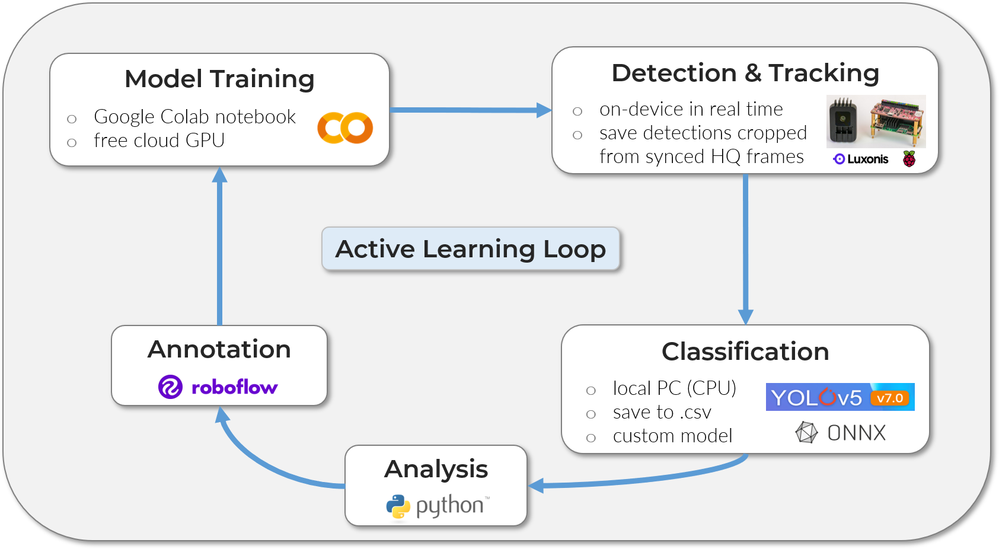

# Introduction

{ width="500" }

<span style="font-size: 140%; font-weight: bold">
Build your own insect-detecting camera trap!
</span>

This website provides instructions on hardware assembly, software setup,
programming, model training and deployment of a DIY camera trap that can
be used for automated insect monitoring.

## Background

Long-term monitoring data at a high spatiotemporal resolution is essential to
investigate potential drivers and their impact on the widespread decline of
insect abundance and diversity
([Wagner, 2020](https://doi.org/10.1146/annurev-ento-011019-025151){target=_blank}),
as well as to design effective conservation strategies
([Harvey et al., 2020](https://doi.org/10.1038/s41559-019-1079-8){target=_blank}).
Automated monitoring methods can be used to extend the ecologists' toolbox and yield
multidimensional data as output, with a comparatively low time and labor input
([Besson et al., 2022](https://doi.org/10.1111/ele.14123){target=_blank}).
If these novel methods are standardized and easily accessible and reproducible,
they could furthermore decentralize monitoring efforts and strengthen the integration
of independent biodiversity observations (e.g. Citizen Science)
([K&uuml;hl et al., 2020](https://doi.org/10.1016/j.oneear.2020.09.010){target=_blank}).

A range of different sensors can be used for automated insect monitoring
([van Klink et al., 2022](https://doi.org/10.1016/j.tree.2022.06.001){target=_blank}).
These include acoustic
(e.g. [Kawakita & Ichikawa, 2019](https://doi.org/10.1007/s13592-018-0619-6){target=_blank})
and opto-electronical sensors
(e.g. [Potamitis et al., 2015](https://doi.org/10.1371/journal.pone.0140474){target=_blank};
[Rydhmer et al., 2022](https://doi.org/10.1038/s41598-022-06439-6){target=_blank}),
as well as cameras (overview in
[H&oslash;ye et al., 2021](https://doi.org/10.1073/pnas.2002545117){target=_blank}).
Several low-cost DIY camera trap systems for insects use video or time-lapse
recordings, which are analyzed in a subsequent processing step
(e.g. [Droissart et al., 2021](https://doi.org/10.1111/2041-210X.13618){target=_blank};
[Geissmann et al., 2022](https://doi.org/10.1371/journal.pbio.3001689){target=_blank}).
Other systems utilize motion detection software as trigger for the image capture
(e.g. [Bjerge et al., 2021a](https://doi.org/10.3390/s21020343){target=_blank};
overview in [Pegoraro et al., 2020](https://doi.org/10.1042/ETLS20190074){target=_blank}).
As for traditional camera traps used for monitoring of mammals, the often large
amount of image data that is produced in this way can be most efficiently processed
and analyzed by making use of machine learning (ML) and especially deep
learning (DL) algorithms (e.g. object detection and image classification models),
to extract information such as species identity, abundance and behaviour
([Tuia et al., 2022](https://doi.org/10.1038/s41467-022-27980-y){target=_blank}).

Small detection models with relatively low computational costs can be run on
suitable devices
[on the edge](https://docs.edgeimpulse.com/docs/concepts/what-is-edge-machine-learning),
to enable real-time detection of objects the model was trained on. The
appearance and detection of an insect can thereby be used as a kind of trigger
to automatically start a recording. This can drastically reduce the amount of
data that has to be stored, by integrating the information extraction into the
recording process. A camera trap with on-device detection for automated
monitoring of pollinators was developed by
[Bjerge et al. (2021b)](https://doi.org/10.1002/rse2.245){target=_blank} using the
[NVIDIA Jetson Nano](https://developer.nvidia.com/embedded/jetson-nano-developer-kit){target=_blank}
in combination with a HD webcam. A custom trained
[YOLOv3](https://doi.org/10.48550/arXiv.1804.02767){target=_blank} model is run
in parallel with time-lapse image recordings and can thereby detect and
classify insects in each image in real-time on the device. Filtering of false
detections and the tracking of individual insects was performed in a subsequent
step on a remote computer. A recent [dataset](https://doi.org/10.5281/zenodo.7395751){target=_blank}
with annotated images was published together with a preprint by
[Bjerge et al. (2022)](https://doi.org/10.1101/2022.10.25.513484){target=_blank},
which can be used as an important benchmark for insect detection with complex background.

??? quote "The necessity of automated biodiversity monitoring"

    "We believe that the fields of ecology and conservation biology are in the
    midst of a rapid and discipline-defining shift towards technology-mediated,
    indirect biodiversity observation. [...] Finally, for those who remain
    sceptical of the value of indirect observations, it is also useful to
    remember that we can never predict the advances in methods that may occur
    in the future. Unlike humans in the field, automated sensors produce a
    permanent visual or acoustic record of a given location and time that is
    far richer than a simple note that 'species X was here at time Y'. Similar
    to museum specimens, these records will undoubtedly be reanalysed by future
    generations of ecologists and conservation biologists using better tools
    than we have available now in order to extract information and answer
    questions that we cannot imagine today. And these future researchers will
    undoubtedly thank us, as we thank previous generations of naturalists, for
    having the foresight to collect as many observations as possible of the
    rapidly changing species and habitats on our planet."
    ([Kitzes & Schricker, 2019](https://doi.org/10.1017/S0376892919000146){target=_blank})

---

## Overview

<figure markdown>
  { width="540" }
  <figcaption>The solar-powered DIY camera trap can be used for continuous
              automated monitoring of flower-visiting insects</figcaption>
</figure>

The **Insect Detect** DIY camera trap for automated insect monitoring is
composed of low-cost off-the-shelf hardware
[components](hardware/components.md#list-of-components){target=_blank},
combined with open source [software](https://github.com/maxsitt/insect-detect){target=_blank}
and can be easily assembled and set up with the provided instructions. All
[Python scripts](software/programming.md){target=_blank} for testing the
system, data collection and continuous automated monitoring can be adapted
to different use cases by changing only a few lines of code. The labeled
[datasets](#datasets) and provided [models](#models) for insect detection and
classification should be seen as a starting point to train your own models,
e.g. adapted to different backgrounds or insect taxa (labels and classes for
detection/classification).

Especially when deploying the camera trap system in new environments, edge
cases (low confidence score or false detection/classification) should be
identified and models [retrained](modeltraining/train_detection.md){target=_blank}
with new data (correctly annotated images). This iterative Active Learning loop
of retraining and redeploying can ensure a high detection and classification
accuracy over time. With the combination of
[Roboflow](https://roboflow.com/){target=_blank} for annotation and dataset
management and [Google Colab](https://colab.research.google.com/){target=_blank}
as cloud training platform, this can be achieved in a straightforward way, even
without prior knowledge or specific hardware requirements and free of charge.

<figure markdown>
  { width="800" }
  <figcaption>An Active Learning loop can increase detection and classification
              accuracy if real-world data is integrated to train new models</figcaption>
</figure>

The use of an artificial flower platform provides a homogeneous, constant
background, which standardizes the visual attraction for insects and leads to
higher detection and tracking accuracy with less data requirement for model
training. Because of the flat design, the posture of insects landing on the
platform will be more uniform, which can lead to better classification
results and less images required for model training. The biggest disadvantage
at the moment is the bias in attraction for different insect groups. We are
currently testing various shapes, colors and materials to enhance the visual
attraction for specific pollinator groups (e.g. hoverflies).

!!! success "Implemented functions"

    - non-invasive, continuous automated monitoring of flower-visiting insects
    - standardized artificial flower platform as visual attractant
    - on-device detection and tracking with provided YOLO models (up to 40 fps)
    - save images of detected insects cropped from high-resolution frames (4K)
    - low power consumption (~ 4 W) and fully solar-powered
    - automated classification and analysis in subsequent step on local PC
    - weatherproof enclosure
    - easy to build and deploy with low-cost off-the-shelf hardware components
    - completely open source software with detailed documentation
    - instructions and notebooks to train and deploy custom models

!!! failure "Not implemented (yet)"

    - high attraction of the flower platform for a wide range of insect taxa
    - on-device classification and analysis
    - real-time data transfer (e.g. via LTE stick/module)
    - comparison with traditional monitoring methods (validation)

In the [**Hardware**](hardware/index.md){target=_blank} section of this website
you will find a list with all required [components](hardware/components.md){target=_blank}
and detailed [instructions](hardware/buildinstructions_enclosure.md){target=_blank}
on how to build and assemble the camera trap system. Only some standard tools
are necessary, which are listed in the Hardware
[overview](hardware/buildinstructions_overview.md){target=_blank}.

In the [**Software**](software/index.md){target=_blank} section, all steps to
get the camera trap up and running are explained. We will start with installing
the necessary software on your [local PC](software/localsetup.md){target=_blank},
to communicate with the Raspberry Pi Zero 2 W. After the Raspberry Pi is
[configured](software/pisetup.md){target=_blank}, you can have a deeper look
at the Python scripts if you want, with details on
[adapting the scripts](software/programming.md){target=_blank} to your use case.

The **Model Training** section will show you tools to
[annotate](modeltraining/annotation.md){target=_blank} your own images and use
these to train your custom [object detection models](modeltraining/train_detection.md){target=_blank}
that can be deployed on the [OAK-1](https://docs.luxonis.com/projects/hardware/en/latest/pages/BW1093.html){target=_blank}
camera. To classify the cropped insect images, you can train your custom
[image classification model](modeltraining/train_classification.md){target=_blank}
in the next step that can be run on your local PC (no GPU necessary). All of the model
training can be done in [Google Colab](https://colab.research.google.com/){target=_blank},
where you will have access to a free cloud GPU for fast training. This means
all you need is a Google account, no special hardware is required.

The **Deployment** section will give you details on each step of the processing
pipeline, from on-device [detection](deployment/detection.md){target=_blank}
and tracking, to [classification](deployment/classification.md){target=_blank}
of the cropped insect images on your local PC and subsequent automated
[analysis](deployment/analysis.md){target=_blank} of the combined results with
the provided Python script.

<figure markdown>
  { width="540" }
  <figcaption>The OAK-1 camera, Raspberry Pi Zero 2 W and PiJuice Zero pHAT
              provide all necessary Hardware functions in a tiny form factor</figcaption>
</figure>

---

## GitHub repositories

- [`insect-detect` GitHub repo](https://github.com/maxsitt/insect-detect){target=_blank}
  > YOLO insect detection models and Python scripts for testing and
    deploying the DIY camera trap system for automated insect monitoring.

      [Download :fontawesome-brands-github:](https://github.com/maxsitt/insect-detect/archive/refs/heads/main.zip){ .md-button }

- [`insect-detect-ml` GitHub repo](https://github.com/maxsitt/insect-detect-ml){target=_blank}
  > Notebooks for YOLOv5/v6/v7/v8 object detection and YOLOv5-cls image classification
    model training. YOLOv5 classification script with YOLOv5s-cls insect classification
    model. Python script for automated analysis of the metadata .csv files.

      [Download :fontawesome-brands-github:](https://github.com/maxsitt/insect-detect-ml/archive/refs/heads/main.zip){ .md-button }

- [`insect-detect-docs` GitHub repo](https://github.com/maxsitt/insect-detect-docs){target=_blank}
  > Source files and assets of this documentation website, based on
    [Material for MkDocs](https://github.com/squidfunk/mkdocs-material){target=_blank}.

      [Download :fontawesome-brands-github:](https://github.com/maxsitt/insect-detect-docs/archive/refs/heads/main.zip){ .md-button }

---

## Datasets

- [**Detection Dataset**](https://universe.roboflow.com/maximilian-sittinger/insect_detect_detection){target=_blank}
  > Dataset to train insect detection models, with annotated images collected in
    2022 with the DIY camera trap and the proposed flower platform as background.

      [Download :simple-zenodo:](https://doi.org/10.5281/zenodo.7725941){target=_blank}

- [**Classification Dataset**](https://universe.roboflow.com/maximilian-sittinger/insect_detect_classification){target=_blank}
  > Dataset to train insect classification models, which mostly contains the
    cropped bounding boxes with insects, exported from the Detection Dataset.

      [Download :simple-zenodo:](https://doi.org/10.5281/zenodo.7725970){target=_blank}

---

## Models

### Detection models

| Model<br><sup>(.blob) | size<br><sup>(pixels) | mAP<sup>val<br>50-95 | mAP<sup>val<br>50 | Precision<sup>val<br> | Recall<sup>val<br> | Speed OAK<br><sup>(fps) |
| --------------------- | --------------------- | -------------------- | ----------------- | --------------------- | ------------------ | ----------------------- |
| **YOLOv5n**           | **320**               | 53.9                 | 97.6              | 96.0                  | 96.6               | **40**                  |
| YOLOv5n               | 416                   | 58.2                 | 97.4              | 97.0                  | 95.0               | 30                      |
| YOLOv5s               | 416                   | 63.4                 | 97.8              | 96.6                  | 95.6               | 17                      |

- All [models](https://github.com/maxsitt/insect-detect/tree/main/models){target=_blank}
  were trained to 300 epochs with batch size 32 and default settings. Reproduce the model training with the provided
  [Google Colab notebook](https://colab.research.google.com/github/maxsitt/insect-detect-ml/blob/main/notebooks/YOLOv5_detection_training_OAK_conversion.ipynb){target=_blank}.
- Trained on custom [dataset_320](https://universe.roboflow.com/maximilian-sittinger/insect_detect_detection/dataset/7){target=_blank} or
  [dataset_416](https://universe.roboflow.com/maximilian-sittinger/insect_detect_detection/dataset/4){target=_blank} with only 1 class ("insect").
- Model metrics (mAP, Precision, Recall) are shown for the original .pt model before conversion to ONNX -> OpenVINO -> .blob format.
- Speed (fps) is shown for the converted model in .blob format, running on the OAK device.

{ width="400" }

### Classification model

| Model<br><sup>(.onnx) | size<br><sup>(pixels) | Top1 Accuracy<sup>val<br> | Top5 Accuracy<sup>val<br> |
| --------------------- | --------------------- | ------------------------- | ------------------------- |
| **YOLOv5s-cls**       | 128                   | 0.9835                    | 1                         |

- The [model](https://github.com/maxsitt/insect-detect-ml/blob/main/yolov5s-cls_128.onnx){target=_blank}
  was trained to 100 epochs with batch size 64 and default settings. Reproduce the model training with the provided
  [Google Colab notebook](https://colab.research.google.com/github/maxsitt/insect-detect-ml/blob/main/notebooks/YOLOv5_classification_training.ipynb){target=_blank}.
- Trained on custom [dataset](https://universe.roboflow.com/maximilian-sittinger/insect_detect_classification/dataset/2){target=_blank}
  with 7 classes ([class balance](https://universe.roboflow.com/maximilian-sittinger/insect_detect_classification/health){target=_blank}).

---

## Citation

Until the corresponding paper will be published, you can cite this project as:

``` text
Sittinger, M. (2022). Insect Detect - Software for automated insect monitoring
with a DIY camera trap system (v1.5). Zenodo. https://doi.org/10.5281/zenodo.7472238
```

[](https://zenodo.org/badge/latestdoi/580886977){target=_blank}

---

## Acknowledgements

Many thanks to:

- [**Dr. Annette Herz**](https://www.julius-kuehn.de/en/bi/staff/p/s/annette-herz/){target=_blank}
  and the whole Ento Lab for constant feedback and support.
- [**Simon Feiertag**](https://www.selvavida.com/){target=_blank} for taking
  many of the pictures shown on this website.
- [**Sebastian Sittinger**](https://de.linkedin.com/in/sebastian-sittinger-a29183b9){target=_blank}
  for helping with the design and build of the first prototype.
- [**Jana Weber**](https://www.researchgate.net/profile/Jana-Weber-6){target=_blank}
  for drawing the hoverfly
  ([*Scaeva pyrastri*](https://en.wikipedia.org/wiki/Scaeva_pyrastri){target=_blank})
  in the Insect Detect logo.
- Everyone in the
  [**automated monitoring community**](https://www.wildlabs.net/groups/autonomous-camera-traps-insects){target=_blank}
  for inspiring ideas and feedback.
- The [**Julius K&uuml;hn Institute**](https://www.julius-kuehn.de/en/bi/){target=_blank}
  and the project [**MonViA**](https://www.agrarmonitoring-monvia.de/en/){target=_blank}
  for funding.

---

## License

{ align=left }

This documentation website and its content is licensed under the Creative
Commons Attribution-ShareAlike 4.0 International License
([CC BY-SA 4.0](http://creativecommons.org/licenses/by-sa/4.0/){target=_blank}).

All Python scripts mentioned on this website are licensed under the GNU General
Public License v3.0 ([GNU GPLv3](https://choosealicense.com/licenses/gpl-3.0/){target=_blank}).
