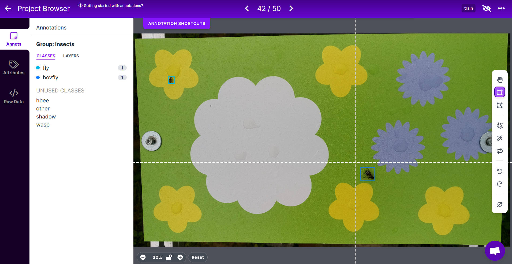

# Annotation

To train [CNN](https://en.wikipedia.org/wiki/Convolutional_neural_network){target=_blank}
models **which** objects to detect **where** in an image (detection/localization)
and **what** these objects are (classification), you will first have to
annotate/label the objects of interest manually to generate a training dataset.

---

## Annotation tools

Various open and closed source tools are available, working offline on your PC
or via an online platform in your browser. These tools have different pricing plans,
but most of them can be used for free with usage limits or for education/academia.
All of them will give you the basic functionalities of annotating images for
object detection (bounding boxes) or image classification (image label).
Some are simple, others are more complex and can provide additional functions
such as [AutoML](https://en.wikipedia.org/wiki/Automated_machine_learning){target=_blank}
("one-click model training") or
[model assisted labeling](https://docs.roboflow.com/annotate/model-assisted-labeling){target=_blank}.

Some widely used annotation tools are:

- [Roboflow](https://roboflow.com/){target=_blank}
- [CVAT](https://www.cvat.ai/){target=_blank}
- [Label Studio](https://labelstud.io/){target=_blank}
- [Supervisely](https://supervise.ly/){target=_blank}
- [labelme](https://github.com/wkentaro/labelme){target=_blank}
- [SuperAnnotate](https://www.superannotate.com/){target=_blank}
- [Hasty](https://hasty.ai/){target=_blank}
- [V7 Labs](https://www.v7labs.com/){target=_blank}
- [Labelbox](https://labelbox.com/){target=_blank}

---

## Roboflow

Because of its free [public plan](https://roboflow.com/pricing){target=_blank},
direct connection to a repository for
[open source datasets](https://roboflow.com/universe){target=_blank} and ease
of use with many helpful functions, we chose Roboflow to annotate our images.
The Roboflow [Python package](https://docs.roboflow.com/python){target=_blank}
makes it easy to automatically upload annotated datasets, e.g. when using a
Google Colab notebook as training environment.

If you are new to image annotation and dataset management, take a look at the
[Roboflow documentation](https://docs.roboflow.com/){target=_blank}, especially
for the [Annotate tool](https://docs.roboflow.com/annotate){target=_blank}.
Carefully read the
[best practices for image labeling](https://blog.roboflow.com/tips-for-how-to-label-images/){target=_blank},
as a dataset with optimally labeled images can significantly increase model
performance and accuracy.

The [dataset health check](https://docs.roboflow.com/dataset-health-check){target=_blank}
can give you a quick overview of your current dataset and show possible
problems, e.g. regarding class imbalance. With different
[image preprocessing](https://docs.roboflow.com/image-transformations/image-preprocessing){target=_blank}
steps, you can easily modify your dataset in multiple ways (e.g. resize,
modify classes).
[Image augmentations](https://docs.roboflow.com/image-transformations/image-augmentation){target=_blank}
can diversify your dataset, e.g. by applying image rotation, exposure or blur.
Multiple datasets can be generated in this way from the same annotated source
images. These datasets can then be
[exported](https://docs.roboflow.com/exporting-data){target=_blank} in all
common formats and downloaded either as .zip file or used to generate a link
to upload the dataset, e.g. into a Google Colab
[model training notebook](train_detection.md){target=_blank}.

<figure markdown>
  { width="800" }
  <figcaption>Roboflow Annotate, a simple Browser-based GUI for annotating
              images, e.g. for object detection (bounding boxes)</figcaption>
</figure>
