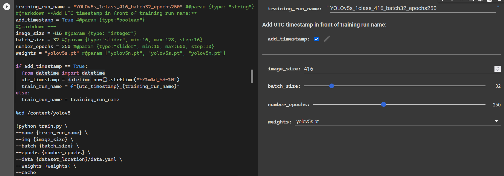

# YOLOv5 Training

[YOLOv5](https://github.com/ultralytics/yolov5){target=_blank} is probably the
easiest to use computer vision framework, including models for
[object detection](https://github.com/ultralytics/yolov5/wiki/Train-Custom-Data){target=_blank},
[image classification](https://github.com/ultralytics/yolov5/pull/8956){target=_blank} and
[instance segmentation](https://github.com/ultralytics/yolov5/releases/v7.0){target=_blank}.
You can find a summary of the YOLOv5 detection model architecture
[here](https://github.com/ultralytics/yolov5/issues/6998){target=_blank}.
It is highly recommended to read the
[tips for best training results](https://github.com/ultralytics/yolov5/wiki/Tips-for-Best-Training-Results){target=_blank}
if this is your first time training a deep learning model.

You can use the provided [Google Colab](https://colab.research.google.com/){target=_blank}
notebooks for custom training with your own dataset of a:

- [**YOLOv5 object detection model**](https://colab.research.google.com/github/maxsitt/insect-detect-ml/blob/main/notebooks/YOLOv5_detection_training_OAK_conversion.ipynb){target=_blank}
  > Includes conversion to
    [.blob](https://docs.luxonis.com/en/latest/pages/model_conversion){target=_blank}
    format for on-device inference on the Luxonis OAK.

- [**YOLOv5 image classification model**](https://colab.research.google.com/github/maxsitt/insect-detect-ml/blob/main/notebooks/YOLOv5_classification_training.ipynb){target=_blank}
  > Includes [export](https://github.com/ultralytics/yolov5/issues/251){target=_blank}
    to [ONNX](https://onnx.ai/){target=_blank} format for faster CPU inference.

Check the [Colab introduction](https://colab.research.google.com/){target=_blank}
and [features overview](https://colab.research.google.com/notebooks/basic_features_overview.ipynb){target=_blank},
if this is your first time using a Google Colab notebook.

After opening the notebook, log in to your Google account and under the **File**
menu choose **Save a copy in Drive**. Now you can change the code and adapt the
training procedure to your use case if desired. Before connecting to a Google
Colab cloud instance, make sure to check that **GPU** is selected as Hardware
accelerator under **Runtime --> Change runtime type**.

<figure markdown>
  { width="800" }
  <figcaption>Train your own YOLOv5 object detection model with the provided
              Google Colab notebook without having to write any code</figcaption>
</figure>
