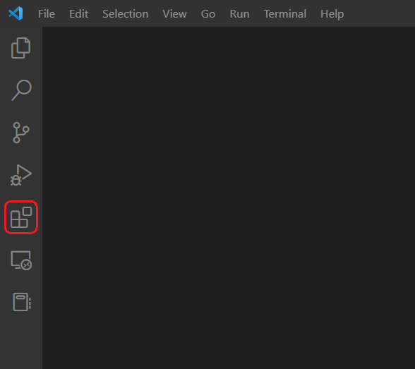

# Local Software Setup

??? warning "Local OS"

    All of the software and installation processes were only tested on a
    **Windows 11** computer. For Mac and Linux users some software may be very
    similar to Windows (e.g. RPi imager, VS Code), but some steps (e.g. X11
    forwarding) will be different to what is shown in these instructions. If
    you are a Mac or Linux user and have problems with the software setup,
    please get in touch with me!

## Raspberry Pi Imager

We will use the official Raspberry Pi Imager to download and install Raspberry
Pi OS Lite on the micro SD card and directly configure some important options.
[Download Raspberry Pi Imager](https://www.raspberrypi.com/software/){target=_blank}
and install it to your computer. [In the next section](pisetup.md){target=_blank},
we are going through all necessary steps to install and configure your
Raspberry Pi OS.

---

## Visual Studio Code

We are going to use Visual Studio Code to connect to the Raspberry Pi Zero 2 W
via [SSH](https://en.wikipedia.org/wiki/Secure_Shell){target=_blank}.
[Download VS Code](https://code.visualstudio.com/){target=_blank} and install it
to your computer. More information on how to set up VS Code can be found in the
[official Docs](https://code.visualstudio.com/Docs/setup/setup-overview){target=_blank}.

After installing and starting VS Code, open the Extensions view by clicking on
the Extensions icon in the left side bar and install the
[Remote - SSH](https://bit.ly/3dw6tSI){target=_blank} extension and the
[Remote X11](https://bit.ly/3A6BNz1){target=_blank} extension.

<figure markdown>
  { width="400" }
  <figcaption>VS Code Extensions icon in the left side bar</figcaption>
</figure>

- The Remote - SSH extension will enable us to use the Raspberry Pi Zero 2 W as
  a remote development environment which will make testing and programming a
  lot easier.
- The Remote X11 extension in combination with a X window server (e.g. VcXsrv)
  is necessary to forward the OAK-1 camera stream received from the Raspberry
  Pi to your local machine via a
  [X11 SSH tunnel](https://en.wikipedia.org/wiki/X_Window_System){target=_blank}
  and show it on your local PC.

??? info "Recommended Extensions"

    - [Python](https://bit.ly/2Zm3Ypq){target=_blank} and
      [Pylance](https://bit.ly/3s4qKTF){target=_blank} extensions if you are
      working with Python scripts.
    - [Excel Viewer](https://bit.ly/3DNAsjM){target=_blank} extension for a
      more readable preview of the .csv metadata and log files.
    - [Save Commands](https://bit.ly/3NntHsb){target=_blank} extension if you
      want to save some often used terminal commands for direct execution.

---

## VcXsrv Windows X Server

To be able to see the OAK-1 camera stream that is sent to the Raspberry Pi on
your local computer (e.g. for testing or adjusting the camera trap), you will
need to install a X server if you are communicating with the RPi via SSH.
[Download VcXsrv](https://sourceforge.net/projects/vcxsrv/){target=_blank} and
install it to your computer. Start the X server with the `XLaunch.exe` and keep
all the default settings. After that you will see a tray icon in the taskbar
and you can test if the connection to the Raspberry Pi is active in
[VS Code](pisetup.md#configure-x11-forwarding){target=_blank}.

---

## DiskInternals LinuxReader

We will use DiskInternals LinuxReader to save data from the Raspberry Pi's SD
card to your local computer. This is only necessary if you are not using a
Linux-based OS, as the Linux partition format is not compatible with Windows.
[Download DiskInternals LinuxReader](https://www.diskinternals.com/linux-reader/){target=_blank}
and install it to your computer.

- Insert the Raspberry Pi's SD card in your card reader and open the program.
  You will see two partitions on the SD card: `boot` and `rootfs`.
- Double-click on the `rootfs` partition and navigate to
  `/home/pi/insect-detect/data` to see all log files and recorded images.
- Select everything you want to download to your PC and click the **Save**
  button in the upper menu bar.
- Keep the **Save Files** option, choose your output folder and select both
  options **Save directory structure** and **Extract file date from metadata**.
  After that, the data you selected will be copied to your computer.
