# Raspberry Pi Setup

## Install Raspberry Pi OS

Insert the microSD card into your card reader and start the Raspberry Pi Imager.

First, use `CHOOSE DEVICE` to select your Raspberry Pi model (`Raspberry Pi Zero 2 W`
in our case). Continue with `CHOOSE OS` to select the operating system.

{ width="700" }

Go to `Raspberry Pi OS (other)` to show the Lite OS versions.

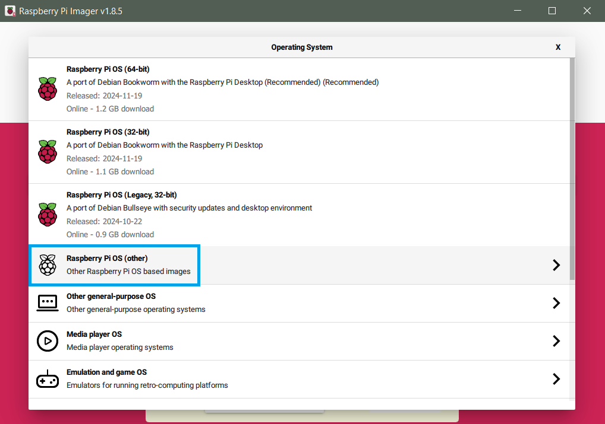{ width="700" }

Select `Raspberry Pi OS Lite (32-bit)` (based on Debian 12 Bookworm with Python 3.11).

{ width="700" }

Continue with `CHOOSE STORAGE` and select your microSD card.

{ width="700" }

Hit `NEXT` and select `EDIT SETTINGS` to customize your OS setup.

{ width="700" }

Configure the following settings under the `GENERAL` tab:

- `Set hostname`: For multiple camera traps, give each one a unique hostname.
  Note the hostname, as you will need it to connect to the RPi via SSH.
- `Set username and password`: Keep the default `pi` as username. Choose a
  simple password (we won't use it after setting up SSH key based authentication
  in the next step).
- `Configure wireless LAN`: Enter your Wi-Fi credentials (e.g. 2.4 GHz
  [mobile hotspot](https://support.microsoft.com/en-us/windows/use-your-windows-device-as-a-mobile-hotspot-c89b0fad-72d5-41e8-f7ea-406ad9036b85){target=_blank}).
- Select the correct `Wireless LAN country`.
- `Set locale settings` to your time zone and keyboard layout.

    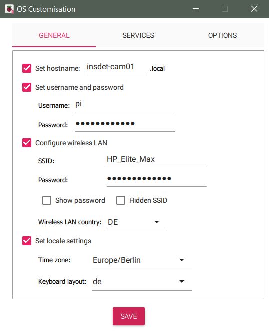{ width="500" }

Configure the following settings under the `SERVICES` tab:

- Activate `Enable SSH` and `Allow public-key authentication only`.
- Hit `RUN SSH-KEYGEN` if you didn't already generate a SSH key pair before.
  The public key will be automatically inserted in the text field.

    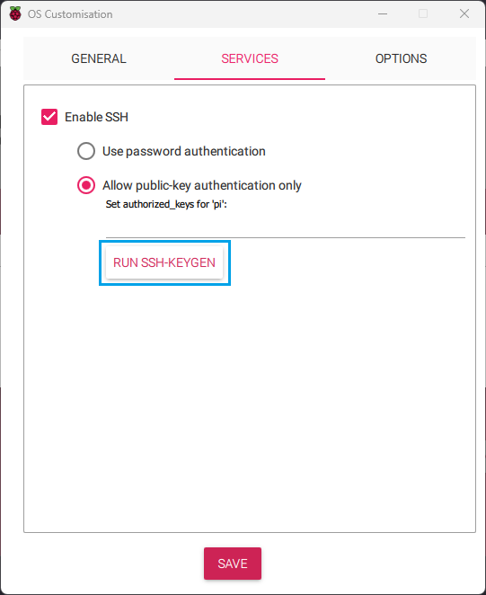{ width="700" }

Keep the default settings under the `OPTIONS` tab and hit `SAVE`.

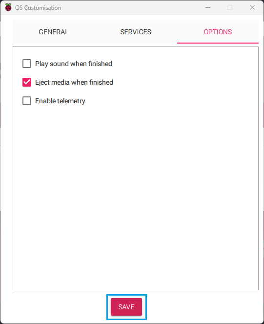{ width="500" }

Hit `YES` to apply the customized OS settings. Confirm again with `YES` that all
existing data on your microSD card will be erased when writing the image.

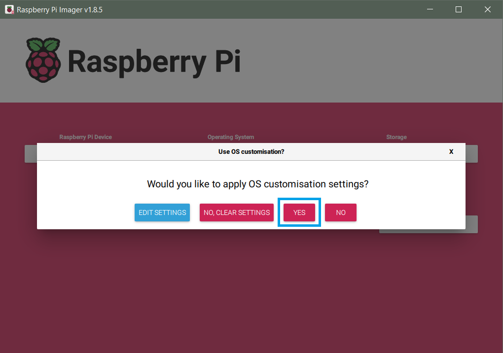{ width="700" }

**Insert the microSD card into the Raspberry Pi after the OS installation is finished.**

---

## Turn On Raspberry Pi

If you are not using a power management board, insert a Micro-USB cable
connected to a power supply, battery or laptop into the **PWR IN** Micro-USB
input of the Raspberry Pi, which will trigger it to turn on. The first boot
can take a little bit longer (up to 5 min).

---

### Witty Pi 4 L3V7

If you integrated the
[LED button](../hardware/2024_buildinstructions_hardware.md#13-led-button){target=_blank},
press it once to turn on the Raspberry Pi. If you don't have an external button,
press the button on the Witty Pi board to turn on the Raspberry Pi.

:material-circle:{ .circle_green } Green LED: battery fully charged indicator

:material-circle:{ .circle_blue } Blue LED: battery charging indicator

:material-circle:{ .circle_red } Red LED: power indicator

:material-circle:{ .circle_yellow } On/Off Button

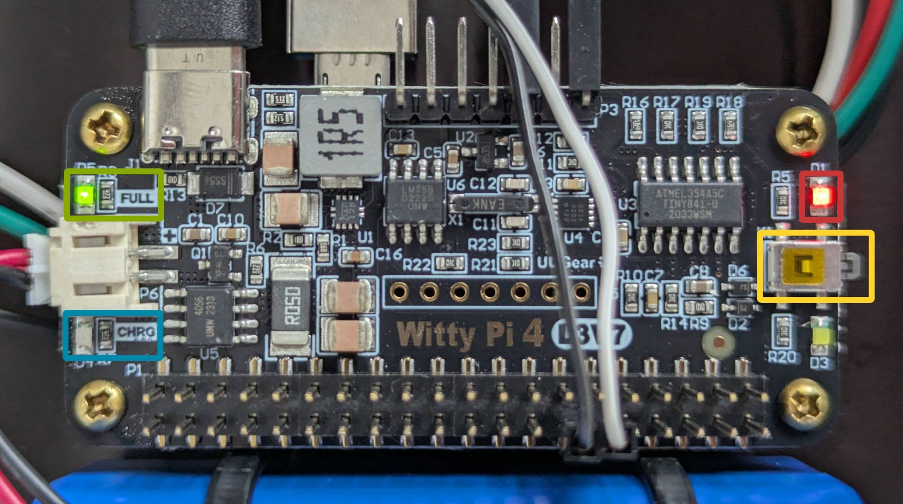{ width="600" }

If the red LED on the Witty Pi board is turned on, the Raspberry Pi is powered
via the GPIO pins by either the USB-C input (if 5V battery pack is connected
and charged) or the 3.7V battery pack (5V battery pack not connected or empty).

After installing and configuring the Witty Pi software, the power to the
Raspberry Pi will be cut 25 seconds after a shutdown command is received
and the red LED will turn off.

More info:
[Witty Pi 4 L3V7 User Manual](https://www.uugear.com/doc/WittyPi4L3V7_UserManual.pdf){target=_blank}

??? bug "Red LED stays on"

    If the Raspberry Pi is turned off, but the red LED on the Witty Pi board
    still stays on after 25 seconds, the button will not be responsive as the
    Witty Pi assumes that the RPi is still turned on. This can happen if the
    Witty Pi software is not yet installed or if there is a problem with the
    GPIO connection (check for faulty solder joints). In this case, you will
    need to unplug both batteries (USB-C and 3.7V) and connect them again to
    reset the Witty Pi board.

---

### PiJuice Zero

Turn on the Raspberry Pi with a short single press on the PiJuice **SW1**
button (marked green on the left side of the following picture).

More info:
[PiJuice Buttons and LEDs](https://github.com/PiSupply/PiJuice#buttons-and-leds){target=_blank}

{ width="600" }

---

## Set up X11 forwarding

To show the camera live stream with OpenCV on your PC, you will have to set up
X11 forwarding.

To set the `DISPLAY` environment variable in Windows,
[open cmd](https://www.howtogeek.com/235101/10-ways-to-open-the-command-prompt-in-windows-10/){target=_blank}
and run:

``` powershell
setx DISPLAY "localhost:0.0"
```

Reboot your computer for the changes to take effect. You only have to do this once.

Follow the instructions in [Local Setup](localsetup.md#vcxsrv-windows-x-server){target=_blank}
to install and start the **VcXsrv X server**.

---

## Connect RPi via SSH

!!! tip ""

    You can connect to the RPi via SSH by using the hostname that you set during
    the RPi OS installation. If this does not work, you will have to use its IP
    address instead. There are
    [several ways](https://www.raspberrypi.com/documentation/computers/remote-access.html#ip-address){target=_blank}
    to find the RPi's IP address, one of the easiest solutions is to install
    the [Fing App](https://www.fing.com/app/){target=_blank} and scan the IP
    addresses of all devices in your Wi-Fi network.

Open a new Terminal in VS Code. Use **right-click** to paste commands to the Terminal.

{ width="700" }

Connect to your Raspberry Pi via
[SSH](https://www.raspberrypi.com/documentation/computers/remote-access.html#ssh){target=_blank}
and trusted X11 forwarding (`-Y`) by running:

``` bash
ssh -Y pi@insdet-cam01
```

!!! info ""

    `pi` = username. `insdet-cam01` = hostname. Change it to
    the hostname that you set during the RPi OS installation.

When you are asked if you want to continue connecting, type `yes` and hit ++enter++.

---

## Add RPi File Explorer

We will use the
[SSH FS](https://marketplace.visualstudio.com/items?itemName=Kelvin.vscode-sshfs){target=_blank}
extension that you installed in [Local Setup](localsetup.md#visual-studio-code){target=_blank}
to mount a remote workspace folder (from Raspberry Pi) as a local workspace
folder in VS Code. This makes working with files on the Raspberry Pi easier
(e.g. editing Python scripts or showing metadata/logs/images).

- Open the SSH FS extension and create a new configuration (`Name`: your RPi
  hostname). Hit `Save` to start editing the configuration.

    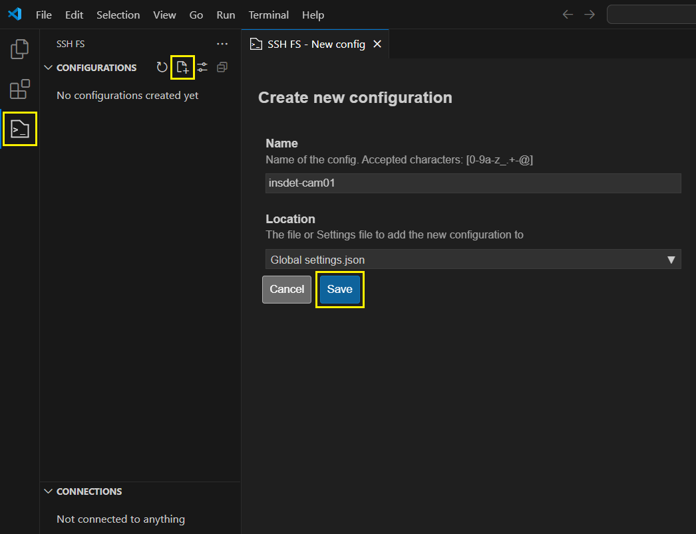{ width="600" }

- Configure the following fields and keep the rest empty:

    - `Host`: your RPi hostname
    - `Port`: `22` (should be the default)
    - `Root`: `~/` (will open the `/home/pi` directory)
    - `Username`: `pi`
    - `Private key`: hit `Prompt` and select the path to your SSH key (`id_rsa`)

        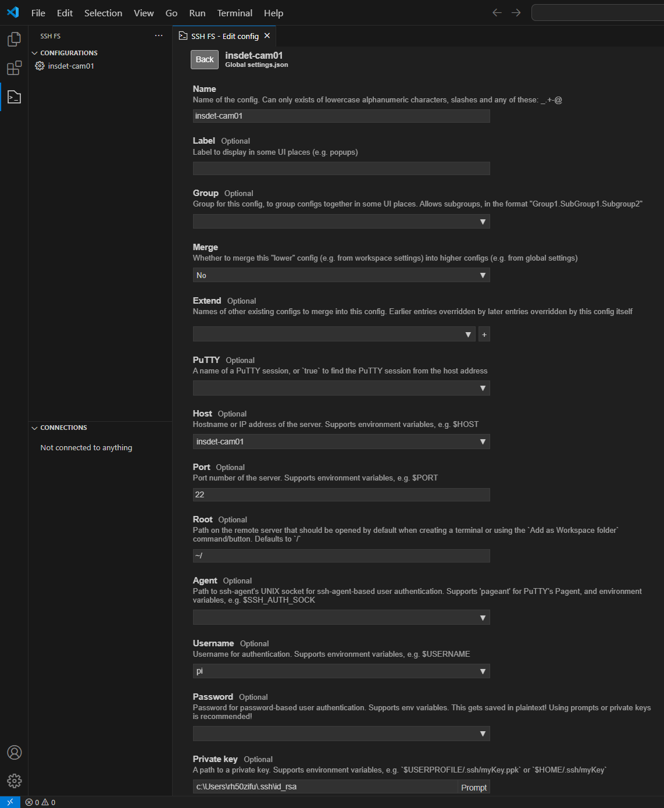{ width="500" }

- Hit `Save` at the bottom to save the configuration.
- Hit `Add as Workspace folder` to the right of your saved configuration to
  mount the `/home/pi` directory from the Raspberry Pi in your local workspace.

    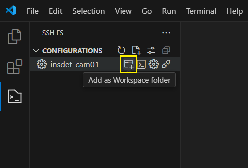{ width="400" }

- Hit the blue SSH FS icon in the bottom left corner and select `Close Remote Workspace`
  to close the workspace and disconnect from the Raspberry Pi (e.g. after shutdown).

    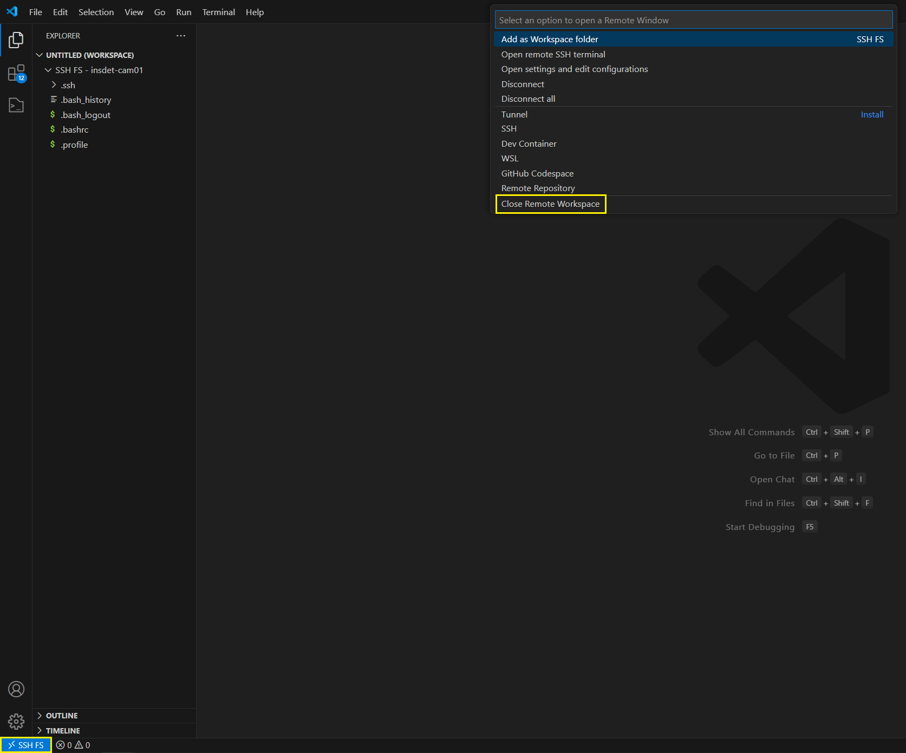{ width="700" }

---

## Update Software

We will start with updating the already installed software by running:

``` bash
sudo apt update && sudo apt full-upgrade
```

When you are asked if you want to continue, confirm with ++y+enter++.

Reboot the Raspberry Pi after all updates were successfully installed with:

``` bash
sudo reboot
```

After the reboot you will have to establish a new SSH connection.

---

## Configure Power Manager

The [`insect-detect`](https://github.com/maxsitt/insect-detect){target=_blank}
software supports both the [Witty Pi 4 L3V7](https://www.uugear.com/product/witty-pi-4-l3v7/){target=_blank}
and [PiJuice Zero](https://uk.pi-supply.com/products/pijuice-zero){target=_blank}
as power management boards. With the new 2024 version of the hardware setup,
the Witty Pi is used by default but can be easily exchanged with the PiJuice.

---

### Configure Witty Pi 4 L3V7

- Install the [Witty-Pi-4](https://github.com/uugear/Witty-Pi-4){target=_blank}
  software from the [modified fork](https://github.com/maxsitt/Witty-Pi-4){target=_blank}:

    ``` bash
    wget -qO- https://raw.githubusercontent.com/maxsitt/Witty-Pi-4/main/Software/install.sh | sudo bash
    ```

- Reboot the Raspberry Pi after the software was successfully installed:

    ``` bash
    sudo reboot
    ```

- Start the Witty Pi 4 configuration tool by running:

    ``` bash
    wittypi/wittyPi.sh
    ```

- Type ++3++ in and hit ++enter++ to synchronize the
  [RTC](https://en.wikipedia.org/wiki/Real-time_clock){target=_blank} time with
  your network time:

    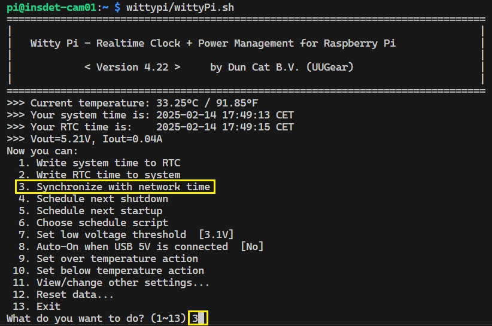{ width="700" }

    ??? warning "Batteries Unplugged"

        If you unplug both the 3.7V battery and USB-C input (5V battery) from the
        Witty Pi board, the RTC will not be powered and lose its time. In this case,
        you will have to synchronize the RTC time with your network time again.

- Next, we will deactivate Auto-On when USB-C is connected to the Witty Pi.
  Type ++8++ in the Terminal and hit ++enter++. Select `No` by typing ++0++
  and hit ++enter++ again:

    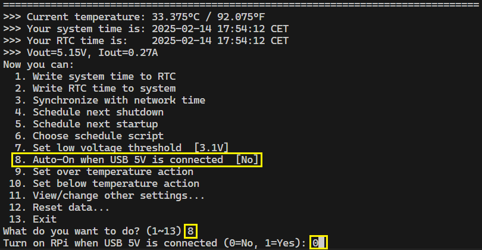{ width="700" }

- Type `11` and hit ++enter++ to go to `11. View/change other settings...`
- Type `2` and hit ++enter++ to change the power cut delay time after shutdown.
  Type in `25` which is the maximum allowed value and hit ++enter++:

    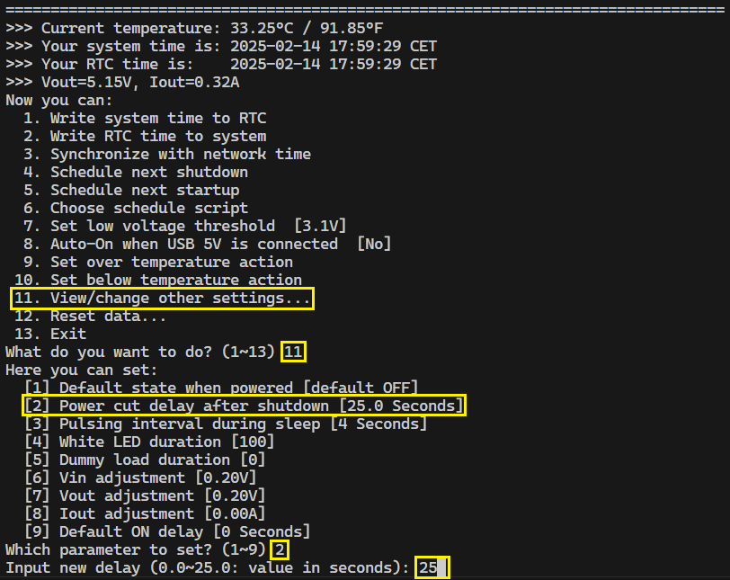{ width="700" }

- Back in the main menu, type `13` and hit ++enter++ to exit the Witty Pi configuration.

Now that the Witty Pi 4 L3V7 is configured, we can set up scheduling of automatic
startup and shutdown times. This is done with `.wpi` schedule files containing a
custom ON/OFF sequence. In the
[`wittypi/schedules`](https://github.com/maxsitt/Witty-Pi-4/tree/main/Software/wittypi/schedules){target=_blank}
directory you can find some example schedule scripts.

Start with creating a `BEGIN` and `END` date + time that will define the duration
of your loop, which will continue as long as the current time is between the
`BEGIN` and `END` time of the schedule script. Add your first `ON` state and how
long it should last. Use `D` to set the number of days, `H` for hours, `M` for
minutes and `S` for seconds.

Add `WAIT` after the duration of an `ON` state to trigger the shutdown externally
(e.g. shutdown command at end of Python script). In this case, the end of the
`ON` state will not automatically trigger a shutdown but is required to calculate
the duration of the next `OFF` state.

To activate your schedule script, run the Witty Pi 4 configuration tool:

``` bash
wittypi/wittyPi.sh
```

Type `6` and hit ++enter++ to `Choose schedule script`. We are selecting the
[example script](https://github.com/maxsitt/Witty-Pi-4/blob/main/Software/wittypi/schedules/on_9_12_15_18_hours.wpi){target=_blank}
that will turn on the Raspberry Pi every day at 9, 12, 15 and 18 o'clock.

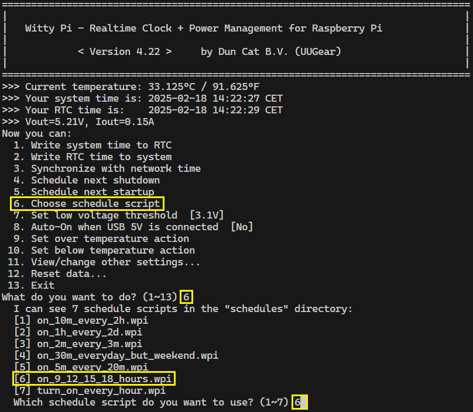{ width="700" }

After choosing the schedule script, it will be copied to `wittypi/schedule.wpi`
and the `wittypi/schedule.log` file will start logging startup/shutdown events.

You can also use the
[Witty Pi Schedule Script Generator](https://www.uugear.com/app/wittypi-scriptgen/){target=_blank}
to create your schedule script with a visual feedback and the option to run a
preview of the scheduling behaviour. You can find more information in chapter 9
of the Witty Pi 4 L3V7 User Manual:
[About Schedule Script](https://www.uugear.com/doc/WittyPi4L3V7_UserManual.pdf){target=_blank}.

---

### Configure PiJuice Zero

Install the PiJuice software by running:

``` bash
sudo apt install pijuice-base
```

When you are asked if you want to continue, confirm with ++y+enter++.

After the installation you can check if the PiJuice Zero is correctly detected
by running:

``` bash
sudo i2cdetect -y 1
```

If you see an entry at address `14` and `68`, the connection to the PiJuice is
now established.

{ width="500" }

From now on we want to use the built-in [RTC](https://en.wikipedia.org/wiki/Real-time_clock){target=_blank}
of the PiJuice Zero board as primary hardware clock to wake up the Raspberry Pi
at specific times when it is not connected to the internet. For this, we will
have to manually load the RTC driver at each boot by modifying the
`config.txt` file:

``` bash
sudo nano /boot/firmware/config.txt
```

Add the following lines at the end of the text file:

``` text
# Load PiJuice RTC driver at boot
dtoverlay=i2c-rtc,ds1307=1
```

Exit the editor with ++ctrl+x++ and save the changes with ++y+enter++.

{ width="600" }

Reboot the Raspberry Pi:

``` bash
sudo reboot
```

After the reboot run:

``` bash
sudo i2cdetect -y 1
```

You should now see `UU` at address 68, which means that the RTC driver was
successfully loaded and the PiJuice RTC will now be used as hardware clock.

{ width="500" }

You can check if the date and time is correct with:

``` bash
sudo hwclock -r
```

We will now configure the PiJuice Zero through its command line interface
by running:

``` bash
pijuice_cli
```

{ width="500" }

- Start with checking if the firmware is up to date by going to the `Firmware`
  tab (use the arrow keys to navigate). If there is a new version available,
  `Update` the firmware.
- Next, go to the `Battery profile` tab and check if the correct profile is
  selected. If you are using the 12,000 mAh battery, this should be
  `PJLIPO_12000`. Scroll down and change `Temperature sense` to `NTC`.
  This will make sure that the battery temperature is correctly estimated.
  Save the changed settings with `Apply settings`.
- Go to the `System Task` tab, activate `Software Halt Power Off` and set the
  `Delay period [seconds]` to `20`. With this setting activated, the power to
  the Raspberry Pi will be cut off 20 seconds after a software shutdown has
  occured. This will make sure that the OS can complete the shutdown process
  without potential SD card corruption.

    { width="500" }

- Optional: Depending on your hardware setup, under the `Battery profile` tab
  you could decrease the `Termination current [mA]` to e.g. `100` if you are
  using a solar panel as direct input into the PiJuice Zero
  ([**Minimal Setup**](../hardware/components.md#minimal-setup){target=_blank}
  without Voltaic battery).

The most important settings are now applied. You can get a lot more information
about all of the other settings at the
[PiJuice GitHub repo](https://github.com/PiSupply/PiJuice/tree/master/Software#pijuice-cli){target=_blank}.

In the last step, we will set the `Wakeup Alarm` to specified times to fully
automate the camera trap recordings. The PiJuice wakeup alarm clock is set in
UTC time, so you have to convert the wake-up times to your time zone (in our
case UTC+2). As you can see in the example below, we set our Wakeup Alarm to
`Every day` at `Hour` `7;10;13;16` UTC time, which means that the PiJuice will
wake up the Raspberry Pi everyday at 9, 12, 15 and 18 o'clock (UTC+2). Activate
`Wakeup enabled` and press `Set alarm` to save your specified wake-up times.

{ width="500" }

!!! tip ""

    During summer it might make sense to not record around noon, as many insects
    are not active during the hottest daytime. Also the temperature in the camera
    trap enclosure will be lower if the RPi and OAK-1 are not running, which can
    increase the charging efficiency of the batteries.

---

## Configure Raspberry Pi

To show the camera live stream with OpenCV and X11 forwarding on your PC, you
will need to switch from Wayland to the X11 backend for the window manager.

Open the Raspberry Pi
[configuration tool](https://www.raspberrypi.com/documentation/computers/configuration.html){target=_blank}
by running:

``` bash
sudo raspi-config
```

Use your arrow keys to navigate and ++enter++ to select settings. Go to
`6 Advanced Options` and then to `A6 Wayland`. Select `W1 X11` to activate
X11.

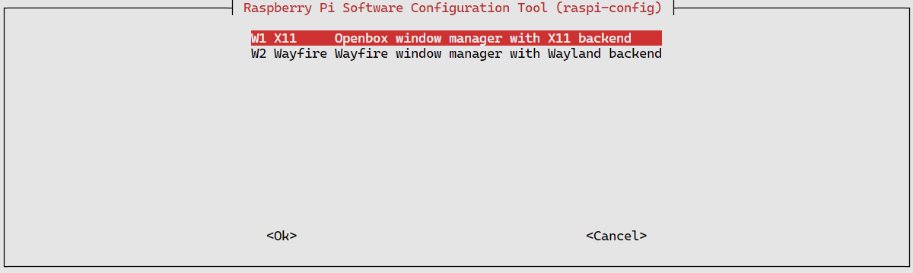{ width="700" }

Select `Finish` in the main menu and confirm with `Yes` when asked if you want
to reboot now.

---

## Install Software

Install all required dependencies for RPi + OAK:

``` bash
wget -qO- https://raw.githubusercontent.com/maxsitt/insect-detect/main/install_dependencies_oak.sh | sudo bash
```

Download the [`insect-detect`](https://github.com/maxsitt/insect-detect){target=_blank}
GitHub repo:

``` bash
git clone https://github.com/maxsitt/insect-detect
```

Create a virtual environment with access to the system site-packages:

``` bash
python3 -m venv --system-site-packages env_insdet
```

Update pip in the virtual environment:

``` bash
env_insdet/bin/python3 -m pip install --upgrade pip
```

Install all required packages in the virtual environment:

``` bash
env_insdet/bin/python3 -m pip install -r insect-detect/requirements.txt
```

Run the scripts with the Python interpreter from the virtual environment:

``` bash
env_insdet/bin/python3 insect-detect/yolo_tracker_save_hqsync.py
```

!!! tip ""

    - A lot more information about setting up the OAK camera and DepthAI can be found at the
      [Luxonis Docs](https://docs.luxonis.com/hardware/platform/deploy/usb-deployment-guide/){target=_blank}.
    - If you want to learn more about the DepthAI software, check out the
      [Software Documentation](https://docs.luxonis.com/software){target=_blank}.
    - For OAK-specific problems, get support in the
      [Luxonis Forum](https://discuss.luxonis.com/){target=_blank} or post an issue
      to the [`depthai-python`](https://github.com/luxonis/depthai-python/issues){target=_blank} repo.

---

## Schedule Cron Job

We will have to set up a cron job that will be executed at each boot to
automatically run the recording script after a startup is triggered by the
power management board. You can find more information about cron, crontab and
cron jobs [here](https://en.wikipedia.org/wiki/Cron){target=_blank}.

Open the crontab file for editing by running:

``` bash
crontab -e
```

When you are asked to choose an editor, type in `1` and confirm with ++enter++.

Now paste the following lines at the end of the crontab file:

``` text
# Sleep for 30 seconds after boot to wait for all services to start, then execute Python script
# Redirect error messages (stderr) to standard output (stdout) and append both to log file with timestamp
@reboot sleep 30 && { printf "\%s " "$(date +"\%F \%T")"; env_insdet/bin/python3 insect-detect/yolo_tracker_save_hqsync.py; } >> insect-detect/cronjob_log.log 2>&1
```

???+ info "Optional argument"

     Add after `env_insdet/bin/python3 insect-detect/yolo_tracker_save_hqsync.py`, separated by space:

     `-config` to set path to YAML file that contains all configuration parameters,
     e.g. `-config configs/config_custom.yaml` to use custom config file

Exit the editor with ++ctrl+x++ and save the changes with ++y+enter++.

This cron job will wait for 30 seconds after boot (`sleep 30`) to make sure
that all important services are ready. It will then run the provided Python
script and append all error messages redirected to the standard output (`2>&1`)
to a log file together with a timestamp.

!!! tip ""

    If you are still in the testing phase, it is highly recommended to comment out
    your cronjob by adding `#` in front of `@reboot`, otherwise each time you are
    booting up your Raspberry Pi, it will try to run the Python script.

---

## Add Wi-Fi Connections

Use the [NetworkManager TUI](https://networkmanager.dev/docs/api/latest/nmtui.html){target=_blank}
to add or edit Wi-Fi connections (navigate with arrow keys):

``` bash
sudo nmtui-edit
```

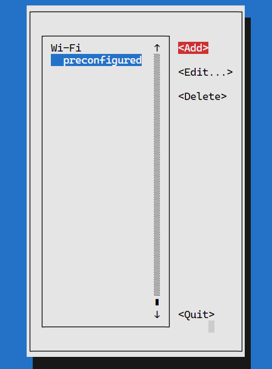{ width="400" }

Select `Wi-Fi` and then `Create` to add credentials for a new Wi-Fi connection.

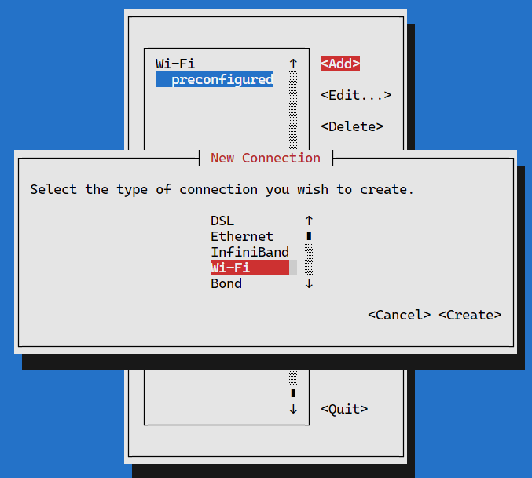{ width="400" }

Set a profile name and enter the SSID and password of the Wi-Fi connection you
want to add. Hit ++space++ to activate `Show password`.

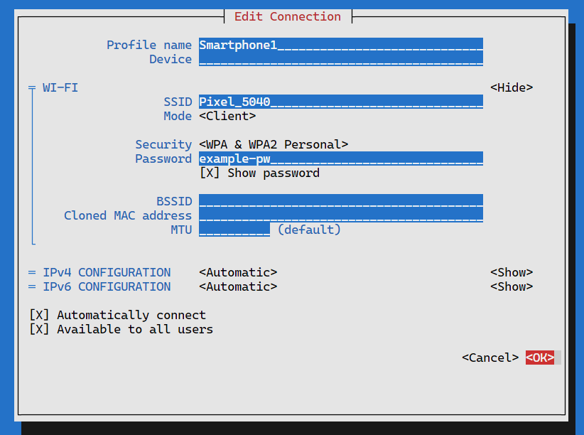{ width="400" }

Hit `OK` and then `Quit` to save your new connection.

To show the available networks and connect to one of them, run:

``` bash
nmtui-connect
```

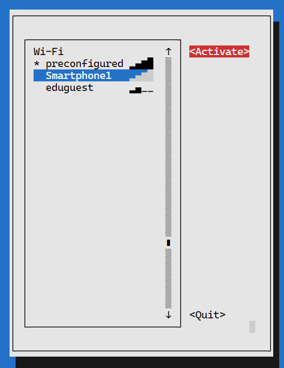{ width="400" }
