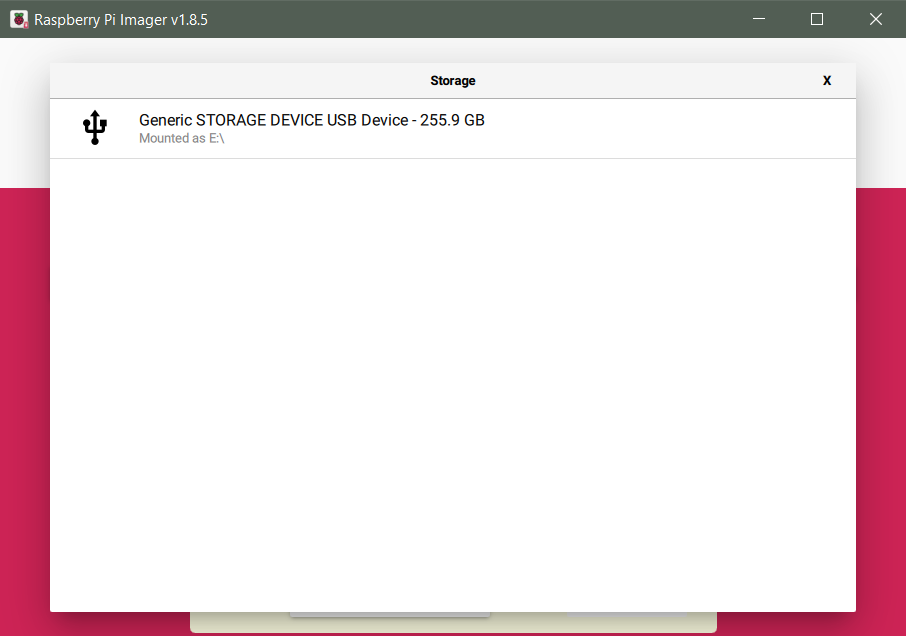
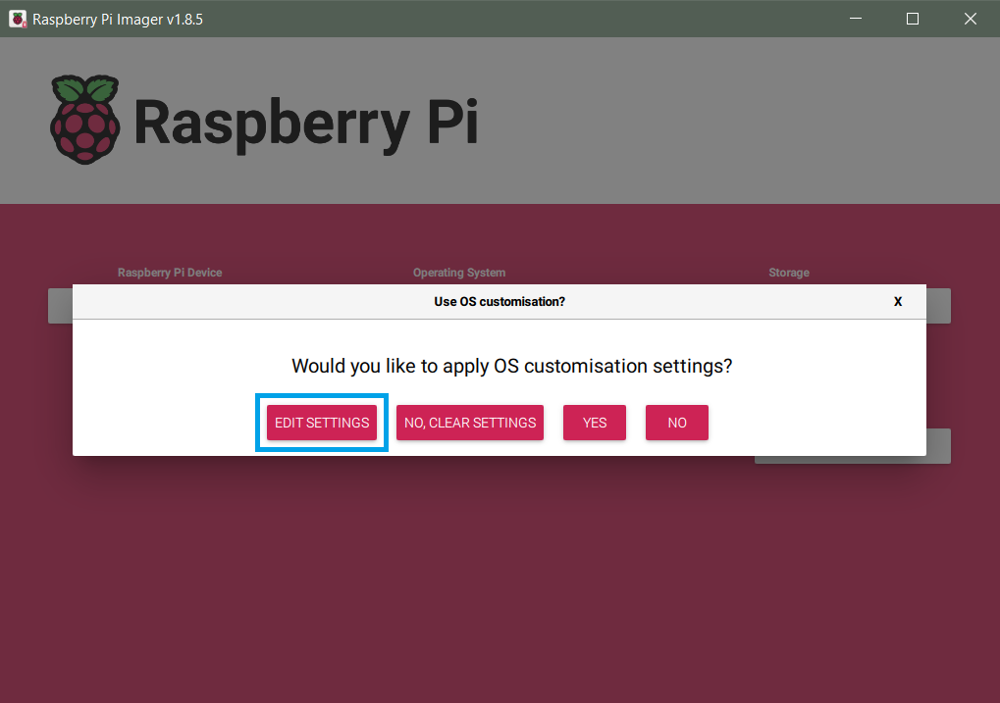

# Raspberry Pi Setup

Before you can use the Raspberry Pi, you will first have to install Raspberry Pi
OS Lite to the microSD card. If you followed the steps in
[Local Setup](localsetup.md#raspberry-pi-imager){target=_blank}, you already have
the [Raspberry Pi Imager](https://www.raspberrypi.com/software/){target=_blank}
installed on your computer.

---

## SSH key based authentication

It is recommended to use SSH key based authentication for communication with your
Raspberry Pi. You can find more details on this topic and instructions for macOS/Linux in the
[VS Code Docs](https://code.visualstudio.com/docs/remote/troubleshooting#_configuring-key-based-authentication){target=_blank} and
[Raspberry Pi Docs](https://www.raspberrypi.com/documentation/computers/remote-access.html#passwordless-ssh-access){target=_blank}.

First check if there is already an SSH key on your computer by going to the
`C:\Users\<username>\.ssh` folder. If there is a file named `id_rsa.pub` you can
skip this step and move on to [RPi OS installation](#raspberry-pi-os-installation).
If you can't find the `.ssh` folder or the key file, you will have to generate
a new SSH key pair on your local PC.
[Open](https://www.digitalcitizen.life/open-windows-terminal/){target=_blank}
a local Terminal (Windows PowerShell) and run the following command:

``` powershell
ssh-keygen -t rsa -b 4096
```

Save the key to the default location `C:\Users\<username>/.ssh/id_rsa` by hitting ++enter++.
When you are asked to enter a passphrase, leave the field empty and hit ++enter++ twice.
You have now generated a private and public SSH key, and will be able to select
**public-key authentication** during the [RPi OS installation](#raspberry-pi-os-installation).

!!! tip ""

    If you want to connect your Raspberry Pi to multiple local PCs with SSH
    key based authentication, generate an SSH key pair on each local PC and
    copy the line with the public key from `/.ssh/id_rsa.pub` on your PC to
    a new row in `/home/pi/.ssh/authorized_keys` on your Raspberry Pi.

    { width="600" }

??? info "Optional: SSH key based authentication after SD card setup"

    If you already have the SD card prepared without public-key authentication,
    you can still configure this by following the steps above to generate the
    key pair and then (while connected to your Raspberry Pi via SSH) running
    the following command in your local Terminal (Windows PowerShell):

    ``` powershell
    cat ~/.ssh/id_rsa.pub | ssh pi@<IP-ADDRESS> 'mkdir -p ~/.ssh && cat >> ~/.ssh/authorized_keys'
    ```

    Please make sure to enter the correct `IP address` (or hostname) of your
    Raspberry Pi. After entering your RPi password, your public SSH key will be
    saved to `/home/pi/.ssh/authorized_keys`. After that you won't be asked to
    enter your password again, as the authentication is now based on the SSH key.

---

## Raspberry Pi OS installation

Insert the microSD card into your card reader and start the Raspberry Pi
Imager. First, we will choose the appropriate OS.

{ width="600" }

We don't want to install the default OS with Desktop, so you have to go to the
other Raspberry Pi OS based images.

{ width="600" }

Here we will select the first option **Raspberry Pi OS Lite (32-bit)**.

{ width="600" }

Now we can choose the storage, where the Raspberry Pi OS will be written to.
Here you just have to select your microSD card.

{ width="600" }

Click the settings button on the bottom right to change some of the default
options.

{ width="600" }

- Set the hostname (default: `raspberrypi`). If you will be deploying multiple camera
  traps, you should give each a unique hostname (e.g. `camtrap1`, `camtrap2` etc.).
- Enable SSH with public-key authentication.
- Set the username and password. It is recommended to use the default `pi`
  as username.
- Enter your WiFi SSID and password, to be able to connect to the Pi via SSH
  immediately after the first boot. In some cases it might be beneficial to use a
  [mobile hotspot](https://support.microsoft.com/en-us/windows/use-your-windows-pc-as-a-mobile-hotspot-c89b0fad-72d5-41e8-f7ea-406ad9036b85#WindowsVersion=Windows_11){target=_blank}
  from your PC (e.g. to share restricted WiFi, multiple WiFis or Ethernet).
  Select the correct Wireless LAN country in the dropdown menu below.
- Set the locale settings to your time zone and keyboard layout, then press **SAVE**.

{ width="600" }

You can now write the correctly configured Raspberry Pi OS Lite to your SD
card. After the writing process is finished, insert the SD card into your
Raspberry Pi.

---

## First boot and IP address search

If you already have the PiJuice Zero pHAT (+ PiJuice battery) connected to your
Raspberry Pi, insert the micro USB cable (connected to your battery, laptop or
power supply) into the PiJuice USB micro input. Power on the Raspberry Pi with
a short single press on the PiJuice **SW1** button (on the left and marked green
in the following picture). More info:
[PiJuice power button and LED](https://github.com/PiSupply/PiJuice#buttons-and-leds){target=_blank}.

If your are working without the PiJuice at the moment, insert your micro
USB cable connected to a power supply, battery or laptop into the **PWR IN**
USB micro input on the outer side of the Raspberry Pi. The first boot will
take a little bit longer, as all of the custom configuration has to be enabled.
Wait until the green LED stops blinking (about 5 min) before moving on.

{ width="500" }

!!! tip ""

    You can connect to the RPi via SSH by using the hostname, that you set during
    the RPi OS installation (e.g. `raspberrypi`) in the [following step](#ssh-connection-and-x11-forwarding).
    If you did not set a hostname or don't know it, you will have to connect to the
    RPi by using its IP address.

    To be able to connect to the Pi via SSH without using the hostname,
    you will first have to find its IP address in the WiFi network. There are
    [several ways](https://www.raspberrypi.com/documentation/computers/remote-access.html#how-to-find-your-ip-address){target=_blank}
    to achieve this, probably one of the easiest solutions is to install
    the [Fing App](https://www.fing.com/products/fing-app){target=_blank}
    and scan the IP addresses of all devices in your WiFi network.

---

## SSH connection and X11 forwarding

For casual users the following steps are recommended, which will give you all
necessary functions to test and deploy the DIY camera trap. For experienced
users, who want to use the Raspberry Pi as remote development environment,
follow the steps in the info box.

??? info "Optional: Remote-SSH & Remote X11 extension configuration"

    === "Remote-SSH extension"

        **Not supported by RPi Zero W (v1)!**

        Open VS Code and press the button (`Open a Remote Window`) in the
        bottom left to open the Remote-SSH extension connection settings.

        { width="600" }

        Choose the first option **Connect to Host...**

        { width="600" }

        Type in your user name (this is `pi` if you didn't change the default name)
        and your Pi's hostname or IP address with `@` in between (e.g. `pi@raspberrypi`
        or `pi@192.168.1.93`) and hit ++enter++.

        { width="600" }

        Now VS Code will connect to the Raspberry Pi via SSH and open a new remote
        window. This might take a while during the first start, as several packages
        have to be installed on the Raspberry Pi first. When you are asked to select
        the platform of the remote host, choose **Linux**. Enter the password that you
        set in the Raspberry Pi Imager options when you are asked for it (not necessary
        if you chose public-key authentication).

        After these steps, the Pi SSH Terminal at the bottom will open and you can
        start with setting up your RPi. In the explorer view on the left, press
        **Open Folder** and open the home folder `/home/pi/`. You can now view and
        edit files (e.g. [Python scripts](programming.md){target=_blank} and images)
        directly in VS Code and drag & drop any files or folders (e.g. `insect-detect`)
        from your PC to the RPi Zero.

        If the Pi SSH Terminal will not automatically open after you established the
        SSH connection, go to `Terminal` in the menu bar at the top and open a
        `New Terminal`.

        { width="600" }

        When you are asked to trust the authors of the files in this folder press
        `Yes` and make sure to check the option `Trust the authors of all files in
        the parent folder 'home'`.

        { width="600" }

    === "Remote X11 extension"

        Open the VS Code Extensions and install the Remote X11 extension that you
        already installed to your computer in [Local Setup](localsetup.md){target=_blank}
        to the Raspberry Pi by selecting `Install in SSH:`.

        { width="700" }

        Open the local **Remote X11 (SSH)** extension and select `Extension Settings`.

        { width="700" }

        At the top you will see two tabs for `User` and `Remote [SSH: <IP-ADDRESS>]`.
        In the `User` settings tab, make sure that the **XAuth Permission Level** is
        set to `trusted`.

        { width="700" }

        Go to the `Remote [SSH: <IP-ADDRESS>]` settings tab and change the
        **Display Command** to:

        ``` text
        echo DISPLAY=$DISPLAY
        ```

        { width="700" }

        Scroll down and set the **XAuth Permission Level** to `trusted`.

        { width="700" }

        Now you can start the **VcXsrv X server** by opening the `XLaunch.exe`, which
        you installed in [Local Setup](localsetup.md#vcxsrv-windows-x-server){target=_blank}.
        Keep all the [default settings](localsetup.md#vcxsrv-windows-x-server){target=_blank}
        and the VcXsrv tray icon will appear in your taskbar. Before we will test the X11
        forwarding, open a new SSH Terminal in VS Code for all changes to take effect.

        { width="700" }

        You can test if the X11 forwarding from the Raspberry Pi to our Windows X
        Server is established by running the following command:

        ``` bash
        echo $DISPLAY
        ```

        ...which should give you the following output:

        ``` bash
        localhost:10.0
        ```

        ??? bug "X11 connection Error"

            If the X11 connection is not properly working, a possible problem could be
            an incompatible private key format. You can convert your private key to the
            older PEM format (which will work with the Remote X11 extension) by running
            the following command in your local Terminal (Windows PowerShell):

            ``` powershell
            ssh-keygen -p -m PEM -f .ssh/id_rsa
            ```

            Restart VcXsrv and reboot the Raspberry Pi before testing the connection
            again with `echo $DISPLAY`.

- Set the `DISPLAY` environment variable in Windows by
  [opening](https://www.howtogeek.com/235101/10-ways-to-open-the-command-prompt-in-windows-10/){target=_blank}
  the Command Prompt (cmd) and running:

    ``` powershell
    setx DISPLAY "localhost:0.0"
    ```

    You may have to reboot your computer for the changes to take effect.

- Start the **VcXsrv X server** by opening the `XLaunch.exe`, which you installed
  after following the [Local Setup](localsetup.md#vcxsrv-windows-x-server){target=_blank}.
  Keep all the default settings (press **Next** three times, then **Finish**) and
  the VcXsrv tray icon will appear in your taskbar.
- Open a new Terminal in VS Code.

    { width="700" }

- Connect to your Raspberry Pi via SSH and trusted X11 forwarding (`-Y`) by running:

    ``` powershell
    ssh -Y pi@raspberrypi
    ```

    If you set a different hostname than `raspberrypi` during the
    [RPi OS installation](#raspberry-pi-os-installation), change it
    accordingly. When you are asked if you are sure you want to
    continue connecting, type in `yes` and hit ++enter++.

- Use **right-click** to paste commands to the Pi's SSH Terminal.
- You can check if X11 forwarding works correctly by running:

    ``` bash
    echo $DISPLAY
    ```

    ...which should give you the following output:

    ``` bash
    localhost:10.0
    ```

- If you followed the steps in [Local Setup](localsetup.md){target=_blank}, you already have the
  [SSH FS](https://marketplace.visualstudio.com/items?itemName=Kelvin.vscode-sshfs){target=_blank}
  extension installed. Open the extension by clicking on the folder icon in the left side bar.
- Create a new SSH FS configuration (`Name:` your RPi hostname) with the following fields:

    - Host: `raspberrypi` (or different hostname)
    - Port: `22`
    - Root: `~/`
    - Username: `pi`
    - Private key: `c:\Users\<username>\.ssh\id_rsa` (insert your Windows username)

- Leave the other fields blank and save the configuration with the
  **Save** button at the bottom.
- In the SSH FS extension, click on the first symbol to the right of your
  configuration (`Add as Workspace folder`). Retry if it does not work
  immediately. This will open the `/home/pi` folder in your VS Code explorer.
  You can now view and edit files (e.g. [Python scripts](programming.md){target=_blank}
  and images) directly in VS Code and drag & drop any files or folders
  (e.g. `insect-detect`) from your PC to the RPi.

---

## RPi configuration

We will start with updating all standard packages by running:

``` bash
sudo apt update
```

...in the Pi SSH Terminal, followed by:

``` bash
sudo apt full-upgrade
```

When you are asked if you want to continue, confirm with ++y+enter++.

{ width="600" }

Reboot the Raspberry Pi after all updates were successfully installed with:

``` bash
sudo reboot
```

After the reboot you will have to establish a new SSH connection. When the
Raspberry Pi SSH Terminal is back and active again, we will change some of
the RPi settings (use the arrow keys to navigate) with:

``` bash
sudo raspi-config
```

{ width="600" }

- Under `1 System Options` --> `Wireless LAN` you can add additional WiFi SSIDs
  and passwords, e.g. if you want to connect to a Hotspot from your phone while
  in the field. All WiFi settings are stored in `wpa_supplicant.conf`. You can
  also edit them directly by running:

    ``` bash
    sudo nano /etc/wpa_supplicant/wpa_supplicant.conf
    ```

- Go back to the main menu and select `3 Interface Options` --> `I5 I2C` and
  enable the I2C interface. We will need this for communication with the
  PiJuice Zero pHAT.
- Next, go to `4 Performance Options` --> `P2 GPU Memory` and change the value
  from `64` to `16`. As we are using the RPi Lite OS version without desktop
  environment, we won't need more memory for graphical features and more RAM
  will be available.
- Under `6 Advanced Options`, choose `A1 Expand Filesystem` to ensure that all
  of the SD card space will be available.
- Also under `6 Advanced Options`, select `A2 GL driver`, which will install
  several packages (confirm with ++y+enter++). After the packages are installed,
  you can select the first option `G1 Legacy` in the raspi-config window, which
  will disable the new KMS video driver for 3D graphics in RPi OS Bullseye.

After these changes are made, select `Finish` in the bottom right of the main
menu and reboot.

---

In the next step, we will disable some features that we won't need to decrease
the RPi power consumption. In the Pi SSH Terminal run:

``` bash
sudo nano /boot/config.txt
```

We will disable audio, camera/display auto detects and Bluetooth, by making the
following changes in the `config.txt` file (use the arrow keys to navigate):

``` py
# Enable audio (loads snd_bcm2835)
dtparam=audio=off

# Automatically load overlays for detected cameras
camera_auto_detect=0

# Automatically load overlays for detected DSI displays
display_auto_detect=0
```

Copy and paste (use right-click to paste) the following two lines directly
under the options you just changed:

``` py
# Disable Bluetooth
dtoverlay=disable-bt
```

Exit the editor with ++ctrl+x++ and save the changes with ++y+enter++.

{ width="600" }

The last thing we can do to decrease the power consumption, is to disable HDMI
at each boot. In the SSH Terminal run:

``` bash
sudo nano /etc/rc.local
```

Add the following lines above `exit 0`:

``` py
# Disable HDMI at boot
/usr/bin/tvservice -o
```

Exit the editor with ++ctrl+x++ and save the changes with ++y+enter++.

{ width="600" }

Reboot the Raspberry Pi for all changes to take effect:

``` bash
sudo reboot
```

If you want to shutdown your Raspberry Pi, run:

``` bash
sudo shutdown -h now
```

---

## PiJuice Zero configuration

In the next steps, we will configure the PiJuice Zero for efficient power
management and wake-up control. If you want to try the system without the
PiJuice Zero connected to the Raspberry Pi, you can skip this and the following
step and directly continue with the [OAK-1 configuration](#oak-1-configuration).

First install the PiJuice package and its dependencies by running:

``` bash
sudo apt-get install pijuice-base
```

When you are asked if you want to continue, confirm with ++y+enter++.

After the installation you can check if the PiJuice Zero is correctly detected
by running:

``` bash
sudo i2cdetect -y 1
```

If you see an entry at address `14` and `68`, the connection to the PiJuice is
now established.

{ width="500" }

From now on we want to use the built-in RTC
([real-time clock](https://en.wikipedia.org/wiki/Real-time_clock){target=_blank})
of the PiJuice Zero board as primary hardware clock to wake up the Raspberry Pi
at specific times when it is not connected to the internet. For this, we will
have to manually load the RTC driver at each boot by modifying the
`/boot/config.txt` file with:

``` bash
sudo nano /boot/config.txt
```

Add the following lines at the end of the text file:

``` py
# Load PiJuice RTC driver at boot
dtoverlay=i2c-rtc,ds1307=1
```

Exit the editor with ++ctrl+x++ and save the changes with ++y+enter++.

{ width="600" }

Reboot the Raspberry Pi:

``` bash
sudo reboot
```

After the reboot run:

``` bash
sudo i2cdetect -y 1
```

You should now see `UU` at address 68, which means that the RTC driver was
successfully loaded and the PiJuice RTC will now be used as hardware clock.

{ width="500" }

You can check if the date and time is correct with:

``` bash
sudo hwclock -r
```

---

We will now configure the PiJuice Zero through its command line interface
by running:

``` bash
pijuice_cli
```

{ width="500" }

- Start with checking if the firmware is up to date by going to the `Firmware`
  tab (use the arrow keys to navigate). If there is a new version available,
  `Update` the firmware.
- Next, go to the `Battery profile` tab and check if the correct profile is
  selected. If you are using the 12,000 mAh battery, this should be
  `PJLIPO_12000`. Scroll down and change `Temperature sense` to `NTC`.
  This will make sure that the battery temperature is correctly estimated.
  Save the changed settings with `Apply settings`.
- Go to the `System Task` tab, activate `Software Halt Power Off` and set the
  `Delay period [seconds]` to `20`. With this setting activated, the power to
  the Raspberry Pi will be cut off 20 seconds after a software shutdown has
  occured. This will make sure that the OS can complete the shutdown process
  without potential SD card corruption.

    { width="500" }

- Optional: Depending on your hardware setup, under the `Battery profile` tab
  you could decrease the `Termination current [mA]` to e.g. `100` if you are
  using a solar panel as direct input into the PiJuice Zero
  ([**Minimal Setup**](../hardware/components.md#minimal-setup){target=_blank}
  without Voltaic battery).

The most important settings are now applied. You can get a lot more information
about all of the other settings at the
[PiJuice GitHub repo](https://github.com/PiSupply/PiJuice/tree/master/Software#pijuice-cli){target=_blank}.

In the last step, we will set the `Wakeup Alarm` to specified times to fully
automate the camera trap recordings. The PiJuice wakeup alarm clock is set in
UTC time, so you have to convert the wake-up times to your time zone (in our
case UTC+2). As you can see in the example below, we set our Wakeup Alarm to
`Every day` at `Hour` `7;10;13;16` UTC time, which means that the PiJuice will
wake up the Raspberry Pi everyday at 9, 12, 15 and 18 o'clock (UTC+2). Activate
`Wakeup enabled` and press `Set alarm` to save your specified wake-up times.

{ width="500" }

!!! tip ""

    During summer it might make sense to not record around noon, as many insects
    are not active during the hottest daytime. Also the temperature in the camera
    trap enclosure will be lower if the RPi and OAK-1 are not running, which can
    increase the charging efficiency of the batteries.

With this we are finished with the PiJuice Zero pHAT configuration and we can
set up the cron job that will execute the monitoring script at boot in the next
step.

---

## Set up Cron Job

Because the Raspberry Pi should run the
[Python script](programming.md#automated-monitoring-script){target=_blank} for
automated insect monitoring on its own after being woken up by the PiJuice, we
have to set up a cron job that will be executed at each boot. You can find more
information about cron, crontab and cron jobs
[here](https://en.wikipedia.org/wiki/Cron){target=_blank}.

Open the crontab file for editing by running:

``` bash
crontab -e
```

When you are asked to choose an editor, type in `1` and confirm with ++enter++.

Now paste the following lines at the end of the crontab file:

``` py
# Sleep for 30 seconds after boot to wait for all services to start, then execute Python script and
# redirect error messages (stderr) to standard output (stdout) and append both to log file with timestamp
@reboot sleep 30 && { printf "\%s " "$(date +"\%F \%T")"; python3 insect-detect/yolo_tracker_save_hqsync.py; } >> insect-detect/cronjob_log.log 2>&1
```

??? info "Optional arguments"

    Add after `python3 insect-detect/yolo_tracker_save_hqsync.py`, separated by space:

    - `-4k` crop detections from (+ save HQ frames in) 4K resolution (default = 1080p)
    - `-crop` save cropped detections with aspect ratio 1:1 (default = `-crop square`)
              or keep original bbox size with variable aspect ratio (`-crop tight`)
    - `-raw` additionally save HQ frames to .jpg (e.g. for training data collection)
    - `-overlay` additionally save HQ frames with overlay (bbox + info) to .jpg
    - `-log` write RPi CPU + OAK chip temperature, RPi available
             memory + CPU utilization and battery info to .csv

Exit the editor with ++ctrl+x++ and save the changes with ++y+enter++.

This cron job will wait for 30 seconds after boot (`sleep 30`) to make sure
that all important services are ready. It will then run the provided Python
script and append all error messages redirected to the standard output (`2>&1`)
to a log file together with a prepended timestamp
(`printf "\%s " "$(date +"\%F \%T")"`).

!!! tip ""

    If you are still in the testing phase, it is highly recommended to comment out
    your cronjob by adding `#` in front of `@reboot`, otherwise each time you are
    booting up your Raspberry Pi, it will try to run the Python script.

---

## OAK-1 configuration

Before you can use the [DepthAI API](https://docs.luxonis.com/projects/api/en/latest/){target=_blank}
in the [Python scripts](programming.md){target=_blank} for automated insect
monitoring on the RPi + OAK-1, you will first have to install some dependencies
by running:

``` bash
sudo curl -fL https://docs.luxonis.com/install_dependencies.sh | bash
```

??? question "Only Raspberry Pi Zero W (v1)"

    Additionally to the installed dependencies, you will have to install the
    package `libusb-1.0-0-dev` with:

    ``` bash
    sudo apt-get install libusb-1.0-0-dev
    ```

[Download](https://github.com/maxsitt/insect-detect/archive/refs/heads/main.zip){target=_blank}
the [`insect-detect`](https://github.com/maxsitt/insect-detect){target=_blank}
GitHub repo, extract it and change its foldername to `insect-detect`. Copy the
renamed folder to the `home/pi` directory of your Raspberry Pi, by simply dragging
& dropping it into the SSH FS Workspace folder (or VS Code remote window explorer).

Install all required Python packages by running:

``` bash
python3 -m pip install -r insect-detect/requirements.txt
```

You can check if your OAK camera is correctly detected by running:

``` bash
lsusb | grep MyriadX
```

...which should give you the following output:

``` bash
Bus 001 Device 002: ID 03e7:2485 Intel Movidius MyriadX
```

??? bug "Device not found"

    If your device is not found, or if you get errors including something like
    `X_LINK_DEVICE_NOT_FOUND` or `skipping X_LINK_UNBOOTED device`, you can set
    new udev rules to identify the OAK device. Unplug the OAK camera, then run:

    ``` bash
    echo 'SUBSYSTEM=="usb", ATTRS{idVendor}=="03e7", MODE="0666"' | sudo tee /etc/udev/rules.d/80-movidius.rules
    ```

    ...followed by:

    ``` bash
    sudo udevadm control --reload-rules && sudo udevadm trigger
    ```

    Plug the OAK device back into the USB port, it should
    be correctly detected and identified now.

!!! tip ""

    - A lot more information on setting up the OAK camera and DepthAI can be found at the
      [Luxonis Docs](https://docs.luxonis.com/en/latest/pages/tutorials/first_steps/){target=_blank}.
    - If you want to learn more about the OAK and DepthAI, also check out the
      [FAQ](https://docs.luxonis.com/en/latest/pages/faq/){target=_blank} and
      [API Documentation](https://docs.luxonis.com/projects/api/en/latest/){target=_blank}.
    - If you have any problems with the OAK device, take a look at the
      [Troubleshooting page](https://docs.luxonis.com/en/latest/pages/troubleshooting/){target=_blank}
      or get [Support](https://docs.luxonis.com/en/latest/pages/support/){target=_blank} in the
      [Luxonis Forum](https://discuss.luxonis.com/){target=_blank}.

With everything set up, you can now move on to [**Programming**](programming.md) and
use the provided Python scripts for your own automated insect monitoring pipelines!
