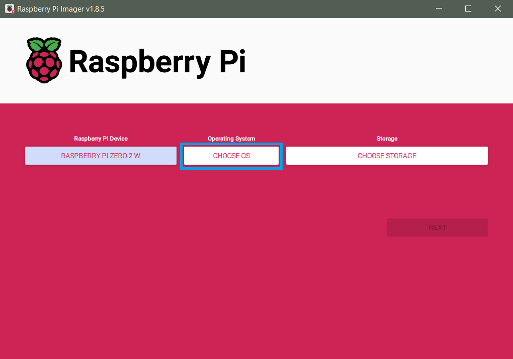
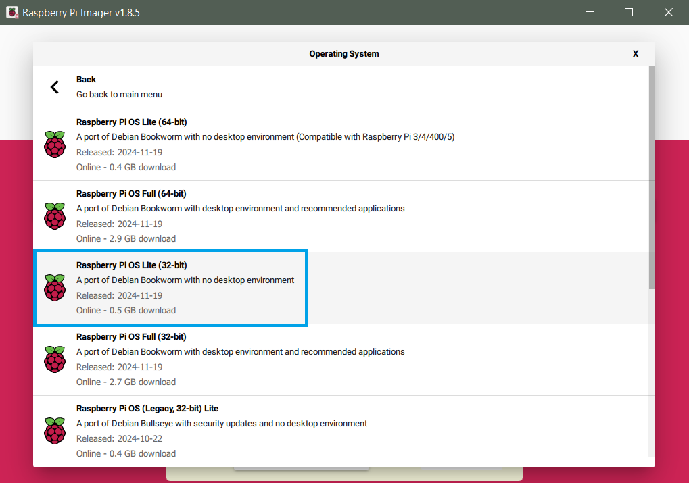

# Raspberry Pi Setup

Before we can use the Raspberry Pi Zero 2 W, we will first have to install
Raspberry Pi OS Lite to the micro SD card. If you followed the steps in
[Local Setup](localsetup.md){target=_blank}, you already have the Raspberry Pi
Imager installed on your system (v1.7.3 is used in the following instructions).

---

## SSH key based authentication

If you will be using the Raspberry Pi - OAK combination for testing and
development and don't want to type in your password all the time, it is
recommended to set up SSH key based authentication. You can find more details
on this topic and instructions for macOS or Linux in the
[VS Code Docs](https://code.visualstudio.com/docs/remote/troubleshooting#_configuring-key-based-authentication){target=_blank} and
[Raspberry Pi Docs](https://www.raspberrypi.com/documentation/computers/remote-access.html#passwordless-ssh-access){target=_blank}.

We will start by generating a new key pair on your local Windows PC and then
copy the public key to the Raspberry Pi with the Raspberry Pi Imager. But first
check if there is already an SSH key on your computer by going to the
`C:\Users\username\.ssh` folder. If there is a file named `id_rsa.pub` you can
skip this step. If you can't find the `.ssh` folder or the key file, open a
[local Terminal](https://www.digitalcitizen.life/open-windows-terminal/){target=_blank}
(Windows PowerShell) and run the following command:

``` powershell
ssh-keygen -t rsa -b 4096
```

Save the key to `C:\Users\username/.ssh/id_rsa` by hitting ++enter++. When you
are asked to enter a passphrase, just hit ++enter++. Now that we have generated
the private and public SSH keys, we can select **public-key authentication** in
the advanced options of the Raspberry Pi Imager in the next steps.

If you want to connect your Raspberry Pi to multiple local machines with SSH
key based authentication, you can simply generate a key pair for each local PC
and copy the line with the public key from `.ssh/id_rsa.pub` to a new row in
`/home/pi/.ssh/authorized_keys`.

{ width="600" }

??? info "SSH key authentication after SD card setup"

    If you already have the SD card prepared without public-key authentication,
    you can still configure this by following the steps above to generate the
    key pair and then (while connected to your Raspberry Pi via SSH) running
    the following command in your local Terminal (Windows PowerShell):

    ``` powershell
    cat ~/.ssh/id_rsa.pub | ssh pi@<IP-ADDRESS> 'mkdir -p ~/.ssh && cat >> ~/.ssh/authorized_keys'
    ```

    Please make sure to enter the correct **IP address** of your Raspberry Pi! You
    will be asked to enter the Pi's password and after you hit ++enter++ your
    public SSH key will be saved to `/home/pi/.ssh/authorized_keys`. After that
    you won't be asked to enter your password again, as the authentication is
    now based on the SSH key pair.

---

## Raspberry Pi OS installation

Insert the micro SD card into your card reader and start the Raspberry Pi
Imager. First, we will choose the appropriate OS.

{ width="600" }

We don't want to install the default OS with Desktop, so you have to go to the
other Raspberry Pi OS based images.

{ width="600" }

Here we will select the first option **Raspberry Pi OS Lite (32-bit)**.

{ width="600" }

Now we can choose the storage, where the Raspberry Pi OS will be written to.
Here you just have to select your micro SD card.

{ width="600" }

Click the settings button on the bottom right to change some of the default
options.

{ width="600" }

- Set the hostname, e.g. to the default *raspberrypi*. If you will be deploying
  multiple Raspberry Pis, individual hostnames may be a good idea.
- Enable SSH with public-key authentication.
- Set the username and password. It is recommended to keep the default **pi**
  as username.
- Enter your local WiFi SSID and password, to be able to connect to the Pi via
  SSH immediately after the first boot. Don't forget to select the correct
  Wireless LAN country in the dropdown menu below.
- Set the locale settings to your time zone and keyboard layout, then hit SAVE.

{ width="600" }

You can now write the correctly configured Raspberry Pi OS Lite to your SD
card. After the writing process is finished, insert the SD card into your
Raspberry Pi.

---

## First boot and IP address search

If you already have the PiJuice Zero pHAT connected to your Raspberry Pi,
insert the micro USB cable (connected to your battery, laptop or power supply)
into the PiJuice USB micro input. Power on the Raspberry Pi with a short single
press on the PiJuice SW1 button (on the left and marked green in the following
picture). If your are working without the PiJuice at the moment, insert your
micro USB cable connected to a power supply into the **PWR IN** USB micro input
of the Raspberry Pi. The first boot will take a little bit longer, as all of
the custom configuration has to be enabled.

{ width="500" }

To be able to connect to the Pi in VS Code via SSH, we will first have to find
its IP address in the WiFi network. There are
[several ways](https://www.raspberrypi.com/documentation/computers/remote-access.html#how-to-find-your-ip-address){target=_blank}
to achieve this, probably one of the easiest solutions is to install
[Fing](https://www.fing.com/){target=_blank} on your PC or smartphone (you
don't need an account to use the [Fing App](https://www.fing.com/products/fing-app){target=_blank})
and scan the IP addresses of all devices in your WiFi network. After you know
the IP address of your Raspberry Pi, we can go on with the next step and
establish a SSH connection in VS Code.

---

## Remote SSH connection

Open VS Code and press the green button in the bottom left to open the
Remote-SSH extension connection settings.

{ width="600" }

Choose the first option **Connect to Host...**

{ width="600" }

Type in your user name (this is **pi** if you didn't change the default name)
and your Pi's IP address with **@** in between (e.g. `pi@192.168.1.93`) and hit
++enter++.

{ width="600" }

Now VS Code will connect to the Raspberry Pi via SSH and open a new remote
window. This might take a while during the first start, as several packages
have to be installed on the Raspberry Pi first. When you are asked to select
the platform of the remote host choose **Linux**. Enter the password that you
set in the Raspberry Pi Imager options when you are asked for it (not necessary
if you chose public-key authentication).

After these steps, the Pi SSH Terminal at the bottom will open and you can
start with setting up your Pi! In the explorer view on the left, press
**Open Folder** and open the home folder `/home/pi/`.

{ width="600" }

When you are asked to trust the authors of the files in this folder press
**Yes** and make sure to check the option **Trust the authors of all files in
the parent folder 'home'**.

{ width="600" }

---

## RPi configuration

We will start with updating all standard packages by running:

``` bash
sudo apt update
```

...in the Pi SSH Terminal, followed by:

``` bash
sudo apt full-upgrade
```

When you are asked if you want to continue, confirm with ++y+enter++.

{ width="600" }

Reboot the Raspberry Pi after all updates were successfully installed with:

``` bash
sudo reboot
```

After the reboot you may have to reload the remote VS Code window. When the
Raspberry Pi terminal is back and active again, we will change some of the Pi
settings (use the arrow keys to navigate) with:

``` bash
sudo raspi-config
```

{ width="600" }

- Under `1 System Options` --> `Wireless LAN` you can add additional WiFi SSIDs
  and passwords, e.g. if you want to connect to a Hotspot from your phone while
  in the field.
- Go back to the main menu and select `3 Interface Options` --> `I5 I2C` and
  enable the I2C interface. We will need this for communication with the
  PiJuice Zero pHAT.
- Next, go to `4 Performance Options` --> `P2 GPU Memory` and change the value
  from `64` to `16`. As we are using the RPi Lite OS version without desktop
  environment, we won't need more memory for graphical features and more RAM
  will be available for our programs.
- Under `6 Advanced Options` choose `A1 Expand Filesystem` to ensure that all
  of the SD card space will be available. This might only be necessary for SD
  cards with a lot of storage, but won't harm anyway.
- Also under `6 Advanced Options`, select `A2 GL driver`, which will install
  several packages (confirm with ++y+enter++). After the packages are installed,
  you can select the first option `G1 Legacy` in the raspi-config window, which
  will disable the new KMS video driver for 3D graphics in RPi OS Bullseye.

After these changes are made, select `Finish` in the bottom right of the main
menu and reboot the Pi.

---

In the next step, we will disable some features that we won't need to decrease
the RPi power consumption. In the Pi SSH Terminal run:

``` bash
sudo nano /boot/config.txt
```

We will disable audio, camera/display auto detects and Bluetooth, by making the
following changes in the `config.txt` file (use the arrow keys to navigate):

``` py hl_lines="2 5 8 10 11"
# Enable audio (loads snd_bcm2835)
dtparam=audio=off

# Automatically load overlays for detected cameras
camera_auto_detect=0

# Automatically load overlays for detected DSI displays
display_auto_detect=0

# Disable Bluetooth
dtoverlay=disable-bt
```

Exit the editor with ++ctrl+x++ and save the changes with ++y++ and then
++enter++.

{ width="600" }

The last thing we can do to decrease the power consumption, is to disable HDMI
at each boot. In the SSH Terminal run:

``` bash
sudo nano /etc/rc.local
```

Add the following lines above `exit 0`:

``` py hl_lines="1 2"
# Disable HDMI at boot
/usr/bin/tvservice -o

exit 0
```

Exit the editor with ++ctrl+x++ and save the changes with ++y++ and then
++enter++.

{ width="600" }

Reboot the Raspberry Pi for all changes to take effect:

``` bash
sudo reboot
```

---

## PiJuice Zero configuration

In the next steps, we will configure the PiJuice Zero for efficient power
management and wake-up control. If you want to try the system without the
PiJuice Zero connected to the Raspberry Pi, you can skip this and the following
step and directly continue with the [OAK-1 configuration](#oak-1-configuration).

To begin, we will have to install the PiJuice package and its dependencies by
running the following in the SSH Terminal:

``` bash
sudo apt-get install pijuice-base
```

After the installation you can check if the PiJuice Zero is correctly detected
by running:

``` bash
i2cdetect -y 1
```

If you see an entry at address `14` and `68`, the connection to the PiJuice is
now established.

{ width="500" }

From now on we want to use the built-in RTC
([real-time clock](https://en.wikipedia.org/wiki/Real-time_clock){target=_blank})
of the PiJuice Zero board as primary hardware clock to wake up the Raspberry Pi
at specific times when it is not connected to the internet. For this, we will
have to manually load the RTC driver at each boot by modifying the
`/boot/config.txt` file.

Open the `config.txt` file with:

``` bash
sudo nano /boot/config.txt
```

Add the following lines at the end of the text file:

``` py
# Load PiJuice RTC driver at boot
dtoverlay=i2c-rtc,ds1307=1
```

Exit the editor with ++ctrl+x++ and save the changes with ++y++ and then
++enter++.

{ width="600" }

Reboot the Raspberry Pi:

``` bash
sudo reboot
```

After the reboot run:

``` bash
i2cdetect -y 1
```

You should now see `UU` at address 68, which means that the RTC driver was
successfully loaded and the PiJuice RTC will now be used as hardware clock.

{ width="500" }

You can check if the date and time is correct with:

``` bash
sudo hwclock -r
```

---

We will now start with configuring the PiJuice Zero through its command line
interface by running:

``` bash
pijuice_cli
```

{ width="500" }

- Start with checking if the firmware is up to date by going to the `Firmware`
  tab (use the arrow keys to navigate). If there is a new version available,
  `Update` the firmware.
- Next, go to the `Battery profile` tab and check if the correct profile is
  selected. If you are using the 12,000 mAh battery, this should be
  `PJLIPO_12000`. Depending on your hardware setup, you could decrease the
  `Termination current [mA]` to e.g. `100` if you are using a solar panel as
  direct input into the PiJuice Zero (**Minimal Setup** without Voltaic
  battery). Scroll down and change `Temperature sense` to `NTC`. This will make
  sure that the battery temperature is correctly estimated. Save the changed
  settings with `Apply settings`.
- Go to the `System Task` tab, activate `Software Halt Power Off` and set the
  `Delay period [seconds]` to `20`. With this setting activated, the power to
  the Raspberry Pi will be cut off 20 seconds after a software shutdown (e.g.
  `sudo shutdown -h now`) has occured. This will make sure that the OS can
  complete the shutdown process without potential SD card corruption.

{ width="500" }

The most important settings are now applied. You can get a lot more information
about all of the other settings at the
[PiJuice GitHub repo](https://github.com/PiSupply/PiJuice/tree/master/Software#pijuice-cli){target=_blank}.

In the last step, we will set the `Wakeup Alarm` to specified times to fully
automate the camera trap recordings. The PiJuice wakeup alarm clock is set in
UTC time, so you have to convert the wake-up times to your time zone (in our
case UTC+2). As you can see in the example below, we set our Wakeup Alarm to
`Every day` at `Hour` `7;10;13;16` UTC time, which means that the PiJuice will
wake up the Raspberry Pi everyday at 9, 12, 15 and 18 o'clock (UTC+2). Don't
forget to activate `Wakeup enabled` and press `Set alarm` to save your
specified wake-up times.

{ width="500" }

With this we are finished with the PiJuice Zero pHAT configuration and we can
set up the cron job that will execute the monitoring script at boot in the next
step.

---

## Set up Cron Job

Because the Raspberry Pi should run the
[Python script](programming.md#automated-monitoring-script){target=_blank} for
automated insect monitoring on its own after being woken up by the PiJuice, we
have to set up a cron job that will be executed at each boot. You can find more
information about cron, crontab and cron jobs
[here](https://en.wikipedia.org/wiki/Cron){target=_blank}.

Open the crontab file for editing by running:

``` bash
crontab -e
```

Now paste the following lines at the end of the crontab file:

``` py
# Sleep for 30 seconds after boot to wait for all services to start, then execute Python script and
# redirect error messages (stderr) to standard output (stdout) and append both to log file with timestamp
@reboot sleep 30 && { printf "\%s " "$(date +"\%F \%T")"; python3 ./insect-detect/yolov5_tracker_save_hqsync.py; } >> ./insect-detect/cronjob_log.log 2>&1
```

Exit the editor with ++ctrl+x++ and save the changes with ++y++ and then
++enter++.

This cron job will wait for 30 seconds after boot (`sleep 30`) to make sure
that all important services are ready. It will then run the provided Python
script and append all error messages redirected to the standard output (`2>&1`)
to a log file together with a prepended timestamp
(`printf "\%s " "$(date +"\%F \%T")"`).

??? info "Optional arguments"

    Add after `yolov5_tracker_save_hqsync.py`, separated by space:

    - `-log` to save additional battery, temperature and RPi memory/CPU logs to .csv
    - `-raw` to save cropped detections + full raw HQ frames (e.g. for training data)
    - `-overlay` to save cropped detections + full HQ frames with overlay (bbox + info)

If you are still in the testing phase, it is highly recommended to comment out
your cronjob by adding `#` in front of `@reboot`, otherwise each time you are
booting up your Raspberry Pi, it will try to run the Python script.

---

## OAK-1 configuration

Before we can use the OAK-1 in our [Python scripts](programming.md){target=_blank},
we will first have to install some dependencies by running:

``` bash
sudo curl -fL https://docs.luxonis.com/install_dependencies.sh | bash
```

Upgrade the package `pip`:

``` bash
python3 -m pip install --upgrade pip
```

Upgrade the package `numpy`:

``` bash
python3 -m pip install --upgrade numpy
```

We will have to install five more packages, that are required for the Python
scripts to work correctly.

Install `python3-pandas`:

``` bash
sudo apt-get install python3-pandas
```

Install `psutil`:

``` bash
python3 -m pip install psutil
```

Install `opencv-python`:

``` bash
python3 -m pip install opencv-python==4.6.0.66
```

Install the [PyAV package](https://github.com/PyAV-Org/PyAV){target=_blank} if you want
to use the [`video_capture.py`](programming.md#video-capture){target=_blank} script:

``` bash
python3 -m pip install av
```

Install the `depthai` package:

``` bash
python3 -m pip install depthai
```

You can check if your OAK camera is correctly detected by running:

``` bash
lsusb | grep MyriadX
```

...which should give you the following output:

``` bash
Bus 001 Device 002: ID 03e7:2485 Intel Movidius MyriadX
```

??? bug "Device not found"

    If your device is not found, or if you get errors including something like
    `X_LINK_DEVICE_NOT_FOUND` or `skipping X_LINK_UNBOOTED device`, you can try
    to set new udev rules to identify the OAK device. Unplug the OAK camera,
    then run:

    ``` bash
    echo 'SUBSYSTEM=="usb", ATTRS{idVendor}=="03e7", MODE="0666"' | sudo tee /etc/udev/rules.d/80-movidius.rules
    ```

    ...followed by:

    ``` bash
    sudo udevadm control --reload-rules && sudo udevadm trigger
    ```

    Plug the OAK device back into USB. If this was the cause of the error, your
    OAK device should be correctly detected and identified now.

- A lot more information on setting up the OAK camera and DepthAI can be found at the
  [Luxonis Docs](https://docs.luxonis.com/en/latest/pages/tutorials/first_steps/){target=_blank}.
- If you want to learn more about the OAK and DepthAI, also check out the
  [FAQ](https://docs.luxonis.com/en/latest/pages/faq/){target=_blank} and
  [API Documentation](https://docs.luxonis.com/projects/api/en/latest/){target=_blank}.
- If you have any problems with the OAK device, take a look at the
  [Troubleshooting page](https://docs.luxonis.com/en/latest/pages/troubleshooting/){target=_blank}
  or get [Support](https://docs.luxonis.com/en/latest/pages/support/){target=_blank} directly
  from the Luxonis developers in the [forum](https://discuss.luxonis.com/){target=_blank}
  or in the [Discord channel](https://discord.gg/luxonis){target=_blank}.

---

## Configure X11 forwarding

In the last step, we are going to configure the X11 forwarding, which is
necessary to show the OAK-1 camera stream that is send to the Raspberry Pi in a
new window on our local computer.

Open the VS Code Extensions and install the Remote X11 extension that we
already installed on our local machine in [Local Setup](localsetup.md){target=_blank}
to the Raspberry Pi by selecting `Install in SSH: [IP-ADDRESS]`.

{ width="700" }

Open the local **Remote X11 (SSH)** extension, press the Settings symbol and
select `Extension Settings`.

{ width="700" }

At the top you will see two tabs for `User` and `Remote [SSH: IP-ADDRESS]`. In
the `User` settings tab, make sure that the **XAuth Permission Level** is set
to `trusted`.

{ width="700" }

Go to the `Remote [SSH: IP-ADDRESS]` settings tab and change the
**Display Command** to `echo DISPLAY=$DISPLAY`.

{ width="700" }

Scroll down and make sure that the **XAuth Permission Level** is set to
`trusted` in the Remote settings too.

{ width="700" }

Now you can start the **VcXsrv X server** by opening the `XLaunch.exe`, which
we installed in [Local Setup](localsetup.md#vcxsrv-windows-x-server){target=_blank}.
Keep all the default settings (press **Next** three times, then **Finish**) and
the VcXsrv tray icon will appear in your taskbar. Before we will test the X11
forwarding, open a new SSH Terminal in VS Code for all changes to take effect.

{ width="700" }

We will test if the X11 forwarding from the Raspberry Pi to our Windows X
Server is established by running the following command:

``` bash
echo $DISPLAY
```

...which should give you the following output:

``` bash
localhost:10.0
```

{ width="400" }

??? bug "X11 connection Error"

    If the X11 connection is not properly working, a possible problem could be
    an incompatible private key format. You can convert your private key to the
    older PEM format (which will work with the Remote X11 extension) by running
    the following command in your local Terminal (Windows PowerShell):

    ``` powershell
    ssh-keygen -p -m PEM -f .ssh/id_rsa
    ```

    Restart VcXsrv and reboot the Raspberry Pi before testing the connection
    again with `echo $DISPLAY`.
